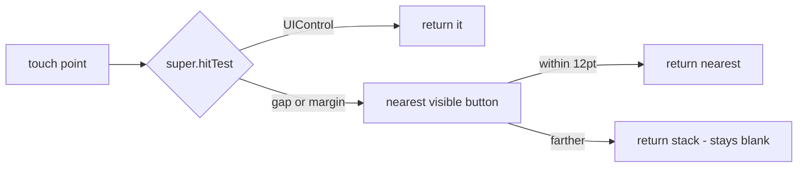

2026-08-30

# OhMyBias iOS：工具列圖示「很難按到」— 按鈕間距與外緣是觸控死角

## 問題

使用者回報候選列上方的工具列圖示（設定、中英切換、數字、符號、游標、Emoji、常用語、貼上、收折）用手指很難觸發，常常按了沒反應。

## 根因

工具列是一個 `.fillEqually` 的 `UIStackView`，10 顆按鈕平分螢幕寬：

```
可用寬 = 螢幕寬 - 16 (左右各 8pt 外緣) - 9 x 4 (按鈕間距)
       = 390 - 52 = 338  ->  每顆 33.8pt 寬（375pt 機種只有 32pt）
```

Apple 的最小建議觸控目標是 44pt。更糟的是 4pt 間距與 8pt 外緣不屬於任何按鈕，`UIView.hitTest` 嚴格以框線判定，指尖落在空隙上就打到 stack view 本身而沒有任何反應。垂直方向倒是沒問題（按鈕貼滿 46pt 列高）。

同一問題的兩個兄弟：

- **候選字**：`stack` 內的候選按鈕之間也是 4pt 間距、前緣 2pt，同樣是死角。
- **鍵面**：`KeyboardView.hitTest` 早就會把按鍵間距轉給最近的鍵，但加了一道「點必須在所有按鍵的外框內」的守門，鍵盤外緣（左右 3pt、上下 6pt）仍是死角 — 尤其上緣 6pt 緊貼候選列，按最上排字母偏高一點就沒反應。

## 修法：整面都有主人



`CandidateBar` 新增 `hitTest` override：`super.hitTest` 回傳的不是 `UIControl` 時，看現在顯示的是工具列還是候選捲動區，把點轉成該 stack 的座標（捲動區會自動算進 contentOffset），找最近的可見按鈕。距離上限 12pt（`gapSlop`）— 足以覆蓋 4pt 間距與 8pt 外緣，但 cskin 排不出來的按鈕 ID 留下的 34pt 佔位空格，其中央仍保持留白，不會莫名觸發鄰居。

`KeyboardView.hitTest` 拿掉外框守門：`hitView` 非 nil 就代表點在本視圖內，一律轉給最近的鍵。長按彈出選單不受影響 — 它是由原本那顆鍵的 `touchesMoved` 驅動，不走 hitTest。

效果：工具列每顆的有效目標從 34x46 變成約 38x46、零死角；鍵面上緣／左右緣也算最近的鍵。視覺版面完全不變。

## 未驗證

模擬器上 OhMyBias 鍵盤沒在啟用清單內（切換鍵只在 English／注音間循環），沒有做模擬器實機點按驗證；改動已建置成功並安裝到實機，請以實機手感為準。
