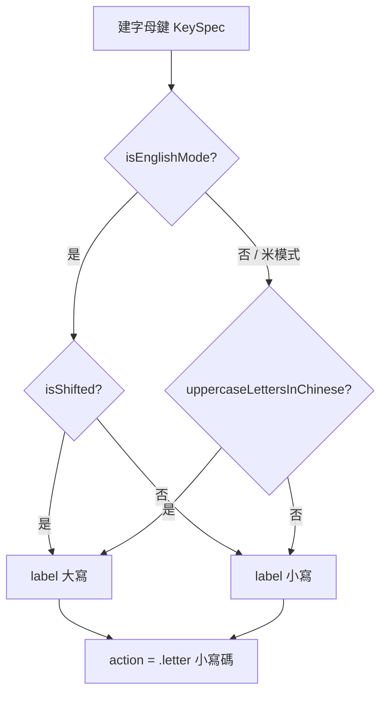

2026-08-21

# OhMyBias iOS：米模式字母鍵顯示大寫的偏好

## 做什麼

新增一個偏好「米模式字母鍵顯示大寫」（預設關）。開啟後，中文（米）模式的
26 個字母鍵面以大寫 `A`–`Z` 顯示，而不是預設的小寫。英文模式完全不受影響，
鍵面大小寫仍由 shift 鍵決定。

## 為什麼

嘸蝦米的字根表、教材與實體鍵帽都是大寫字母。使用者對照字根圖查碼時，
小寫鍵面要在腦中多轉一次；大寫鍵面直接對應，尤其是 `i/l`、`q/g` 這些
小寫形近的字母。但也有人習慣系統鍵盤的小寫外觀，所以做成偏好而不是改預設。

## 怎麼做

這是純顯示層的改動——`KeySpec.action` 仍然是 `.letter("a")` 小寫碼，
`InputEngine` 與 `CINTable` 查表完全不碰，引擎測試不必動（93 passed）。

鍵面標籤的大小寫決策：

三個檔案：

- `Shared/Prefs.swift`：`OhMyBiasPrefs.uppercaseLettersInChinese`，存 App Group
  UserDefaults，主 app 寫、鍵盤 extension 讀，與其他 toggle 同一套。
- `OhMyBiasKeyboard/KeyboardView.swift`：`letterRows()` 先算出一個 `uppercase`
  布林（英文模式看 shift、中文模式看偏好），`key()` 據此決定 label。
- `OhMyBiasApp/ContentView.swift`：「輸入」區多一個 `Toggle`，`@AppStorage`
  綁同一個 key。

## 設定改了要即時生效的細節

`KeyboardView.syncSessionState` 在每次鍵盤出現時會短路——只有 🌐 鍵有無、
Enter 標籤、皮膚世代變了才整面重建。若只加偏好不動這裡，使用者在容器 app
切換 toggle 後回到鍵盤，鍵面會維持舊的大小寫，直到 extension 被系統回收重啟。

所以比照 `builtSkinGeneration` 的做法，多記一個 `builtUppercaseLetters`
（建鍵當下的偏好值），`syncSessionState` 把它納入比對條件；不一致就
`reloadKeys()`。這樣切換後下次叫出鍵盤立即看到效果，而平常沒改設定時
仍然走短路，不多付重建成本。
