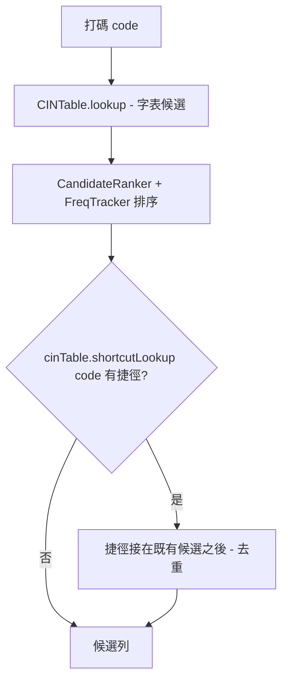

2026-08-25

# OhMyBias iOS：常用語可設自訂組字碼（commit `7347b2f`）

常用語（`user_phrases.txt`）原本只能從鍵盤的 ♥ 面板點選，或打詞首字靠聯想帶出。
這次讓每句常用語可以設一組**自訂組字碼**，在字母頁直接打碼就叫出整句，不必開面板。
檔案格式改為「詞`<TAB>`碼」（碼可省略，舊檔一行一詞照樣相容），與 Android 版同格式、可互通。

## 撞碼怎麼處理

使用者設的碼很可能跟字表（liu.cin）既有的碼撞上。原則：**捷徑排在字表候選之後、不參與字頻排序**
— 撞碼時不擠掉原本的字，位置固定可預期；獨佔碼時就是唯一候選，「唯一候選自動送出」開著會直接上屏。

實作上捷徑表跟字表分開存（`CINTable.shortcuts`），字表本身是 mmap 的 liu.bin 不動；
捷徑碼長也算進 `maxCodeLength`，否則比字表最長碼長的捷徑根本打不出來。
`hasPrefix` / `nextChars` 也把捷徑鍵算進去，打到一半時鍵盤的可用鍵提示才正確。

## 設定頁即時對照

容器 app 的常用語設定從一個大 `TextEditor` 改成列表，每列「詞＋組字碼」。組字碼欄一邊打一邊對照字表：

- ✓ 未被使用 — 打碼直接出現本詞
- ⚠ 已有候選（列出撞到的字，最多 6 個）— 本詞排在其後
- ✗ 不合法 — 只允許 `a–z , . ' [ ]`；`,,` 開頭是指令前綴不能用

設定頁要對照字表，所以容器 app 自己也開一份 `CINTable`（只用 `lookup`，不含捷徑）。

## 兩個行程的同步

鍵盤 extension 行程常活過容器 app 的編輯，singleton 讀的可能是舊檔。`UserPhrases` 記住上次讀檔的
修改時間，`KeyboardViewController.viewWillAppear` 每次呼叫 `cinTable.reloadShortcutsIfNeeded()`，
時間沒變就什麼都不做 — 不重 mmap 字表、鍵擊路徑零成本。

## 附帶：密碼／ASCII 欄位暫切英文直通

設定頁的組字碼欄用 `asciiCapable` 鍵盤型別，但使用者的 OhMyBias 鍵盤跳出來時若在米模式，
打的碼會被組成中文。所以 `KeyboardViewController` 在 `viewWillAppear` 與 `textDidChange` 檢查
`isSecureTextEntry || keyboardType == .asciiCapable`，符合就暫時 `setEnglishMode(true)`，
離開欄位還原成 `OhMyBiasPrefs.lastEnglishMode`。暫時狀態**不寫入** `lastEnglishMode` —
它是欄位性質，不是使用者偏好。密碼欄本來就不該經過組字，順便一起修了。

測試：`UserPhrases.parse/serialize` 往返、`isValidCode`、引擎撞碼排序與獨佔碼（`Tests/main.swift`，141 全過）。
