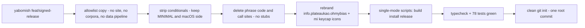

2026-08-14

# OhMyBias 米：自 Yabomish 抽出的極簡嘸蝦米輸入法

新專案 `~/src/ohmybias`：把 Yabomish 的「極簡版」從 compile flag 變成一個獨立、乾淨、只有 3.8MB 的 repo。名字 **OhMyBias** 是命名腦力激盪的結果——*Boshiamy* 的字母重組（同一批字母也拼得出 AmishBoy、Yashimbo、Yamboshi），選單圖示配一顆「米」字鍵帽。

## 為什麼

Yabomish 的極簡版一直存在，但只是 `-DMINIMAL` 編譯旗標：程式碼裡到處是 `#if MINIMAL`／`#if !MINIMAL`，repo 內帶著 98MB 語料 binary、corpus pipeline、文件網站。想要一個「純打字」的版本時，這些都是負擔。目標：小、輕、乾淨——沒有聯想、沒有詞庫、沒有殘留旗標、沒有 stub，git 歷史從零開始。

## 抽出流程

關鍵決策：

- **條件實體化而非沿用旗標**。用 unifdef 式腳本把 `#if MINIMAL` 保留極簡側、`#if os(iOS)` 保留 macOS 側，直接改寫原始碼。repo 裡不再有任何 MINIMAL 字樣。
- **連 stub 一起刪**。上游極簡版靠空殼 `SuggestionEngine`／`WikiCorpus`／`BigramSuggest` 讓呼叫端編得過；這裡把呼叫端一併清掉（`InputEngine` init 簽名、`CandidateRanker` 的 domain/region 邏輯、controller 暖機、`engineDidSuggest` delegate、相關 prefs 與 IMEPreferences 協定成員）。順帶撿回一個藏在 `WikiCorpus.swift` 檔尾、極簡版也需要的 `Data.u16/u32` extension（獨立成 `DataExt.swift`）。
- **全新識別**：`info.plateaukao.ohmybias`（+ `.prefs`），app 名 OhMyBiasIM／OhMyBiasPrefs，使用者資料改在 `~/Library/Application Support/OhMyBias/`，通知名、queue label、UI 字串全數換。蝦頭方向／狀態列名稱這兩個 shrimp 專屬客製直接移除。
- **圖示重生**：沿用 Yabomish 的 gen_menu_icon_pdf／gen_app_icon 產生器（幾何實測自系統鍵帽），字符換成「米」，產出模板 PDF 選單圖示＋icns。產生器一併入 repo。
- **腳本單一化**：`ohmybias.sh [build|install|uninstall]`，無互動選單、無 full/lite/min 模式；`release.sh` 簽章＋公證流程照搬但去掉模式參數。

## 結果

57 個檔案、3.8MB（最大的是 zhuyin_data.json 344K）；輸入法 app 建出來 1.4MB（完整版 108MB）。保留：打字、注音／拼音反查、繁簡轉換、`freq.db` 字頻學習（unigram/bigram/trigram）、候選釘選、`,,` 指令＋截圖 capture script、擴充表、可拖曳固定選字列（含本日 yabomish 的拖曳記位修正）。測試 78 passed（原 80，扣除聯想記錄的 2 個斷言）。

上游對照：yabomish `e08f6ec`（feat/signed-release）。往後從 Yabomish 移植修正時，凡上游在 `#if !MINIMAL` 內的程式碼，此 repo 不存在也不應補回——這條已寫進新 repo 的 CLAUDE.md。
