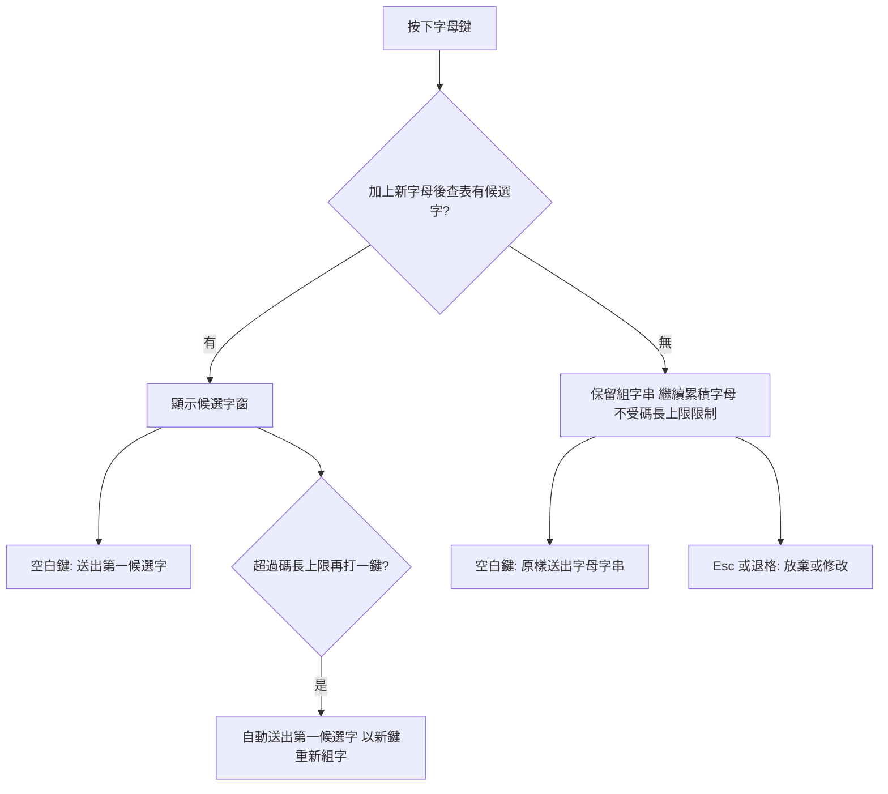

2026-08-17

# OhMyBias：無候選字時可續打，空白鍵原樣送出字母（英文直印）

## 這是什麼

無蝦米模式下打英文一直很麻煩：輸入碼查無候選字時，引擎會自動把組字串清空——打滿碼長上限（4 碼）無候選就直接清掉，按空白鍵也是清掉。使用者若想在中文輸入途中夾帶一個英文單字，得先切換到英文模式再切回來。

這次的改動把「無候選字」從錯誤狀態改成合法的輸入途徑：查無候選字時組字串不清空、不受碼長上限限制，可以一路把整個英文單字打完；按空白鍵時把打到一半的字母**原樣送出**（與 Enter 送出原文的既有行為一致）。這成為無蝦米模式下快速輸入英文單字的途徑——打 `hello` 按空白，畫面上就是 `hello`。

## 怎麼改的

全部改在 `InputEngine.swift`（Shared 引擎層，平台無關）：

- **`handleLetter`**：移除兩處自動清空——「組字串達碼長上限且無候選」的重設，以及「超長且無候選」的重設。超長時只剩一個分支：**有**候選字才自動送出首選並以新鍵重新組字（連打送字的既有行為不變）；無候選字則繼續累積。
- **`handleSpace`**：無候選字時由 `_resetComposing()` 改為 `_commitText(_composing)`——走與 Enter 相同的送出路徑（IMK 端 `insertText` 取代 marked text，不需額外清理）。
- 順手移除 `_lastWasEmptySpace`（雙空白清空）：第一個空白現在就會送出並清空組字串，這個 iOS 鍵盤時代留下的旗標已不可達。

放棄組字的出口改為 Esc 或退格——原本「空白鍵清掉打錯的碼」這個習慣要改成「空白鍵會把錯字母送進文件」，這是本功能刻意的取捨（使用者明確要求）。

## 已知邊界

- **模糊比對（預設開啟）會攔截這條路**：打錯的碼若被相鄰鍵替換找到候選字，空白鍵送出的是那個候選字、不是原字母。同理，英文單字的前綴若恰好是合法字根碼，也會出中文候選。所以這是「快速夾帶英文」的捷徑，不是完整英文模式（Shift 臨時英文與 A 模式切換仍是正規途徑）。超過碼長上限後模糊比對自然失效（替換不改變長度，超長碼查表必空），不需另外處理。
- Controller 端的 Shift+字母與直通標點（`-`、`=`、`;` 等）在無候選字時仍走 `handleEscape()` 丟棄組字串——維持原行為，未納入本次範圍；若要讓它們也原樣送出，是獨立的小後續。

## 測試

測試字表補了一個 4 碼字（`abab 帕`）才能觸發碼長上限（`CINTable.maxCodeLength` 下限為 4，原字表最長 2 碼壓不到界）。新增三個整合測試：無候選續打超過碼長上限、空白鍵原樣送出、有候選超長仍自動送出首選。隨 v0.4.0 發佈。
