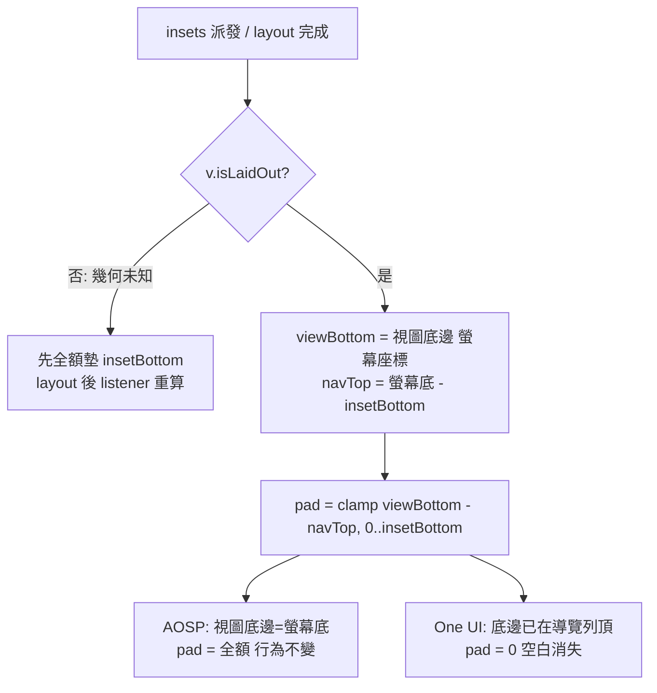

2026-08-19

# OhMyBias Android：One UI 鍵盤與導覽列間多出整條空白（0.3.1 修法的 Samsung 副作用）

## 什麼壞了

Samsung S25U 使用者回報：鍵盤最下排（空白鍵那排）與系統導覽列之間多出
一條約「兩個導覽列高」的空白。Pixel 上完全正常。第三方鍵盤在 One UI 7
上有相同已知回報（HeliBoard #1519 — Samsung 自家鍵盤不受影響）。

## 根因

0.3.1 的修法（見 [[ohmybias-android-navbar-covers-keyboard-fix]]）是把
`navigationBars ∪ tappableElement` 的 bottom inset 直接墊成 root view 的
bottom padding — 這在 AOSP 上正確：Android 15 起 targetSdk 35+ 的 IME
視窗強制 edge-to-edge、延伸到導覽列底下，墊 inset 剛好讓開。

但 **One UI 沒有照 AOSP 的方式把 IME 視窗延伸到導覽列底下** — 系統本來
就把鍵盤排在導覽列上方，卻仍對 IME 視窗回報導覽列 inset。照抄 inset
等於在系統已經讓開的位置上再墊一次 → 兩倍空白。

## 修法：墊「實際重疊量」而非回報值

不再信任 inset 簿記，改讀幾何：以螢幕座標算出視圖底邊伸進導覽列區域
多少，只墊那個重疊量（夾在 0..insetBottom）：

設計要點：

- **收斂不震盪**：input view 底邊由框架錨定在視窗底，改自身 padding 只會
  把內容往上推、底邊不動 — 所以重疊量對 padding 不敏感，layout listener
  重算頂多改一次值（有 `pad != paddingBottom` 守門）就穩定。
- **layout 前的 fallback**：insets 常在首次 layout 前派發，幾何未知時先
  全額墊（舊行為，Pixel 正確；One UI 首幀可能多墊、layout 完成立即修掉）。
- 讀的是當下幾何而非寫死各廠商行為 — Samsung 或 Google 之後改視窗擺法
  都自動跟上。

## 驗證

- 實體 Pixel 9 Pro XL（Android 17）無回歸：手勢導覽、3 鍵導覽、以及
  「鍵盤收起時切換導覽模式再打開」（0.3.1 第二層情境）最下排皆不被蓋、
  無多餘空白；並經 IME 路徑實打（軟鍵盤點按）確認輸入正常。
- S25U 為使用者回報裝置、手邊沒有 — 症狀端靠幾何推理＋公開回報佐證，
  待回報者升級確認。
