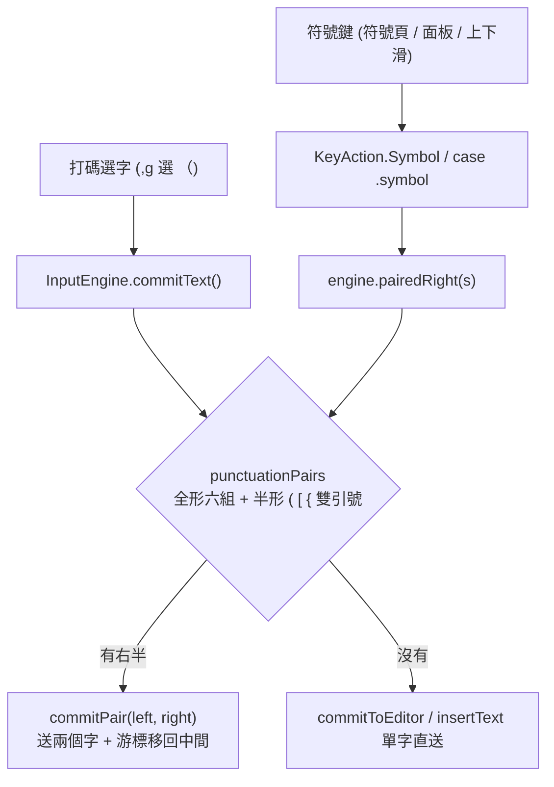

2026-08-20

# OhMyBias 米：成對標點擴到半形括號，符號鍵也自動補右半

嘸蝦米鍵盤打出左半括號時會自動補上右半、游標停在中間（`（｜）`）。這次把這個行為
補齊到兩個原本漏掉的地方：**半形括號 `(` `[` `{` 與雙引號**，以及**所有符號鍵**
（符號頁／符號面板／按鍵上下滑）。Android 與 iOS 同步，macOS 兩個版本刻意不動。

## 起點：一個其實不存在的 bug

使用者回報「設定頁的成對符號 `(` `[` 沒作用」。實測（Pixel_7_API_34、真實字表）
的結果是**設定頁沒問題**：在測試輸入框打 `,g` 選 `（`，欄位得到 `（）`，再插一個字元
變成 `（X）`，游標確實停在中間；拿系統「設定」App 的搜尋框做同一件事，結果一模一樣。
所以跟設定頁、跟 IME 與設定同 process 都無關。

真正的落差有兩層，而且兩層都不分 App：

1. **配對邏輯只長在引擎的送字路徑上。** `InputEngine.commitText()` 裡查 `punctuationPairs`
   決定要發 `engineDidCommitPair` 還是 `engineDidCommit`。但符號鍵走的是
   `KeyAction.Symbol`（iOS 是 `case .symbol`），註解寫得很誠實 ——「符號頁直接送出
   （不經引擎組字）」—— 直接呼叫 `commitToEditor()` / `insertText()`。結果就是同一個
   `【`，用打碼打會配對，用符號頁按就不會。
2. **配對表只有全形六組** `「」（）『』【】《》〈〉`。半形 `(` `[` `{` 從來不在表裡，
   就算改走引擎也不會配對。這點 iOS 與 Android 一致，是上游的設計而非移植漏掉。

## 決策：半形也配，但單引號不配

使用者選擇把半形也納入（打程式碼、打英文括號都方便），並明確排除單引號。
排除的理由值得留下來：`'` 在英文裡是縮寫（don't）與所有格（Daniel's）的一部分，
自動補右半會變成 `don''t`，誤判率遠高於它的價值。雙引號 `"` 沒有這個問題，留著。

macOS 版（`yabomish`／`ohmybias`）不同步 —— 桌面是雙手打字，右半自己補就好，
自動配對在那裡反而礙事。這是本家族第一次讓引擎層的 `punctuationPairs` 在
桌面與行動端分岔，之後從上游移植修正時要記得這一條不是漏改。

## 做法：兩條路徑共用同一份表與同一段送字

新增 `InputEngine.pairedRight(text)` —— 查同一份 `punctuationPairs`，順便把
`punctuationPairing` 偏好與「單一 code point」兩個前置條件包進去。它不碰任何可變狀態，
所以不需要進 `sync {}` / `NSRecursiveLock`。符號鍵改成先問它，有右半就走
`commitPair()`；而 `engineDidCommitPair` 也改成呼叫同一個 `commitPair()`，兩條路徑
從此共用「送兩個字 + 游標移回中間」那段（Android 是 `commitText` + `setSelection`，
iOS 是 `insertText` + `adjustTextPosition`）。

`pairedRight` 限制「單一 code point」不只是防呆：符號面板的「半括」「全括」分類存的
本來就是 `()`、`（）` 這種**兩個字的項目**，限制單一 code point 正好讓它們原樣通過，
不會被重複補成 `(())`。

## 驗證

模擬器上全部走真的鍵盤觸控（`sim-use swipe` 打在鍵面上），不是 `adb shell input text`
—— 後者繞過 IME，測不到這條路徑。單獨按每一顆鍵，各自出自己的寬度：

| 按法 | 結果 |
|---|---|
| `o` 上滑 `(` | `()` |
| `x` 上滑 `[` | `[]` |
| `l` 下滑 `"` | `""` |
| `l` 上滑 `'` | `'` ← 單獨出現，不配對 |
| `f` 上滑 `【` | `【】`（這顆鍵本來就定義成全形，沿用 sweetlime 皮膚） |

不清空欄位連按 `f↑` `o↑` `x↑` `l↓`，得到 `【([""])】` —— 一層層包進去，證明每一次
游標都真的停在中間。回歸確認打碼 `,g` 選 `（` 仍得 `（）`。

測試：Android `testDebugUnitTest` 綠、iOS `Tests/run_tests.sh` 93 passed
（新增 `pairedRightForSymbolKeys` / `testEnginePairedRight`，涵蓋 `'` 不配對、
右半不配對、多字不配對、偏好關閉時不配對），iOS `xcodebuild` BUILD SUCCEEDED。

commits：`ohmybias-android` 2aeca79、`ohmybias-ios` 16419bc。
