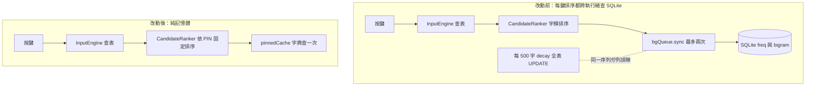

2026-08-14

# OhMyBias：排序改為字表順序＋,,PIN 固定，打字路徑去 SQLite 化

## 這次改了什麼、為什麼

OhMyBias 的候選字排序原本是「字頻學習」：每次送字記錄 freq／bigram／trigram 到
SQLite，每個按鍵重新整理候選字時再查回來排序。這次把整套自動排序拿掉——候選字
順序＝**字表順序**，唯一的例外是使用者用 `,,PIN` 明確固定過的碼（固定字依序排最
前）。

動機有兩層：

1. **效能**：檢視按鍵路徑時發現，每個字母鍵都會經 `CandidateRanker` →
   `FreqTracker.sortedWithContext` 做最多兩次 `bgQueue.sync` 的同步 SQLite 查詢
   （freq＋bigram）。更糟的是同一條序列佇列也負責批次寫入交易與每 500 字觸發一次
   的 `decay()`（全表 UPDATE＋兩段帶子查詢的 DELETE）——按鍵若剛好落在 decay 進行
   中，就得等它做完，正是「打字偶爾莫名頓一下」的來源。
2. **產品**：對嘸蝦米使用者來說同碼字衝突少且穩定，候選字順序跟著使用頻率浮動反
   而破壞肌肉記憶；真正需要調順序的少數碼，用 `,,PIN` 明確固定一次就好。既然固定
   排序才是想要的行為，字頻機制連「搬進記憶體」都不必——整個不呼叫即可。

## 怎麼改的

- `CandidateRanker.rank`：移除 `sortedWithContext` 呼叫與 `prev` 參數。有
  `,,PIN` 的碼把固定字（依固定順序）排最前、其餘維持字表順序；資料來源是
  `FreqTracker.pinnedChars` 的記憶體快取，不碰 SQLite。模式過濾（速／慢／繁簡）
  不變。
- `InputEngine._commitText`：不再呼叫 `record`／`recordBigram`／`recordTrigram`。
  decay 由記錄次數觸發，因此也永不執行。
- `FreqTracker.loadPinnedCache`：改 build-then-swap——`pinnedCache` 現在每個按鍵
  都會讀，偏好設定變更觸發重載時不能讓讀取方看到清空到一半的字典。

## 順帶修掉的 bug：每個 app 一個 FreqTracker、flush 錯實例

IMK 對每個 client app 各建一個 `OhMyBiasInputController`，而 controller 的
`engine` accessor 建 `InputEngine` 時沒傳 `freqTracker`，於是**每個打過字的 app
都有自己的 FreqTracker**——各開一條 SQLite 連線、各一份 pinned 快取。同時
`deactivateServer` 呼叫的 `Self.freqTracker.flushAll()` 是那個從來沒人寫入的
static 實例，真正累積中的待寫紀錄（上限 49 筆）從未被明確 flush。改為把
`Self.freqTracker` 傳進 engine 共用單一實例：一條連線，`,,PIN` 立即跨 app 生效；
`flushAll` 呼叫因已無寫入而一併移除。

## 保留與後續

`FreqTracker` 的 freq／bigram 機制（record、decay、JSON 遷移／同步）與 `,,RS` 指
令保留未刪——打字路徑不再觸及，測試仍覆蓋其 API。若之後想徹底極簡，可整組移除、
讓 `FreqTracker` 縮成只剩 pinned 表。

測試：`rank` 簽名更新、新增 `testRankerPinnedOrderOnly`（斷言字頻不再影響排序＋
固定字排最前），80 全數通過。

Commit：`9302264`（ohmybias@main）。
