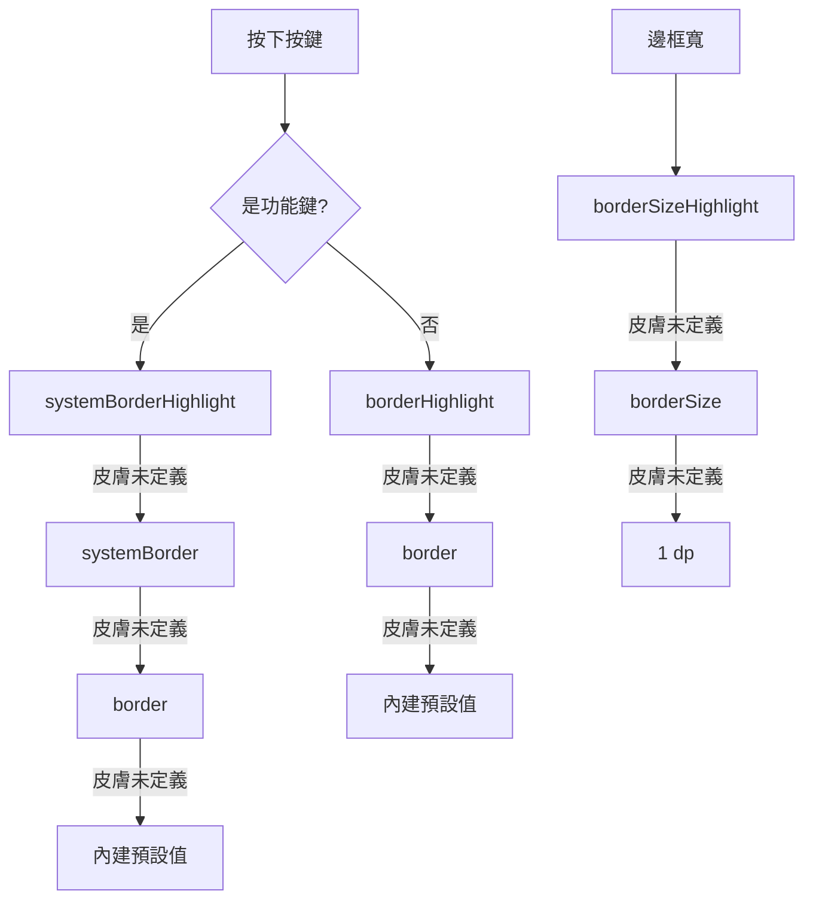

2026-08-22

# 按鍵按下時可另設邊框色與邊框寬

OhMyBias 的鍵盤外觀一直是「按下只換鍵底色」：`keyNormalHighlight` /
`keySystemHighlight` 換底，邊框則不動。手繪線稿風的皮膚（內建預設就是）鍵底本來就
接近白或黑，換底的回饋很弱；真正搶眼的是那圈框線，但它按下前後一模一樣。

這次讓框線也進入按壓態：可以另外指定按下時的**邊框色**與**邊框寬**，做出「按下框
線變色 / 加粗」的效果。三個 App 端（Android、iOS）＋外觀編輯器網站同步。

## 新增的 palette 鍵

| 鍵 | 意義 | 未定義時的 fallback |
|---|---|---|
| `borderHighlight` | 一般鍵按下邊框色 | `border` |
| `systemBorderHighlight` | 功能鍵按下邊框色 | `systemBorder`，再 `border` |
| `borderSizeHighlight` | 按下邊框寬（dp / pt） | `borderSize` |

fallback 鏈是這次設計的重點。既有的 `.cskin` 一定沒有這三個鍵，如果缺鍵就掉到「內
建常數」，深色皮膚會在按下瞬間閃出一圈亮框——所以缺鍵時必須鏈回**該皮膚自己**平時
的邊框值，讓舊皮膚的按壓外觀與改版前逐像素相同。這與 `textSystem` 缺鍵時鏈回皮膚
`textMain`（而非內建黑）是同一條原則。

出廠的 `assets/default_skin.json` 也補上這三個鍵，值一律等同平時的邊框——出廠外觀
不變，但使用者匯出預設主題再編輯時，欄位是實心的、看得到可以改什麼。

## 加粗要往內長

邊框寬會隨按壓改變，就得決定加粗往哪長。往外長會吃掉鍵與鍵的間距、按下的鍵看起來
會「脹大」推擠鄰居；往內長則外框尺寸恆定，只有框線變厚。三端剛好都能自然做到往內：

- Android `KeyButton.onDraw` 本來就用 half-inset 畫法（`drawRoundRect(half, half,
  width - half, height - half)`），`half = 邊框寬 / 2`，換寬度自動往內長。
- iOS 用 `CALayer.borderWidth`，CALayer 的框線本來就畫在 bounds 內側。
- 網站預覽的 `.pv-key` 吃全域 `box-sizing: border-box`，改 `border-width` 不動外框。

## 網站端（ohmybias-skin）

配色面板的「一般鍵」「功能鍵」各多一列「按下邊框」色票；原本單支的邊框寬滑桿抽成
`borderWidthRow(label, key)`，長出「按鍵邊框」與「按下邊框」兩支。預覽鍵盤本來就可
以實按（`wireKeyPress` 在 press/release 換鍵底），這次一併換邊框色與寬度，所以在網
站上按一下就看得到成品。

匯入既有 `.cskin` 走 `materializePalette` 的 alias 鏈補值，`borderSizeHighlight`
缺值時取 `out.borderSize` — 與 App 端同一套規則，維持「所見即所得」。

## 驗證

- Android：Pixel_7_API_34 模擬器裝 debug APK，推一份測試皮膚
  （`borderHighlight` 紅、`systemBorderHighlight` 藍、`borderSizeHighlight` 3），
  用 `input motionevent DOWN` 壓住鍵再截圖 — 一般鍵紅粗框、功能鍵藍粗框，放開還原。
  （`input tap` 是瞬間事件，截不到按壓態，必須用 motionevent 分開 DOWN / UP。）
- iOS：`xcodebuild -scheme OhMyBias -destination generic/platform=iOS Simulator`
  BUILD SUCCEEDED。
- 網站：本機 http server ＋ headless Chrome 驅動 UI，把「按下邊框」設成紅色 3dp 後
  量測 computed style，按下由 `rgb(0,0,0)/1px` 變 `rgb(255,0,0)/3px`、放開還原，
  無 console error。

## 順帶記下

iOS `KeyboardTheme` 有一組 `keyEnter` / `keyEnterHighlight`，全專案沒有任何地方讀
它，網站的 `COLOR_KEYS` 也沒列。這次沒有動它，但下次整理調色盤鍵時可以決定是要接
上 Enter 鍵、還是刪掉。
