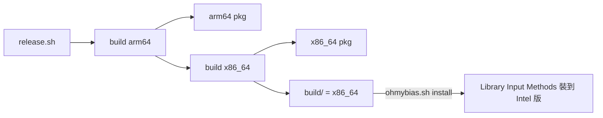

2026-08-29

# OhMyBias：release 後 build/ 殘留 Intel 版，開發安裝誤裝成 x86_64

## 問題

發完 0.8.0 後，macOS 對本機的 OhMyBias 跳出「Support Ending for Intel-based Apps」。
檢查 `/Library/Input Methods/OhMyBiasIM.app` 的 binary 是 x86_64，而這台是 Apple Silicon。

## 根因

`release.sh` 對 arm64、x86_64 各跑一次 `ohmybias.sh build`，兩次都寫進同一個
`OhMyBiasIM/build/`，所以跑完時 `build/` 留下的是最後一種——x86_64。之後
`./ohmybias.sh install`（只複製、不重編）就把這份 Intel 版裝進 `/Library/Input Methods`。
pkg 本身沒問題，兩個架構各自正確；只有開發機的本機安裝被牽連。

## 修正

兩道防線：

- `release.sh` 結尾多跑一次 `ARCH=$(uname -m) ohmybias.sh build`，讓 `build/` 回到本機架構。
- `ohmybias.sh install` 先用 `lipo -archs` 比對 `build/` 的 binary 與 `$ARCH`（預設 `uname -m`），
  不符就中止並提示改跑 `./ohmybias.sh` 重編——即使日後 `build/` 又被別的流程換掉，也不會再裝錯。
