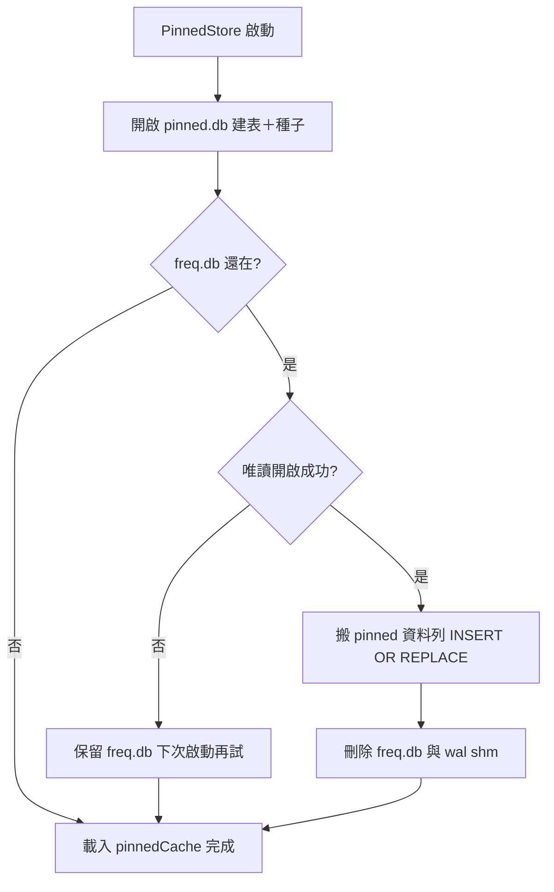

2026-08-14

# OhMyBias：字頻機制整組移除，FreqTracker 瘦身為 PinnedStore

## 這次改了什麼、為什麼

前一個 commit（[pin-only ranking](ohmybias-pin-only-ranking.md)）已把排序改成
「字表順序＋`,,PIN` 固定排序」，字頻機制當時保留但打字路徑不再呼叫。使用者接著
問：「why not remove frequency db and implementation?」——確實，一旦沒有任何路徑
讀寫字頻，那 400 多行 record／flush／decay／排序／JSON 遷移／syncFolder 同步就
是純粹的死重，跟專案的極簡定位相悖。這次整組刪除，淨減 324 行。

## 怎麼改的

- **`FreqTracker.swift` → `PinnedStore.swift`**（`git mv` 保留歷史）：420 行縮到
  約 140 行，只剩 `pinned` 單表、記憶體快取、`pin`／`unpin`／`pinnedChars`、
  偏好變更重載。DB 檔從 `freq.db` 換成 `pinned.db`——舊檔名已名不符實。
- **一次性遷移**：首次啟動把舊 `freq.db` 裡的 pinned 資料列搬進 `pinned.db`
  （`INSERT OR REPLACE`，舊資料蓋過新種子，使用者調過的順序優先），成功後連同
  `-wal`／`-shm` 刪除舊檔；唯讀開啟失敗則整個跳過、留待下次啟動再試——寧可多留
  一個檔，不能冒丟固定排序的險。已在開發機實測：pins 完整搬入、`freq.db` 刪除。

- **`,,RS`（重置字頻）指令移除**：dispatch、`,,H` 說明、PrefsUI HelpTab 一併更新；
  HelpTab 的資料路徑列表 `freq.db` 改列 `pinned.db`。
- **呼叫端更名**：`InputEngine`／`CandidateRanker`／controller 的參數改
  `pinnedStore:`；死碼 `scheduleBackgroundTasks`（唯一內容是 freq JSON 同步）隨
  之刪除。PrefsUI 的 `PinnedOrderSection` 原本自己拼 `freq.db` 路徑，改用
  `AppConstants.pinnedPath`。
- **測試**：兩個字頻測試刪除；ranker 測試改用 `PinnedStore`，
  `testRankerPinnedOrderOnly` 補上 unpin 斷言（固定→排前、解除→回字表順序）。
  78 全過，app 完整編譯。

## 附帶修正：CHANGELOG 不可改寫已發佈條目

上一個 commit 把變更併進了 `[0.2.0]` 條目——但 0.2.0 已經發佈（有 `release:`
commit 與公證過的 pkg），發佈後的條目是歷史紀錄，不能事後改寫。使用者指正後改
為：發佈後的變更記在 CHANGELOG 最上方的 `## 未發佈` 段，發新版時才改成
`## [x.y.z]`。

一個陷阱：`release.sh`／`ohmybias.sh` 用 `grep -m1 '^## \['` 抓第一個帶方括號的
標題當版本號，所以未發佈段的標題**刻意不加方括號**（`## 未發佈` 而非
`## [未發佈]`），否則版本會被解析成「未發佈」三個字。此規則已寫入專案
CLAUDE.md 與 CHANGELOG 內的註解，避免之後被「修正」回去。

Commit：`dac6198`（ohmybias@main）。
