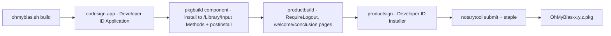

2026-08-14

# OhMyBias：合併為單一 app＋pkg 安裝程式

OhMyBias 從「輸入法 app＋設定 app」二合一：設定視窗直接內建在 OhMyBiasIM.app 裡；發佈物從「zip＋install.sh」改成標準的 macOS 安裝程式 `OhMyBias-x.y.z.pkg` — 使用者雙擊安裝，不再需要跑任何 shell script。

## 為什麼可行／怎麼合併

這其實是 macOS 第三方輸入法的主流做法（McBopomofo、vChewing 都是單一 app 內建設定視窗）。輸入法 app 本來就是一個可以開視窗的 NSApplication——OhMyBias 的 IM 進程原本就會跳 NSAlert、開 NSOpenPanel 匯入字表，內建一個 SwiftUI 設定視窗只是同一件事的延伸：

- 原設定 app 的 `main.swift` 只是一層薄殼（開一個 NSWindow 裝 `ContentView`）。改寫成 IM 內的 `PrefsWindow` singleton，其餘九個 SwiftUI 檔原封搬進 `OhMyBiasIM/Sources/PrefsUI/`，輸入法選單的「偏好設定⋯」從「launch 外部 app」變成 `PrefsWindow.shared.show()`。
- 兩個關鍵陷阱：(1) `UserDefaults(suiteName:)` 用自己 bundle id 會拿到 nil——同進程後直接用 `.standard`；(2) 視窗關閉只能隱藏、選單絕不能掛 Cmd+Q terminate，否則會殺掉輸入法本體。`PrefsWindow` 只裝 Edit／Window 選單（Cmd+C/V/W），不裝 app 選單。
- 合併也順手消掉了跨 app 的重複：兩個 prefs 檔各自的 `private extension Data { u16/u32 }` 與 IM 的 `DataExt.swift` 同 module 衝突，刪掉留一份。
- 使用者資料夾部署（capture script、commands.json）從安裝腳本搬進 `AppDelegate.setUpUserDir()`（冪等）——因為 pkg 的 postinstall 以 root 執行，不應該碰使用者家目錄。

測試不動：`run_tests.sh` 的 `find -maxdepth 1` 本來就不會撈到 `Sources/PrefsUI/` 子目錄，78 個測試照樣全過。單一 app 2.3MB（多了 SwiftUI 設定視窗，仍比原本兩個 app 加起來小）。

## pkg 流程

- **postinstall**（root）：`pkill` 舊版，再用 `launchctl asuser <console user uid>` 跑 `imklaunchagent` 註冊＋`open` 啟動——多數情況安裝完即可在輸入方式清單看到，不必登出。
- **登出建議進安裝程式本身**（使用者要求）：distribution 的 `onConclusion="RequireLogout"` 讓 Installer 結尾顯示「登出」按鈕，conclusion.html 同時說明「也可以先關閉、稍後再登出」＋接下來的啟用三步驟。
- `hostArchitectures="arm64"`＋`allowed-os-versions min 14.0` 擋掉裝不了的機器。
- 已用未簽章 dry-run 驗證 pkg 結構（payload 落在 `/Library/Input Methods`、Scripts、Distribution、資源頁俱全）。**尚缺一張憑證**：公證 pkg 需要 Developer ID **Installer**（現有的是 Application）——Xcode → Settings → Accounts → Manage Certificates 一次性建立後，`./release.sh` 即可跑完全程（腳本會先檢查並提示）。

install.sh 已刪除；`ohmybias.sh` 保留為開發用（build/install/uninstall）。
