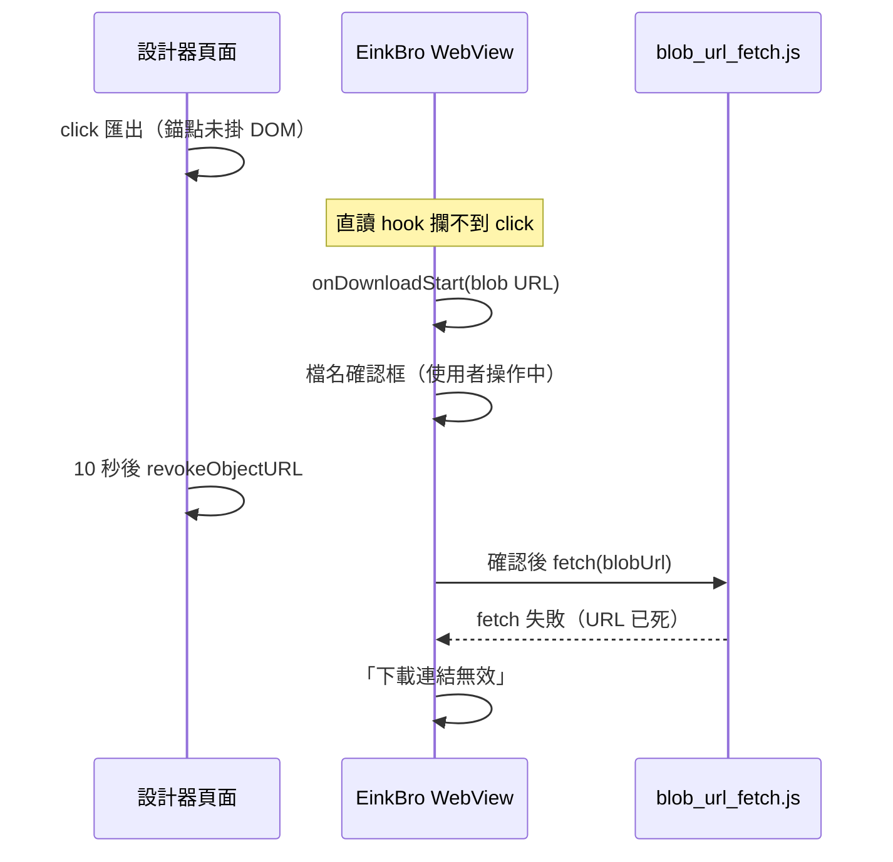

2026-08-16

# ohmybias-skin：匯出下載在 EinkBro 顯示「下載連結無效」

使用者在 EinkBro 按「匯出 .cskin」得到「下載連結無效」。讀 EinkBro 原始碼
（`DownloadHelper.kt`、`WebViewJsBridge.kt`、`blob_url_fetch.js`、
`blob_download_hook.js`）比對後，確認兩個根因**都在設計器的匯出程式**，
且互相疊加：

1. **下載錨點從未掛進 DOM。** EinkBro 對 blob 下載有快路徑：
   `blob_download_hook.js` 在 document 的 capture 階段攔截帶 blob href 的
   `<a download>` 點擊、直接讀記憶體中的 Blob（也因此知道確切檔名、免跳
   檔名框）。`document.createElement('a').click()` 的游離節點事件不經過
   document，快路徑攔不到 → 退回 `onDownloadStart` ＋頁內 `fetch(blobUrl)`
   的慢路徑。
2. **object URL 十秒就 revoke。** 慢路徑會先跳檔名確認框，使用者確認後才在
   頁面 context `fetch(blobUrl)` 分塊回傳 —— 十秒早過，URL 已 revoke，
   fetch reject → `onBlobDownloadError` → 「下載連結無效」。

順帶解開一個懸案：稍早桌面 Chrome 自動化測試時匯出也從未落地
`~/Downloads`，當時誤判為自動化環境擋下載 —— 其實就是根因 1，游離錨點在
部分情境下整個下載都不會觸發。

## 修法

- 錨點 `document.body.appendChild(a); a.click(); a.remove()` —— 讓 EinkBro
  的直讀快路徑攔得到（並修好桌面 Chrome）。
- 不再用計時器 revoke；改保留最後一次匯出的 object URL，只在**下一次匯出時**
  回收前一個。皮膚檔只有幾 KB，掛著無妨。

## 驗證

- 桌面 Chrome：按鈕點擊 → `我的皮膚.cskin` 實際出現在 `~/Downloads`。
- 模擬器裝 EinkBro 開本機站台 → 按匯出 → 直讀快路徑靜默完成（有確切檔名
  故不跳框），`/sdcard/Download/我的皮膚.cskin` 出現，pull 回本機通過
  zip CRC 與 settings.json 內容驗證。

教訓：`URL.revokeObjectURL` 的「用完就收」直覺在 WebView 系瀏覽器是錯的 ——
下載方消費 blob URL 的時間點不受頁面控制（中間可能隔著使用者對話框）。
