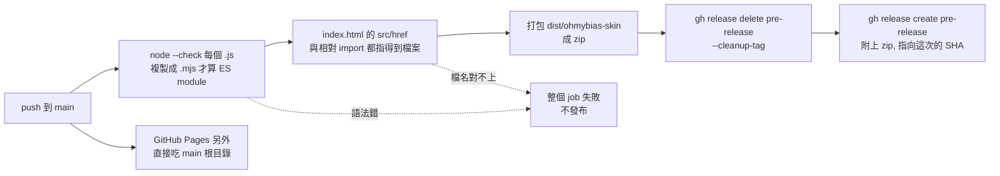

2026-08-17

# OhMyBias 皮膚設計器：比照 Android 版加上 pre-release workflow

`ohmybias-android` 每次 push 到 main 就自動發一份 pre-release APK，固定 tag `pre-release`、新 build 先刪舊的再重建，所以那個下載連結永遠指向最新版。皮膚設計器現在也吃同一套規則。

差別在這個 repo 沒有東西可以「build」—— 純靜態網頁、零依賴、零 build step，線上版由 GitHub Pages 直接吃 main 根目錄。所以 pre-release 發的不是編譯產物，而是**打包好的站台 zip**：解開後用瀏覽器開 `index.html` 就能離線用設計器（.cskin 匯出入全都在瀏覽器端完成，本來就不需要伺服器）。簽章那段自然也整段不存在 —— Android 版要從 Secrets 還原 keystore 才能發，這裡沒有這個問題。

## 沒有測試的 repo，發布前要擋什麼

Android 版在發布前跑 `testDebugUnitTest assembleRelease` —— 編譯本身就是一道很強的閘門。這裡沒有編譯，一個錯字要等使用者開網頁才會發現，而且 Pages 是無條件部署的，壞的也照上。所以補了兩道最便宜、又剛好擋得住實際會犯的錯的檢查：

- **JS 語法**：每個 `.js` 過 `node --check`。要注意 `--check` 是靠副檔名決定當成 CommonJS 還是 ES module，`.js` 裡的 `import` 會直接被判語法錯 —— 先複製成 `$RUNNER_TEMP/x.mjs` 再檢。
- **引用的檔案存在**：`index.html` 的 `src`/`href`，以及各檔的相對 `import`，指到的檔案都必須在。改檔名忘了跟著改引用，就是這種站台最典型的壞法。

寫的時候在本機先跑過，第一版就踩到坑：`for ref in $(grep ...)` 會照空白斷詞，而 favicon 是一整條內含空白的 `data:` URI，於是被拆成十九個「不存在的檔案」全部報錯。改成 `while IFS= read -r` 逐行讀才對。順手也做了反向測試 —— 故意把 `icons.js` 改成 `iconz.js`、`style.css` 改成 `styl.css`，確認兩個都被抓出來且 job 會失敗，不是「怎樣都綠燈」的假閘門。

## 驗證

實際 push 上去跑：11 秒綠燈，`pre.1 (b845a06)` 發出來、附件 `ohmybias-skin-pre.1.zip`。再把發布出來的 zip 抓回本機解開，確認 8 個檔案齊全、`app.js` 與 HEAD 完全一致，並用本機 http server 開起來 —— 鍵盤預覽 33 個鍵、工具列 21 個選項、五個設定分頁都在，離線副本是真的能用，不只是「檔案有打包進去」。
