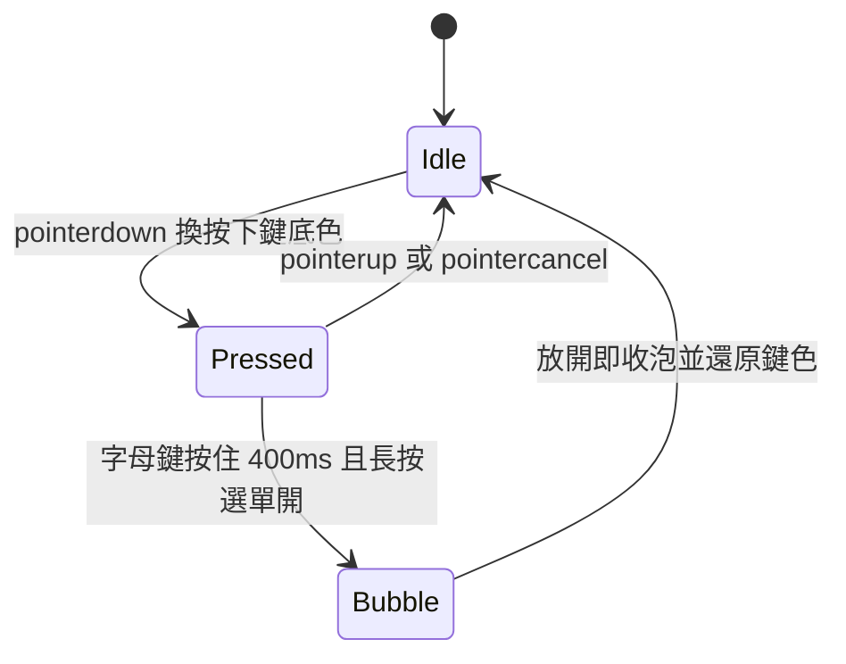

2026-08-19

# ohmybias-skin：預覽/設定分區明確化＋預覽鍵盤可實按

## 做了什麼、為什麼

參考蝦米輸入法皮膚設計器的版面：它把「看的區」與「調的區」分得一眼可辨 —
左半是一整片灰色畫布浮著鍵盤，右半是白卡表單。ohmybias-skin 原本兩邊都是
白卡加墨線框、連分頁都同一種鍵帽造型按鈕，第一眼分不出哪塊是預覽、哪塊是設定。

這次把兩區改成兩種視覺語言：

- **預覽區 = 點陣紙舞台**。點陣底（`--stage` 色票）、拿掉墨線外框，
  鍵盤預覽浮起帶陰影；掛「即時預覽」標頭，副標直接寫明「鍵盤可以按」。
- **設定區 = 白卡表單**。保留白卡並接手原本在預覽卡上的 1.5px 粗墨線框；
  掛「皮膚設定」標頭。
- **控件語言分流**：預覽的頁面切換（蝦米/數字/符號面板/Emoji）從鍵帽造型
  改成藥丸 chip，跟淺深色、組字中等檢視 chip 同一族；鍵帽造型按鈕從此只出現在
  「會改到皮膚」的設定分頁 — 鍵帽＝設定、藥丸＝觀看。

手機版原有的 sticky 縮小邏輯照舊：進入 compact 時把區塊標頭 `display:none`
收掉省高度，量測程式本來就是切 class 後實量、自動吃到這個差額。

## 預覽鍵盤互動

「配色」分頁裡可調「按下鍵底」（keyNormalHighlight / keySystemHighlight）與
整組長按氣泡色，但預覽從來沒有地方展示按壓態；氣泡也只有一顆釘住示意的 chip。
現在預覽鍵盤直接可按：

- 一般鍵按下換 keyNormalHighlight、功能鍵換 keySystemHighlight，放開還原。
- 字母鍵按住 400ms 在**該鍵**上方跳長按氣泡：吃「長按選單」全域開關與
  「長按選單排序」設定；e 鍵給完整重音樣本，其餘字母示意大小寫排序。
  原本的「長按氣泡」chip 保留 — 釘住氣泡慢慢調色用（錨在 e 鍵）。
- `buildBubble` 從「寫死錨在 e 鍵」改成收 anchor 與 options 參數，
  釘住示意與互動氣泡共用同一段繪製。

### 實作時碰到的取捨

- **Pointer capture**：`setPointerCapture` 讓手指滑出鍵外仍收得到 pointerup，
  不會卡在按壓態；無 PointerEvent 的舊 WebView（本站支援到 Chrome < 64）
  退回 mouse/touch 事件。
- **`touch-action: manipulation` 而非 `none`**：手機版預覽 sticky 在頁面頂端，
  從鍵盤上起手捲頁必須仍然可捲 — 捲動觸發 pointercancel、按壓態自動還原，
  只犧牲雙擊縮放。
- **contextmenu 擋掉**：長按試氣泡時瀏覽器自己的長按/右鍵選單會蓋上來，
  在 `#pv-frame` 上 preventDefault（只掛一次，用 dataset 旗標防重複掛）。

commit：b0a36b6（ohmybias-skin）
