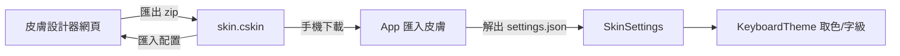

2026-08-16

# ohmybias-skin：純化版皮膚設計器靜態網站（新 repo，GitHub Pages）

OhMyBias 米（嘸蝦米鍵盤，Android＋iOS）一直能匯入 `.cskin` 皮膚，但唯一的設計工具是
Ryan 的「蝦米輸入法皮膚設計器」（Gemini Canvas app）。它為 iOS 元書輸入法而生，
大半功能對 OhMyBias 無效：AI 靈感配色、九鍵盤套用範圍與 overrides、分行滑動開關、
慣用手／內嵌模式、jsonnet 佈局編譯與資源打包。原本想「純化」該網站，但其原始碼
不在任何 repo（`rime-liur-ios-new-skin` 只有 guide 與 jsonnet 模板），Gemini share
頁又拿不到源碼——於是改為**以 cskin 資料模型為本，重寫一個純化版**。

成品：<https://plateaukao.github.io/ohmybias-skin/>（repo `plateaukao/ohmybias-skin`）。
純 vanilla HTML/CSS/JS、零依賴、無 build step，手機優先 RWD，繁體中文 UI。

## 純化的依據：兩個 App 實際讀什麼

一切以 `SkinSettings` ＋ `KeyboardTheme`（Android/iOS 逐行對照過，兩邊一致）為準：

- **調色盤 24 色 × 淺深 ＋ `borderSize`**：一般鍵／功能鍵／工具列／候選列／面板／
  長按氣泡各色，含 fallback 別名鏈（`textSystem→textMain`、`toolbarBg→bg`、
  `systemBorder→border`…）。設計器預覽走同一條鏈與同一組 sweetlime 預設值，
  所見即 App 所得。
- **字級 7 鍵**：`lowercaseSize/systemSize/numberSize/swipeSize/panelLarge{Symbol,Emoji,Kaomoji}Size`。
  `toolbarSize`、`panelSmallSize` 兩鍵在兩個 App 都是 dead accessor → 純化掉。
- **工具列 10 格**：只提供 App 支援的 ID。平台差異由設計器頂部的 Android/iOS
  切換呈現（依 user agent 預選）：iOS 不支援 4 簡繁／11 複製／12 剪下／14 復原／
  15 重做（extension API 缺失），且 ID 10 在 Android 是「全選」、iOS 是「常用語」。
  不支援的按鈕標「僅 Android」、預覽照 App 行為留空格。
- **佈局**：`keyboardLayout`（row ⇄ 九宮格+面板）、`longPressLayout`（長按選單大小寫序）。
  `spaceKeyLayout` 兩個 App 都刻意不用（空白鍵永遠最大）→ 純化掉。
- **滑動與長按**：只有 5 個全域開關（App 不讀分行設定）。

## 設計要點

- **預覽即引擎**：四頁（蝦米／數字隨 layout 切 row 或九宮格／符號面板／Emoji）＋
  候選列（工具列與「組字中」兩態）＋長按氣泡示意。幾何逐行移植
  `KeyboardView.onLayout`（padding 6/6/3、列距 8、鍵距 5、字母頁第二列置中、
  空白鍵吃剩餘寬），以 `--u = 容器寬/393dp` CSS 變數縮放，所有尺寸
  `calc(var(--u) * N)`，DOM 不因 resize 重建。
- **cskin 十六進位 `#RRGGBBAA`（alpha 在尾端）恰好就是 CSS 8-digit hex** —— 色值
  原字串直通預覽，無轉換損耗。
- **迷你 zip（`zip.js`）**：寫出用 STORE＋CRC32（兩 App 的解 zip 都收）；讀取解析
  central directory，DEFLATE 走瀏覽器內建 `DecompressionStream('deflate-raw')` ——
  零依賴仍能匯入 Ryan 設計器輸出的壓縮 .cskin。
- **匯入雙 schema**：對照 `SkinSettings.apply` 同時吃扁平新 schema 與舊巢狀
  schema（`layout/toolbar/swipe/globalSettings`）；缺鍵時照 App 的別名鏈補齊後
  materialize，匯入後編輯器所見＝App 會渲染的樣子。
- **匯出**：`<皮膚名>.cskin`（zip 內 `jsonnet/settings.json` 扁平 schema），App 端
  **零改動**直接走現有「匯入皮膚（.cskin）」。
- 視覺語彙取自內建皮膚 sweetlime 的手繪線稿風：紙感底、墨線鍵帽式分頁按鈕、
  萊姆綠點綴；localStorage 自動保存進度。

## 驗證

1. Chrome 實測（手機寬 500px＋桌機 1280px）：四頁預覽、深淺色、組字態、氣泡、
   工具列指派即時反映；iOS 模式徽章與空格行為正確。
2. Node 以同一份 `zip.js`/`data.js` 產出 .cskin → 系統 `unzip`＋Python `zipfile`
   CRC 全過；round-trip 讀回一致。
3. 以 Ryan 設計器輸出的真實 `sweetlime.cskin`（巢狀 schema、DEFLATE）走完整
   UI 匯入 → 名稱／工具列／調色盤／開關全數正確帶入。
4. **上機**：匯出「測試粉紅」（粉鍵面＋紅邊框）→ adb 推上模擬器 → App SAF
   匯入 → 鍵盤呈現與網頁預覽一致（連工具列順序、角標、功能鍵不受影響都吻合）。

## 取捨

- 不做 per-keyboard overrides、陰影、空白鍵/Enter 專屬色 —— App 根本不讀，
  留著只會誤導使用者「調了沒反應」。
- 預覽不含注音／顏文字頁：色鍵與現有四頁完全重疊，多做只是重複。
- sim-use 的 Android bridge 在本機壞掉（homebrew 與 dev build 框架衝突），上機
  驗證退回 adb＋uiautomator dump 完成。
