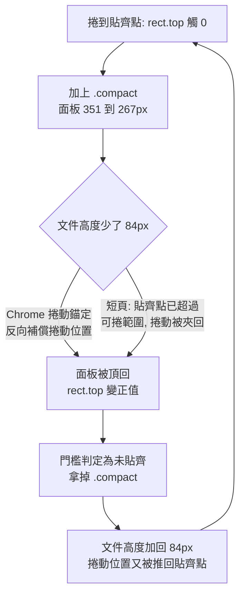
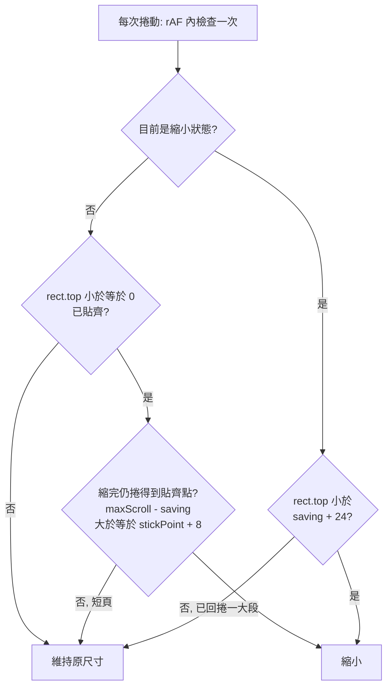

2026-08-17

# OhMyBias 皮膚設計器：釘住的鍵盤預覽捲動後縮成 2/3 寬

手機版把鍵盤預覽 `position: sticky` 釘在頂端，捲動設定時仍看得到配色效果。問題是預覽以整個內容寬渲染，在一般手機上釘住後佔掉將近半個螢幕高度 —— 下方的設定項目擠不下，等於用捲動換來一個看得到但改不動的預覽。

這次讓預覽「貼齊之後才縮」：釘到頂端時卡片縮成 `min(66vw, 100%)` 並置中，回捲一段再還原原尺寸。鍵盤本體所有尺寸都是 `calc(var(--u) * N)`、而 `--u = 卡片實際寬 / 設計寬 393`，寬度一改，高度就等比跟著縮，不必另外算 —— 在 390×800 的手機上，釘住的面板從 351px 降到 267px，讓出約 84px 給下方設定。切換用 `.preview-col.compact` 這個 class，寬度加上 .18s 轉場，縮放過程中 `ResizeObserver` 會逐幀重算 `--u`，鍵盤是平滑縮小而不是跳一下。

## 真正花時間的部分：面板在門檻附近無限縮放／還原

「貼齊就縮」這個規則本身有個回授迴圈：縮小會改變面板在流內的高度 → 文件變矮 → 捲動位置被動了 → 面板看起來不再貼齊 → 還原 → 文件變高 → 又貼齊。第一版做出來就是這樣抖，使用者在「佈局」分頁看得最明顯。



迴圈有兩條不同的路徑進來，得分開處理。

**一、Chrome 的捲動錨定（scroll anchoring）。** 面板縮小後，它下面的內容整段往上移，Chrome 為了讓使用者看的內容不要跳，會反向調整捲動位置補回來 —— 補的量剛好就是省下的 84px，於是面板被頂回「還沒貼齊」的位置。這是瀏覽器在做對的事，只是跟 sticky 的狀態判定互咬。手機版直接關掉補償：

```css
@media (max-width: 899px) {
  html { overflow-anchor: none; }
}
```

關掉之後縮放時下方內容會順著轉場滑上來，因為高度是漸變的，看起來像是設定跟著鍵盤一起讓位，不是硬跳。

**二、頁面根本不夠長。** 「佈局」分頁只有兩組選項，縮小後文件變矮，貼齊點直接超出可捲範圍，瀏覽器把捲動位置夾回來，面板當然彈開 —— 這條路徑跟錨定無關，關掉 `overflow-anchor` 也擋不住。解法是在「要不要縮」的判斷裡先問一句：縮完之後還捲得到貼齊點嗎？



短頁因此維持原尺寸 —— 這也是對的結果：頁面短到不太需要捲，本來就不缺那 84px。還原門檻取 `saving + 24` 而不是固定的十幾 px，是因為任何一次夾回／補償的跳幅上限就是 `saving`，門檻小於跳幅的話，縮完馬上會被自己造成的位移判定成「該還原」。

## 兩個量錯的值

守門條件要成立，得先量得準，而兩個量法都踩到坑：

- **省下的高度**：切上 class 後同步 `getBoundingClientRect()` 只量到 12px，不是實際的 84px。因為鍵盤高度是由 `--u` 換算的，而 `--u` 平常靠 `ResizeObserver` 在下一幀才更新 —— 同步量到的是「卡片已經變窄、鍵盤還是舊高度」的中間態。改成量測時直接呼叫 `syncPreviewScale()` 補算，並暫時掛 `.measuring` 關掉寬度轉場，量的才是終值。
- **貼齊點**：`pageYOffset + rect.top` 和 `offsetTop` 兩種算法都不能用。sticky 一貼齊，`rect.top` 就釘死在 0（那個算式回傳的其實是當下捲動位置）；而 Chrome 的 `offsetTop` 會把 sticky 位移含進去 —— 實測捲到 993 時它就回報 993，貼齊點永遠等於現在位置，守門條件於是全都判否，任何分頁都不縮。改量不會 sticky 的父層 `.workspace`（預覽是它第一個子項，上緣同一條線），值就穩定停在 272。

## 驗證方式

Chrome 擴充功能改不動這台機器的視窗寬度，改成在頁面裡開一個 390×800 的同源 iframe —— iframe 內的媒體查詢是對自己的 viewport 判斷的，所以手機版面、sticky、捲動全都是真的。用 `MutationObserver` 盯 `.preview-col` 的 class，把五個設定分頁各捲到底再捲回頂端，數切換次數：修好前在門檻附近是 24 次、頁尾是 20 次；修好後每個分頁剛好 2 次（縮一次、還原一次），「佈局」是 0 次。桌面版（≥900px）維持雙欄不受影響。

順帶一提，測到一半數字全部變成「不會縮」，是因為分頁被切到背景，Chrome 把計時器節流到約 1Hz、`requestAnimationFrame` 也停了 —— 不是程式壞掉。這類用 rAF 驅動的行為，驗證時要確認分頁真的在前景。

## 同一次提交：工具列選單只留當下平台能用的按鈕

選好 Android／iOS 之後，選單卻還是把兩個平台的東西全列出來，等於要使用者自己過濾：

- 名稱寫成「全選（Android）／常用語（iOS）」擠成三行 —— 改成只顯示當下平台的名稱（`labels` 對照表，沒列到的平台用原本的 `label`）。
- iOS 做不到的按鈕（簡繁切換、複製、剪下、復原、重做、語音輸入）原本畫成淡色 Android 字樣加「僅 Android」標籤 —— 那個字樣根本不是 iOS 上會出現的樣子，直接不列，21 項剩 14 項。
- ID 10 在 iOS 的行為跟 ID 5 完全一樣（App 端 `CandidateBar.swift` 註明鍵盤 extension 無 API 可全選，這格固定當 ♥ 常用語），選單會出現兩個一模一樣的「常用語」。`dup` 從布林擴成可指定平台（`dup: 'ios'`），iOS 下不列。

匯入的 `.cskin` 若帶著該平台不支援的 ID，上方工具列格子仍會顯示成淡色空位（跟 App 一致），只是選單不再提供。名稱變短後格子也收小：`minmax(104px)`／`min-height: 68px` → `minmax(70px)`／`50px`，手機一列從 2 格變 4 格。
