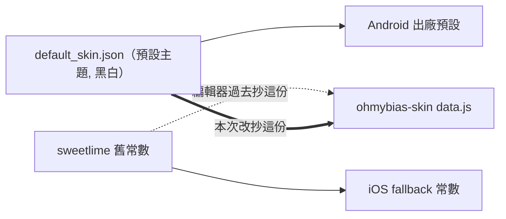

2026-08-19

# ohmybias-skin：預設值同步 App 出廠「預設主題」— 工具列不再有游標鍵

## 什麼壞了

編輯器的預設工具列出現游標左移/右移（ID 16/17），但使用者先前已經給
App 定了新的出廠預設主題，裡面沒有這兩顆。另外還原預設後的四個色值
也跟 App 出廠值對不上。

## 根因

預設值有兩份互相漂移的來源：

ohmybias-android 自 272a618 起，出廠預設改為 `assets/default_skin.json` 的黑白
「預設主題」（工具列 `[3,7,29,8,5,26,13,1,32,2]`，無游標鍵），「還原內建」也還原到它。
但 ohmybias-skin 的 `data.js` 是更早從 sweetlime 程式常數抄來的
（`[1,3,9,7,16,17,8,5,13,2]`，含游標鍵），之後沒人同步，於是漂移：
工具列差兩顆，加上四個色值（淺色 bg `#FFFFFF` vs `#FFFFFFB1`、淺色 textSub
`#666666` vs `#222222`、淺色 keySystem `#D6D6D696` vs `#D6D6D6C2`、
深色 textSub `#555555` vs `#999999`）。

除錯時另外兩層干擾把問題蓋住，值得記下：

- **localStorage 舊狀態**：編輯器自動存檔，改了預設值後舊分頁照樣渲染存過的
  舊工具列，必須按「還原預設」（兩段式：先變「確定還原？」再按一次）才吃到新值。
- **HTTP 快取**：本機預覽用 `python3 -m http.server` 不送 Cache-Control，
  舊分頁按還原時跑的還是記憶體裡的舊 JS，還原出來的自然還是舊 sweetlime 預設 —
  看起來就像「還原預設沒作用」。本機預覽伺服器改成送 `Cache-Control: no-store`。

## 修法

`data.js` 逐鍵改抄 `default_skin.json`：`DEFAULT_TOOLBAR`、上述四色，
並用腳本逐鍵比對確認 編輯器預設 == default_skin.json（工具列、48 色值、字級全同）。
還原 toast 從「已還原為內建 sweetlime 預設」改稱「已還原為內建『預設主題』」，
檔頭註解標明 default_skin.json 是出廠事實來源、改了要同步回來。

## 待辦（App 端）

ohmybias-ios 尚未跟進「預設主題」— `SkinSettings.swift` 的 fallback 仍是
sweetlime 常數（含游標鍵），也沒有隨附的出廠 default_skin。另外 ID 32
語音輸入是 Android 專屬，iOS 工具列該格顯示為空格（與 App 行為一致）。

commit：74e1d17（ohmybias-skin）
