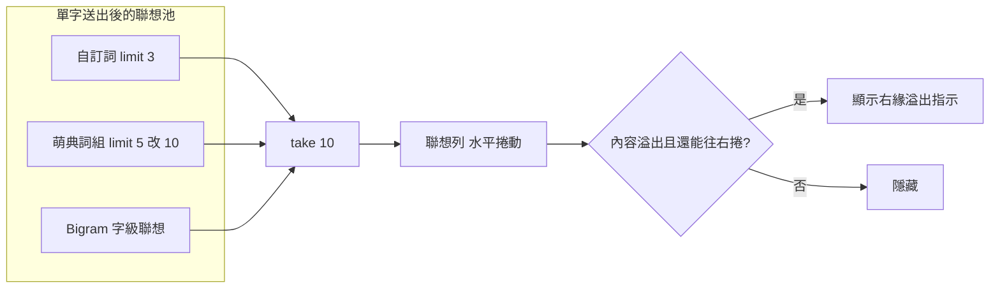

2026-08-25

# 單字聯想 5→10 個＋候選列右緣「›」溢出指示（Android + iOS）

使用者回報：Android 版聯想詞「只剩 5 個」，而且聯想列「滑不動」。

## 診斷：不是捲動壞了，是真的只有 5 個

在模擬器上重現後發現捲動機制完全正常 — 塞入幾條長自訂詞讓聯想列真的
溢出，一滑就動。滑不動的原因是 5 個詞塞不滿一列，根本沒東西可捲。

真正的瓶頸在引擎：送出單一字後的聯想走 `SuggestionEngine` 的單字
fallback，`suggestDomainTerms(prefix, limit: 5)` 把萌典詞組硬砍在 5，
後面的 `take(10)` 從來吃不滿 — 而 `phrases.bin` 每個字其實最多存 30 條
（「月」就有整整 30 條）。iOS 版數字一模一樣，是移植時原樣帶過來的
既有行為，不是 Android 退化。

另一個問題是「看不出還有更多」：候選捲動區的捲軸本來就隱藏
（`isHorizontalScrollBarEnabled = false`），內容溢出時沒有任何視覺線索，
使用者自然以為眼前這幾個就是全部。

## 修改（兩平台同步，引擎層維持一對一）

1. **聯想上限 5→10**：`SuggestionEngine` 單字 fallback 的
   `suggestDomainTerms` limit 改 10，讓結尾的 `take(10)` 名副其實。
2. **右緣「›」溢出指示**：
   - Android（`CandidateBar.kt`）：TextView 疊在候選捲動區右緣，
     `canScrollHorizontally(1)` 為真才顯示，捲到底自動消失；監聽
     scroll 與 layout 變化。覆蓋工具列模式時貼齊捲動區右緣（避開右側
     保留的那顆工具列鍵）。不設 clickable — 觸控穿透到捲動區，從 › 上
     照樣能起手滑動。有底色（同列背景）才不會與被截斷的候選字重疊難讀。
   - iOS（`CandidateBar.swift`）：UILabel 釘在 trailing，
     `scrollViewDidScroll` 與 `layoutSubviews` 更新顯示狀態；玻璃模式
     底色維持透明。

## 驗證

- Android：模擬器實測 — 打「月」出 10 個聯想、首次顯示即有 ›、捲到底
  消失、捲回來重現；`testDebugUnitTest` 全過。
- iOS：引擎測試 141/141 過；OhMyBiasKeyboard target 模擬器編譯通過
  （UI 未實機驗證）。

Commits：ohmybias-android `36e6f8e`、ohmybias-ios `2981cc9`。
