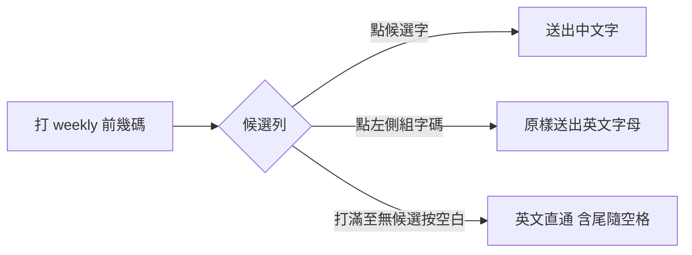

2026-08-17

# OhMyBias：組字碼可點 — 有候選也能直接送出英文單字

Android `fe968ac`、iOS `b1fc92e`（引擎層一對一鏡射）。

## 做什麼、為什麼

打 weekly 這類「前幾碼恰好是有效字根」的英文字時，候選列一直有中文候選，
既有的英文直通（打滿至無候選後按空白）幫不上忙 — 使用者要英文單字，
卻只能硬把字打長或先清掉候選。現在候選列**左側的組字碼本身可以點**：
點了就把打的字母原樣上屏，等於英文直通的手動版。

## 怎麼做

- 引擎新增 `commitComposingRaw()`：組字非空時原樣 `engineDidCommit` 後重置。
  比照英文直通**不記字頻**；與空白鍵直通不同的是**不帶尾隨空格**（點擊是
  精準意圖，空格由使用者自己決定）。注音／拼音／同音／Pin／`,,` 指令等
  特殊模式中不動作（那些狀態下組字碼不是英文字母）。
- Android：`CandidateBar` 組字標籤 `isClickable` ＋ `onCommitComposing`
  callback，service 接線帶觸覺回饋。
- iOS：`composingLabel` 加 `UITapGestureRecognizer`，`KeyboardViewController`
  接線同樣帶觸覺回饋。引擎方法在 `Shared/InputEngine.swift` 同名鏡射。

## 驗證

兩平台各補引擎測試（原樣送出、清空狀態、空組字無動作）：Android
`testDebugUnitTest` 全綠、iOS `Tests/run_tests.sh` 83 passed。Android 於
API 34 模擬器（真字表）實測：打「a」出現候選「對」，點組字碼得到英文 `a`。
