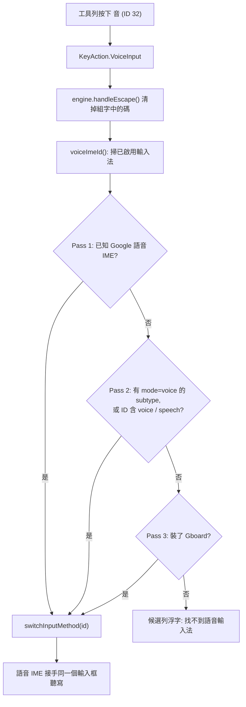

2026-08-16

# 工具列新增「語音輸入」按鈕（Android ID 32）

OhMyBias 米的工具列一直沒有語音輸入。使用者要講話輸入時得自己按 🌐 換到 Gboard 或
Google 語音輸入法，講完再換回來 — 一趟要動兩次系統輸入法選單。這次把它做成工具列上的
一顆按鈕，並同步進皮膚設計器 `ohmybias-skin`，讓使用者可以自己排到工具列的任一格。

## 作法：照抄 sweetlime 的 startVoiceInput 流程

Android 的 IME 不能自己開聽寫視窗 — `RecognizerIntent` 要一個 Activity，從
InputMethodService 拉一個 Activity 起來會把使用者正在打字的畫面蓋掉，而且辨識結果還得
自己塞回 `InputConnection`，等於重做一套語音 UI。sweetlime（`LIMEService.startVoiceInput()`）
的作法才是 Android 上的正解：**把輸入法切給系統的語音輸入法**，由它接手聽寫，
它會直接把文字送進同一個輸入框，講完自己切回來。使用者體感就是「按麥克風 → 講話 → 字出現」。

所以本專案完全照著移植，包含 `LIMEUtilities.isVoiceSearchServiceExist()` 的三段搜尋：

Pass 3 的 Gboard 是退而求其次：Gboard 有內建語音但不對外提供語音專用 IME/subtype，
切過去至少讓使用者按得到 Gboard 自己的麥克風鍵。三段都沒中就用候選列的浮字提示
（不是 Toast — IME 內走既有的 `showToast()`）。

實作落在三個檔：`KeyAction.VoiceInput`、`OhMyBiasImeService` 的
`startVoiceInput()` / `voiceImeId()`、以及 `CandidateBar` 的按鈕 ID 對應表。

## 按鈕 ID 選 32

工具列按鈕 ID 是 Hamster 那套編號，App 端的對應表註解記得很清楚：0 佔位、6 剪貼本、
18-25 與 31 是 Hamster 專屬。也就是說 31 以下都被別人佔著了，本家自訂只能從 **32** 開始。
語音輸入拿 32，並在 `CandidateBar` 的註解裡寫明「32 起是本家自訂 ID，需與皮膚設計器
`data.js` 同步」，免得下一顆自訂按鈕又去踩到 Hamster 的號碼。

iOS 版標成不支援（設計器顯示「僅 Android」）— 鍵盤 extension 沒有切換到其他輸入法的 API。

## 麥克風怎麼畫：Android 沒有黑白的麥克風字

工具列其他鍵都是文字字樣（設／米／符／顏／←／∨），顏色由 `TextView.setTextColor` 吃皮膚的
`toolbarColor`。麥克風本來也想比照辦理，先在模擬器上把候選字列的四種寫法並排畫出來看：

| 候選 | 結果 |
|---|---|
| 🎤 U+1F3A4 | 彩色 emoji |
| 🎤︎ U+1F3A4 + VS15（要求文字呈現）| 一樣彩色 — Android 沒有這個碼位的文字字形可退 |
| 🎙 U+1F399（Emoji_Presentation=No）| 一樣彩色 |
| 🎙︎ U+1F399 + VS15 | 一樣彩色 |

結論是 Android 的字型堆疊沒有黑白麥克風可用，四種都會變成不吃 `toolbarColor` 的彩色點陣，
跟旁邊的字擺一起很突兀。改走系統內建圖示 `android.R.drawable.ic_btn_speak_now`：
`ToolbarItem` 多一個 `iconRes` 欄位，非 0 時工具列改放 `ImageView` 並用
`imageTintList = toolbarColor` 上色，行為與文字鍵完全一樣（含 contentDescription）。
不自帶向量圖是因為這顆本來就是系統的語音輸入鍵，用平台自己的資產最不會走鐘、也不用多帶檔案。

大小則是量出來的：`ImageView` 內縮 12dp 時圖示只有 28px 高，旁邊 19sp 的「音」是 47px，
明顯小一號。掃過 12/9/6/3/0dp 五種內縮拍照量像素，**6dp** 畫出來 50px，與字樣的 47px 同一級，
定案。

設計器那邊 `android` 欄原本只能放文字，這次比照 `ios` 欄開放 `{ icon }`，
`icons.js` 補一個同形狀的 inline SVG（走 `currentColor`），預覽才會跟 App 長得一樣。

## 設計器：順手收掉重複的「符號面板」

排按鈕時會看到兩個一模一樣的「符號面板」選項 — ID 7 和 30 在 Android 與 iOS 都對到同一個
動作，這是 Hamster 編號表本來就有的重複。直接把 30 從清單刪掉會讓既有 `.cskin` 匯進來
變成空格，所以改成在 `data.js` 標 `dup: true`：解析、預覽照舊認得 30，
只是選按鈕的清單 (`app.js` 的 `renderToolbarPanel`) 跳過它。之後再遇到這種同義 ID
沿用同一個旗標即可。

## 驗證

模擬器 Pixel_7_API_34（已啟用 `com.google.android.tts/...VoiceInputMethodService`）：
推一份 `toolbarButtons: [1,3,9,32,...]` 的 `skin_settings.json` 進 `files/shared/`，
重開 App → 點測試輸入框叫出鍵盤 → 工具列第 4 格出現麥克風 → 點下去，
`settings get secure default_input_method` 變成 Google 語音 IME，畫面出現它的
「Tap to pause」聽寫面板，貼在同一個輸入框上。字樣比對與內縮掃描也是同一套流程
（把候選寫法暫時掛在 33-37 號，並排拍照比完再刪）。

設計器則在本機 `python3 -m http.server` 開起來確認：Android 平台下「語音輸入」選項無
「僅 Android」徽章、放進格子後選格與預覽工具列都畫出麥克風 SVG；iOS 平台下顯示為不支援；
清單只剩一個「符號面板」；主控台無錯誤。（改了 module 要換 port 重開，
Chrome 對 ES module 的快取不吃 `?v=` 蓋在 index.html 上。）

設計器已推上 GitHub Pages（`ohmybias-skin` `8dfc268` ＋ `24d6c25`）。App 端改動待 commit —
舊版 App 讀到 ID 32 會依既有規則降級成空白格，兩邊不同步也不會壞。
