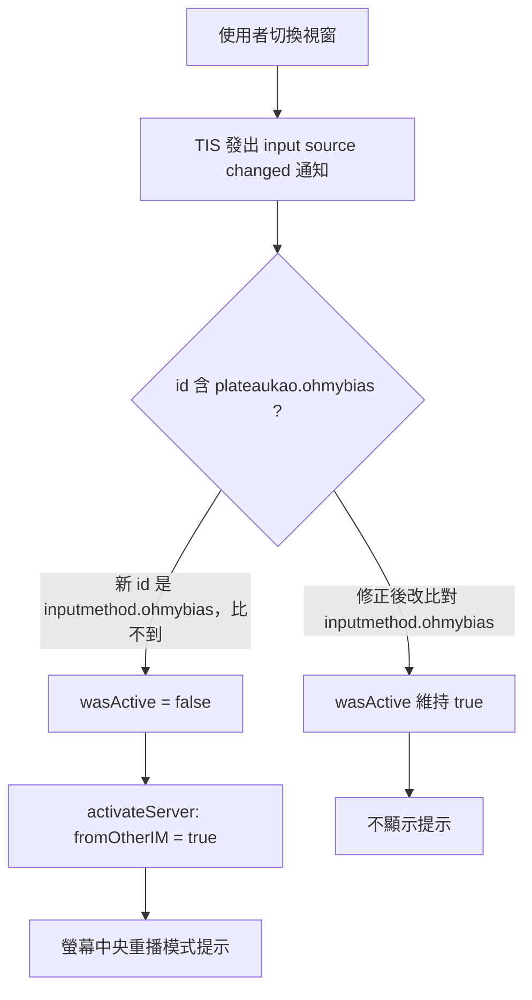

2026-08-14

# OhMyBias v0.2.0 — 首個公開發行版：三個選字窗／提示修正＋「無米蝦」定名

OhMyBias（Yabomish 的極簡嘸蝦米分支）發佈第一個公開版本：新開 GitHub repo
[plateaukao/ohmybias](https://github.com/plateaukao/ohmybias)，附上已簽章＋Apple
公證＋staple 的 `OhMyBias-0.2.0.pkg`（[Release
v0.2.0](https://github.com/plateaukao/ohmybias/releases/tag/v0.2.0)）。發行前這個
session 修了三個使用者實際碰到的問題，並把輸入來源顯示名稱改為「無米蝦」。

## 修正一：游標選字窗過寬（兩個獨立原因）

使用者回報直向選字窗比內容寬一大截。查下來是兩個疊在一起的原因：

1. **上游修正漏移植** — Yabomish 的 `fix/cursor-panel-stale-width`（dea1c41）：
   隱藏中的固定模式標籤（fixedLabel）殘留 leading/trailing constraint 與上次顯示的
   長文字，其 compression resistance 把視窗最小寬度撐在舊尺寸，`setContentSize`
   縮小後立即被 Auto Layout 撐回。修法是該組 constraint 只在固定模式啟用。
   這個 commit 只存在於**未合併的側分支**，抽出 OhMyBias 時是從
   `feat/signed-release` HEAD 整包 diff，因此漏掉 — 教訓：移植修正要
   `git branch -a` 掃全部分支（`git log <base>..<branch>`），不能只比 HEAD。
2. **80pt 最小寬度下限** — 直向模式 `max(size.width + 12, 80)`，候選只有兩字
   （如「0可」）時內容約 45pt，被硬撐到 80pt。這不是移植遺漏，上游也有；
   是 OhMyBias 刻意分歧：拿掉下限、貼齊內容寬。

## 修正二：每次切換視窗都跳出模式提示

0.2.0 把 bundle id 改成 `info.plateaukao.inputmethod.ohmybias`（TIS 只註冊含
`inputmethod` 子字串的輸入法）之後，輸入來源觀察者裡的舊子字串比對
`id?.contains("plateaukao.ohmybias")` 永遠比不到新 id — 於是每個 TIS 通知都被
誤判為「換到別的輸入法」，切回任何視窗都重播螢幕中央的模式提示：

改比對 `inputmethod.ohmybias`，並順手把使用者的 `showActivateToast` 偏好關掉
（偏好設定 → 外觀 → 「切入提示」可再開）。改 bundle id 時全案搜尋舊字串有掃過，
但這一處是「子字串包含」而非全等比對，字面上不含 `inputmethod` 所以沒被抓到 —
rename 時 `contains`／prefix 類的部分比對是盲區。

## 定名「無米蝦」

系統設定的輸入來源清單原本上下兩行都是 OhMyBias（粗體＝input mode 名稱、
灰色副標＝提供該來源的 app 名稱）。灰色副標是系統設定對**第三方輸入法**的固定
標示 — Squirrel（宣告結構與本案完全相同）也有；Apple 內建輸入法（TCIM 等）
走私有註冊機制、Info.plist 根本沒有 `ComponentInputModeDict`，所以宣告 input
mode 的第三方做不出單行。折衷：mode 名稱（en＋zh-Hant 的 InfoPlist.strings）
改為「無米蝦」、app 名稱維持 OhMyBias，清單顯示「無米蝦／OhMyBias」不再同名
重複。真要單行只能拿掉 input mode 宣告，但那會失去 macOS 26 的模板選單圖示
（自動反轉），不值得。

## 發行

`release.sh`（swiftc 建置 → Developer ID 簽 app → pkgbuild/productbuild →
productsign → notarytool 公證 → staple）產出 748KB 的 pkg；`gh repo create`
開新公開 repo、推 main、`gh release create v0.2.0` 附上 pkg。README 連結上游
[Yabomish](https://github.com/plateaukao/yabomish)，安裝指引改指「無米蝦」。
