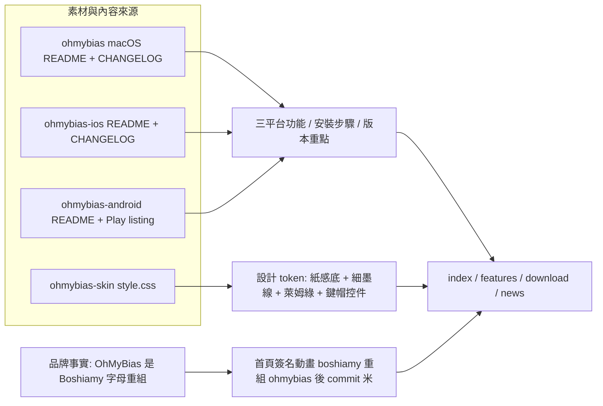

2026-09-03

# ohmybias-web：官方網站初版 — 四頁靜態站

OhMyBias 米 至今只有三個 app repo 各自的 README，沒有一個對使用者的入口。
新 repo `ohmybias-web`（https://github.com/plateaukao/ohmybias-web）補上這塊：
純靜態 HTML/CSS/JS、零建置、僅繁體中文，四頁 — 首頁（index）、功能（features）、
下載（download）、更新（news）。原本做成 one-pager，中途依需求改為多頁。

## 內容與視覺從哪裡來

內容不是新寫的行銷稿，全部整理自三個 app repo 既有的 README／CHANGELOG／
Play listing 文案；視覺不是新發明的識別，直接沿用家族現有的設計語彙 —
ohmybias-skin（外觀編輯器網站）的 `style.css` 調色盤與造型規則：
紙感底（#FAF9F5）、細墨線（1.5px #1C1C1A 邊框）、萊姆綠點綴
（#B5CC5A／#EFF3DC／#6E8A1F）、鍵帽造型控件、點陣 stage 底紋。
標題字用 Chocolate Classical Sans（鉛字復刻感，呼應嘸蝦米的年代）、
內文 Noto Sans TC、碼與指令 IBM Plex Mono。

## 首頁簽名動畫：為什麼是字母重組而不是打碼示範

最直覺的 hero 是「打幾個碼、跳出候選字」的輸入法示範，但那需要展示真實的
嘸蝦米編碼 — liu.cin 是行易版權物，官方網站不該出現任何「某碼＝某字」的
對應（拿不準還會寫錯，嘸蝦米使用者一眼看穿）。改用一個完全真實、又只屬於
這個品牌的事實：OhMyBias 是 Boshiamy 的字母重組。動畫逐鍵打出
`boshiamy` 八個鍵帽 → FLIP 重排成 `ohmybias` → 候選列選 1 → commit「米」。
無 JS 時 markup 內建最終畫面；`prefers-reduced-motion` 時顯示靜態結果。

macOS 平台視覺同理不造假 UI：不 mock 候選窗（會暗示編碼），改畫選單列的
輸入法選單（✓ 無米蝦／偏好設定⋯ — 都是真實存在的項目）。

## 落地時踩到的兩個坑

- **reduce-motion 通用覆寫把游標變頻閃** — 常見的
  `*{animation-duration:.01ms!important}` 對「無限循環」動畫是災難：
  demo 游標的 1.2s 閃爍變成每 0.01ms 一輪的高速頻閃（使用者實際回報
  「cursor blinks so fast」）。修法：覆寫加上 `animation-iteration-count:1`，
  游標另外指定 `animation:none; opacity:1` 恆亮。
- **headless Chrome 假溢位** — `--window-size=390` 截圖時整頁右緣被切，
  看起來像 mobile 溢位，實際是 macOS Chrome 視窗最小寬約 500px：
  layout 以 500px 排版、截圖只擷 390px，所有東西「等寬地」被切掉。
  用 500px 重截即正常。窄幅驗證別用 headless window-size 硬縮。

## 其他決策

- 下載頁把「字表自備（liu.cin 版權屬行易）、裝置上編譯、不離開裝置」
  聲明置頂 — 這是三個 app 共同的法律與隱私立場，安裝前必讀。
- iOS 於本日上架 App Store（id6805070802），下載頁用免地區的
  `apps.apple.com/app/id6805070802` 連結；Android 連 Google Play
  （`info.plateaukao.ohmybias.g`）與 GitHub APK 雙通道，並註明
  Android 9 裝置只能走 APK（Play 商店已不支援）。
- 更新頁（news）為手動整理的近期重點，資料來源是各 repo 的
  CHANGELOG.md／Play release notes — 各平台發新版時記得同步。
