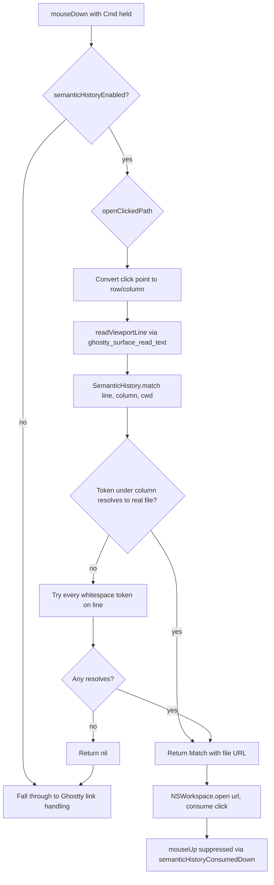

# Prowl — Semantic History: Cmd+click to open file paths in the terminal

## Summary

Added iTerm2-style "Semantic History" to Prowl's terminal surfaces. Cmd+clicking a
bare file path inside a terminal now opens that file (or directory) on disk via
`NSWorkspace`. Ghostty only linkifies text that carries a known URL *scheme*
(`http://`, `file://`, …), so bare paths like `~/src/foo.md`, `Sources/App.swift`,
or `/etc/hosts` were previously invisible and unclickable. This fills that gap
entirely in the embedding layer.

A related fix: `GHOSTTY_ACTION_OPEN_URL` previously captured the clicked URL into
view state but never actually opened it, so even scheme'd links did nothing — the
handler now opens them.

The path-click behavior is **opt-in and off by default**, exposed as a
`semanticHistoryEnabled` global setting (Settings → General → Terminal → "Open file
paths on Cmd+click"). It defaults off because it intercepts Cmd+click in the
terminal, which some users rely on for selection or other bindings.

## Approach

The path-detection logic lives in a small, pure, UI-free `SemanticHistory` enum so
it can be unit-tested without a live terminal surface. The view layer supplies three
inputs — the clicked line of text, the click column, and the surface's cwd — and gets
back a concrete file `URL` to open (or `nil` to fall through to Ghostty's own click
handling).

The setting is stored in `GlobalSettings` (persisted to `~/.prowl/settings.json`)
following the existing inline-default pattern, and read in the AppKit terminal layer
via `@Shared(.settingsFile)` — the same Sharing-backed store the TCA reducers write
to, so toggling it in Settings takes effect immediately without a bespoke client.
`mouseDown` checks the flag before attempting any path resolution:

Detection details:

- **Token extraction** scans outward from the click column over a maximal non-break
  run. Path-friendly characters (`/ . - _ ~ : @ + =` plus alphanumerics) stay inside a
  token; shell punctuation and brackets break it. A click on the space just past a
  path nudges one cell left.
- **Resolution** trims wrapping/trailing punctuation, then prefers a `path:line[:col]`
  split (so `App.swift:42` resolves the file rather than a sibling literally named
  `App.swift:42`). The parsed 1-based line number is preserved on the `Match` for a
  future "open in editor at line" integration, though opening in the default app
  currently ignores it.
- **Existence check** expands `~`, resolves relative paths against the cwd (reducing an
  OSC-7 `file://host/path` cwd to a plain path), standardizes, and only returns a URL
  when the file or directory actually exists.
- **Fallback**: if the token straddling the click doesn't resolve, every
  whitespace-delimited token on the line is tried, so a click landing a cell off (or on
  a line whose leading whitespace was trimmed) still works.

Mouse plumbing: a Cmd+click that resolves a path consumes the event and sets
`semanticHistoryConsumedDown`, which suppresses the matching `mouseUp` so Ghostty
never sees a stray release. Non-resolving Cmd+clicks fall through untouched, preserving
Ghostty's native link handling.

## Trade-offs

- **Off by default.** Shipping the feature opt-in avoids surprising users who rely on
  Cmd+click in the terminal, at the cost of discoverability — most users won't find it
  unless they read the General settings. A reasonable future step is promoting it to
  on-by-default once it has proven unobtrusive.
- **Existence-gated, not heuristic.** A path only becomes clickable if it exists on
  disk. This avoids false positives on arbitrary slash-containing text, at the cost of
  not linkifying paths to files that don't (yet) exist.
- **Opens in the default app, ignores the line number.** Parsing `:42` is done and
  stored, but jumping to a line requires editor-specific integration that isn't wired
  up yet. Opening with `NSWorkspace` is the lowest-friction default.
- **cwd-dependent for relative paths.** Relative paths only resolve when the surface
  reports a cwd (via OSC-7 / shell integration). Absolute and `~` paths always work.
- **Conservative token breakers.** The breaker set errs toward keeping a path intact;
  exotic paths containing quotes/brackets won't be detected, which is an acceptable
  edge for the common case.

## Key Files

- `supacode/Infrastructure/Ghostty/SemanticHistory.swift` — new; pure path
  extraction/resolution logic (`match`, `token`, `resolve`, `existingFile`).
- `supacode/Infrastructure/Ghostty/GhosttySurfaceView+Mouse.swift` — Cmd+click
  handling in `mouseDown`, `openClickedPath`, `readViewportLine`, and `mouseUp`
  suppression.
- `supacode/Infrastructure/Ghostty/GhosttySurfaceView.swift` — added
  `semanticHistoryConsumedDown` flag.
- `supacode/Infrastructure/Ghostty/GhosttySurfaceBridge.swift` — actually open the
  URL on `GHOSTTY_ACTION_OPEN_URL` (previously captured but never opened).
- `supacode/Domain/ProjectWorkspace.swift` — use a task-local `FileManager` in the
  detached cleanup task to satisfy Swift 6 region isolation under Xcode 26.3.
- `supacodeTests/SemanticHistoryTests.swift` — new; unit tests for token extraction
  and resolution.
- `supacode/Features/Settings/Models/GlobalSettings.swift` — new
  `semanticHistoryEnabled` field (default `false`), Codable round-trip with a
  back-compat fallback.
- `supacode/Features/Settings/Reducer/SettingsFeature.swift` — thread the field
  through State, init, and the `globalSettings` mapping.
- `supacode/Features/Settings/Views/AppearanceSettingsView.swift` — "Terminal"
  section with the opt-in toggle.
- `docs/components/settings.md`, `docs/reference/settings-fields.md` — document the
  new setting.
- `supacodeTests/SettingsFeatureTests.swift` — `semanticHistoryEnabledPersistsChanges`
  covers the reducer binding/persist path.
