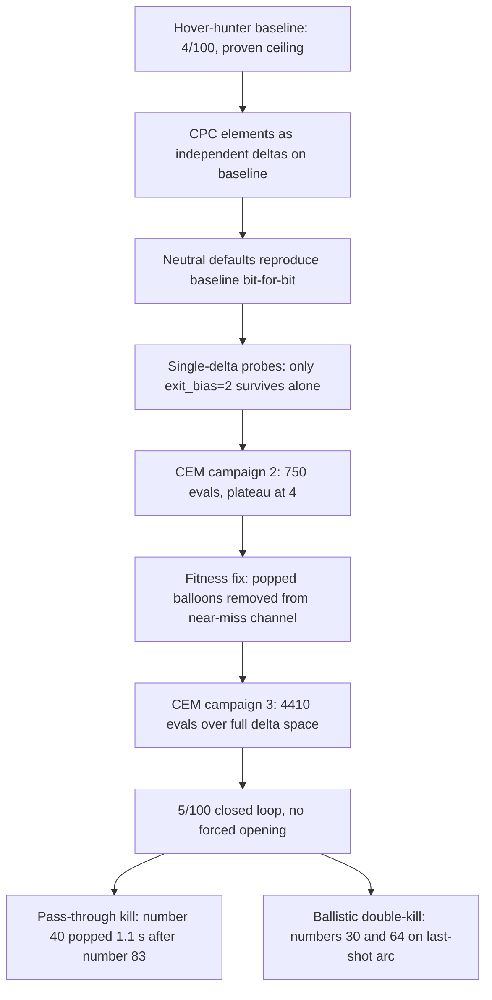

2026-08-10

# Rocket: CPC racing-line guidance breaks the 4-balloon ceiling (scenario 1 → 5/100)

TASTI 2026 Balloon Popping Challenge 的 scenario 1 卡在 4/100 很久了——前一輪
CEM 用 750 次模擬證實 4 分就是「懸停逐顆獵殺」架構的硬天花板。這次把無人機競速的
CPC(complementary progress constraints)結論搬進來:1.5 m 的戳破半徑其實是競速門,
穿過即得分,不需要減速停留。成果:**scenario 1 = 5/100(官方 eval),全閉迴路、
無強制開局,scenario 0 迴歸維持 10/10**。

## 為什麼是「增量疊加」而不是重寫

一開始真的全面重寫了 mid-course 導引,結果退化到 1–2 分:穿越速度命令劫持垂直通道
(推重比只有 1.25,vz 需求吃光推力、水平通道餓死),高速下「遠離即放棄」規則連鎖
放棄整片氣球雲。更根本的問題是單種子世界是混沌系統——任何選擇排序的微擾都會級聯
改寫整段飛行,單跑分數比較幾乎無意義。

正解是把每個 CPC 元素做成基線上的**獨立參數化增量**,中性預設逐位元重現基線:
`exit_bias`(PN 終端朝下一門加速)、`lookahead_gain/time`(走線混合)、
`next_weight/turn_weight`(配對成本序列選擇)、`speed_increment`(不減速地板)、
`climb_weight/dive_weight`(非對稱高度定價)、`turnaround_pricing`、`abandon_radius`。
單參數探測只有 `exit_bias=2` 單獨成立;其他全部要靠 CEM 聯合重調。

## 突破的前提:fitness 修乾淨

CEM 戰役 #2(750 評估)在 4 分平台上原地踏步。診斷發現次要 fitness 的 near-miss
通道被污染:被擊破的氣球取樣後的最近距離(~1.53 m,剛好超過 1.5 m 門檻)漏了進去,
4 分組態之間的梯度全是雜訊。把 popped 氣球設為 inf 之後,戰役 #3(344 代 / 4410 評估)
爬出了兩個獨立的 5 分解——都不需要強制開局,資格賽(scenario 4 + 主辦方 seed)可用。

## 5 分政權長什麼樣

參數面貌跟 4 分政權完全不同:晚射 4.7 秒(等氣球雲升起來再俯衝)、巡速上限 31.6 m/s
(+9.5)、配對成本選擇全開(`next_weight` 0.82)、放棄與換手都變快;有趣的是 4 分政權
的單參數贏家 `exit_bias≈2` 在新政權被壓回 0.4——舊政權的參數結論換了政權就翻盤。
擊殺鏈:#47@29.7s → #83@35.5s → **#40@36.6s(距上一殺 1.1 秒,真正的穿越擊殺)**→
41.6 s 燒完進 last-shot 彈道段 → **#30@43.0s + #64@51.1s 彈道雙殺**。戰役 #2 列出的
三個結構出口,CEM 自己找到了兩個。

## 週邊工程

- RocketPy 每次 scenario 1 reset 會寫 169 MB 的 MonteCarlo journal,每次 eval 再留
  85 MB 的 trajectory JSON——兩輪戰役累積了 48 GB 把磁碟寫滿。榮譽守則不能改比賽
  程式碼,所以清理全放在我方 harness:`cem_optimize.py` 自建 RAM disk 給暫存、
  各評估腳本以 60 秒年齡閘刪 trajectory JSON。
- 新工具:`tools/analyze_run.py`(交戰時間軸:換手、近失、每顆耗時)、
  `tools/render_video.py`(從 run_hunter npz 渲染 mp4 飛行影片,配色過 dataviz
  六項檢查)。
- 往 6 分(排行榜第一):`optimizer/state.json` 停在 gen 344 可續跑;剩下的結構出口
  是真模擬器序列樹搜尋(FMC*-TSP 式、前綴快取)。
