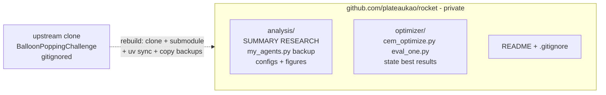

2026-08-09

# rocket:建立 Balloon Popping Challenge 工作區 repo(private)

把 `~/src/rocket` 初始化為 git repo 並推上 GitHub(`plateaukao/rocket`,private),
保存 TASTI 2026 火箭 GNC 競賽的全部開發成果。

## 這個工作區裡有什麼

一天內從零建起的完整競賽管線:

- **BalloonHunterAgent**(`analysis/my_agents.py`)——GNCSkeletonAgent 三層骨架
  (navigate / guide / control)+ 實戰 agent。策略核心是「懸停獵殺」:推重比僅 ~1.25
  的火箭用油門把垂直速度配平到跟氣球雲同步上升(~6 m/s),推力餘裕全給水平衝刺;
  終端用 ZEM/PN 導引,熄火前 6 秒用含阻力+風場(以漂浮氣球當風速計)的彈道外推
  做「最後一擊」。成績:scenario 0 = 10/10 滿分、scenario 1 = 4/100,
  排行榜並列第二(第一名 6)。
- **CEM 最佳化器**(`optimizer/`)——利用 scenario 1 固定 seed、世界完全確定性的特性,
  以真實模擬器為評分器做交叉熵參數搜索;fitness 用「pops×1000 + 近失獎勵 − 最近距離」
  讓同分世代仍有梯度。可斷點續跑(state.json),5 路平行。
- **文獻研究**(`analysis/RESEARCH.md`)——subagent 收集 ~25 個驗證過的來源。
  關鍵結論:CMA-ES 比樸素 CEM 樣本效率高;無人機競速 CPC 的「不減速穿越多路標」
  是打破 6–8 秒交戰週期的正解;正式資格賽用主辦方 seed 的 Scenario #4,
  所以最佳化必須留在閉迴路 GNC 內、不能開環重放。

## 版控結構的取捨

上游 `BalloonPoppingChallenge/` clone(含 ActiveRocketPy submodule)**不進版控**:
直接 add 只會產生無 .gitmodules 的 gitlink,砍掉它的 `.git` 又會失去跟上游同步的能力。
改為 `.gitignore` 掉整個目錄,把我們在 clone 內新增的檔案(`my_agents.py`、
`hunter_*.yaml`)複製一份到 `analysis/` 進版控,README 和 .gitignore 內建重建步驟
(clone → submodule → `uv sync` → 把備份複製回去)。

`optimizer/runs/`(暫存 npz)與 `STOP` 旗標也被 ignore;`results.csv`/`state.json`/
`best.json` 則進版控,commit 當下即為戰役進度快照(commit 時 CEM 正在第 9+ 世代
跑一場 4 小時戰役)。
