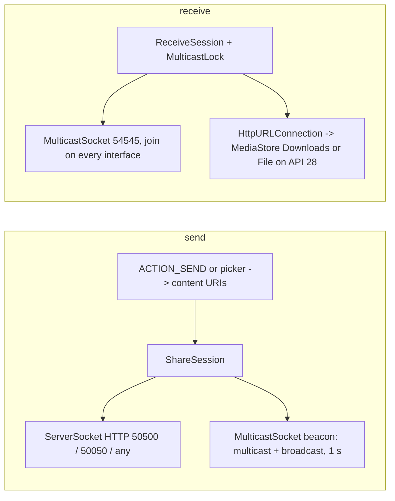

2026-08-24

# sharik-android: an 80 KB native Android Sharik

`~/src/sharik-android` ports the minimal Sharik client to Android with the
same brief as the macOS one — device name, share files or text, receive,
history — plus the one thing a phone needs most: Sharik shows up in the
system Share sheet, so any file manager, gallery or browser can hand it a
file. Drag and drop was explicitly out of scope.

## Size first

The user's constraint was binary size, so the app uses framework Views only:
`Activity`, `ListView`, `AlertDialog`, `Theme.DeviceDefault`, XML layouts.
No AndroidX, no Compose, no Material library, no coroutines — the only
dependency is the Kotlin stdlib, which R8 shrinks to a few KB. Release APK:
**~80 KB**, versus several MB for the Flutter build. Styling (brand color,
rounded flat buttons without shadow) is a ripple/shape drawable and a theme
overlay, which costs nothing.

## Protocol mapping

- Files arrive from other apps as `content://` URIs with no usable path, so
  the HTTP listing addresses entries by **index** (`/?q=0`) instead of by
  path; every existing receiver only follows the `href` it is given and takes
  the file name from `Content-Disposition`, so it stays compatible. Display
  names and sizes come from `OpenableColumns`; bodies stream straight from
  `ContentResolver.openInputStream`.
- Temporary URI grants from the Share sheet may expire; re-sharing from
  history checks `openInputStream` first and offers to drop the entry. The
  picker uses `ACTION_OPEN_DOCUMENT` with persistable grants, so those
  history items keep working.
- Receiving writes to the public `Download/` folder: `MediaStore.Downloads`
  with `IS_PENDING` on Android 10+, plain files plus the runtime storage
  permission on Android 9 (the Hisense A7 generation).

## Verification without a LAN

The emulator cannot see host multicast, and the console `redir` only targets
the legacy `10.0.2.15` NIC that current images no longer have; `adb reverse`
crashed the API 28 adbd mid-transfer. What worked was a 7 KB dex (`Beacon`)
run in the guest with `app_process`: it beacons to `127.0.0.1:54545` and
serves files over HTTP, so the whole exchange stays inside the guest.
Verified on API 28: single 3 MB unicode-named file (md5 identical), two-file
listing with de-duplicated names, text with Copy; and in the other direction
`ACTION_SEND` of a file and of text, fetched from the Mac through
`adb forward` (md5 identical), with the app's own beacon answered by a
receiver in the same guest.
