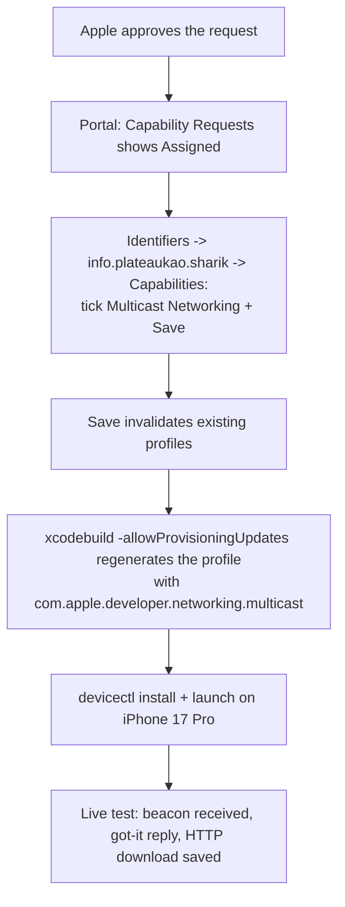

2026-08-30

# sharik-ios: from Apple's multicast approval to a working phone build

Follow-up to the sharik-ios ADR: Apple approved the Multicast Networking
request for team 3WD42GF27D, and this records the part that was not obvious —
approval alone did not make `xcodebuild` succeed.

The checkbox in step C is manual: the grant marks the capability *Assigned*
for the bundle ID, but the App ID keeps its old configuration until someone
ticks and saves (done via the Claude-in-Chrome extension in the user's own
logged-in session). Purging cached profiles without step C changes nothing —
that was tested and still failed with the same two Xcode errors.

The end state: the entitlement-bearing configuration is the default build
(`make device`), identical to what the App Store submission will use, and the
whole pipeline was verified on the physical phone over real Wi-Fi against the
Python Sharik stand-in on the Mac. The `make device-nomulticast` fallback
remains in the Makefile for other teams bootstrapping from zero.
