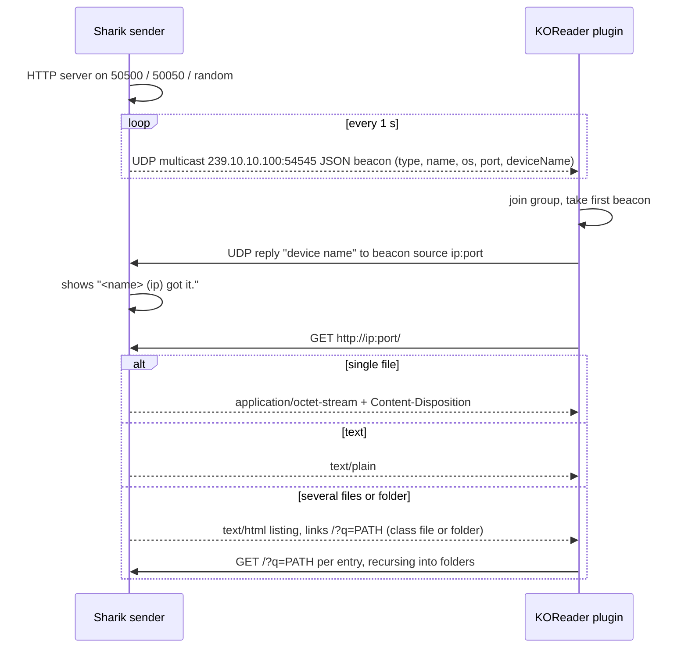
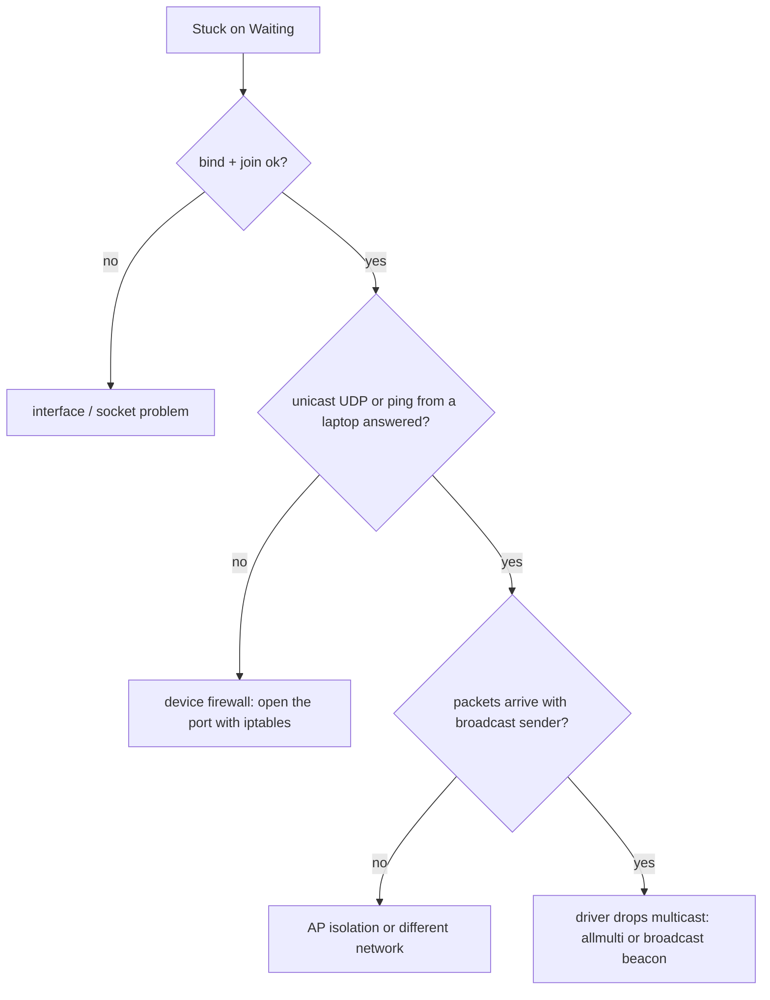

2026-08-23

# sharik.koplugin: a KOReader receiver for Sharik LAN shares

KOReader e-readers can now receive whatever Sharik (or the EinkBro fork that
multicasts URLs) shares on the local Wi-Fi: single files, folders, text and
links. The plugin lives at `~/src/sharik.koplugin` and is published at
https://github.com/plateaukao/sharik.koplugin (v0.1.0).

## How Sharik's receive path works

Reverse-engineered from `lib/logic/services/{sharing,receiver}_service.dart`:

## Design

- `sharik_client.lua` is the whole protocol in plain LuaSocket with no
  KOReader dependency, so it is exercised on a laptop against
  `test/fake_sender.py` (a Python stand-in for Sharik's sender) before any
  device work. It streams via `http.open` so the sink is chosen after the
  headers are known (file vs text vs listing), writes to a `.part` file and
  renames to a collision-free name.
- `main.lua` is the UI glue: non-blocking UDP polling on `UIManager:scheduleIn`,
  tap-to-cancel, confirm dialog, progress popups, TextViewer with Copy /
  Open link, a manual-address fallback and a dispatcher action for gestures.
- `netinfo.lua` enumerates IPv4 interfaces with `getifaddrs` so the group is
  joined explicitly per interface (Kindles also have `usb0`), and can set
  `IFF_ALLMULTI` through `ioctl` and toggle Wi-Fi power save.
- `android_multicast.lua` acquires a `MulticastLock` over JNI; the stock
  KOReader APK lacks `CHANGE_WIFI_MULTICAST_STATE` so it fails gracefully.

## The Kindle detour

On a Paperwhite 5 the plugin sat on "Waiting..." forever even though bind and
group join succeeded. Two wrong hypotheses were worked through first
(multicast filtering in the Wi-Fi driver, hence allmulti / power-save /
a broadcast beacon in the Sharik fork), and one real regression was caught in
`crash.log` (an edit dropped the `LISTEN_TIMEOUT` constant, crashing the poll
loop). The actual cause surfaced by probing from the Mac: the Kindle answered
ARP but not ping nor a unicast UDP aimed at its bound port. Kindle firmware
ships `iptables` rules that drop unsolicited inbound packets; KOReader's SSH and
HTTP-inspector plugins punch holes for the same reason. The plugin now inserts
`-p udp --dport 54545` INPUT / `--sport` OUTPUT ACCEPT rules while listening
and removes them afterwards.

A "Network diagnostics" screen encodes this: interfaces, flags, firewall rules,
bind/join results and a 5-second packet count, also written to
`koreader/sharik-diagnostics.txt` for easy retrieval over USB.

## Other findings

- Sending from Sharik's *recent files* list with a stale path makes the Dart
  server close the connection without a response ("waiting for response:
  closed"); pick the file again. Sharik could guard with `existsSync()`.
- The Sharik fork gained a broadcast beacon (`255.255.255.255`) alongside the
  multicast one; unnecessary for the Kindle in the end but harmless.
