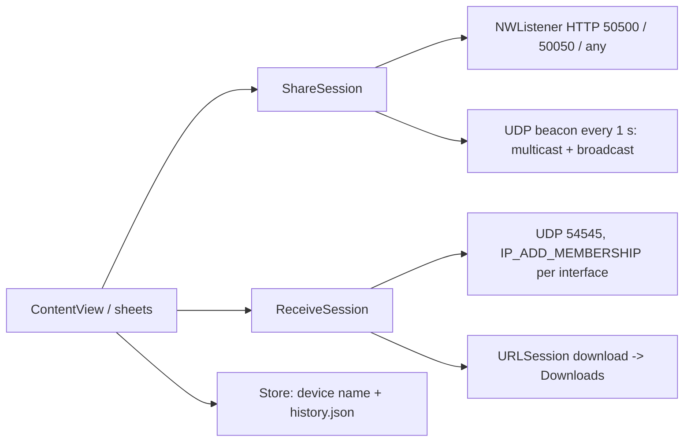

2026-08-23

# sharik-native: a minimal native macOS Sharik

`~/src/sharik-native` is a SwiftUI app that speaks Sharik's LAN protocol
natively, keeping only what is used day to day: device name, share files or
folders, share text, receive, and a clickable history. English only, system
appearance, and receiving never opens a browser — files land in `~/Downloads`,
text is shown with a Copy button. It replaces the Flutter build for the Mac
while staying wire-compatible with Sharik 3.x on phones and with
`sharik.koplugin` on e-readers.

## Shape

- `Sender.swift`: the HTTP server reproduces Sharik's responses byte for byte
  (octet-stream with percent-encoded `Content-Disposition`, `text/plain`,
  and the same `<a href="/?q=PATH" class="file|folder">` listing HTML), so
  existing receivers parse it unchanged. The beacon goes to the multicast
  group and to limited broadcast, matching the change made in the Sharik fork.
- `Receiver.swift`: joins the group on every IPv4 interface, replies once per
  new offer, downloads with `URLSession.download(for:)`, recurses into folder
  listings, de-duplicates names.
- Launch arguments `--share`, `--text`, `--receive [--auto]` make the app
  scriptable, which is also how it was verified without clicking around.
- Built with xcodegen from `project.yml`; ad-hoc signed, not sandboxed.

## What went wrong on the way

The first run accepted TCP connections but never answered. The culprit was the
UDP reply reader: `while let datagram = recvfrom()` on a blocking socket
drained one "got it" reply and then blocked forever on the serial queue that
also services HTTP connections. curl-first tests passed because nobody had
replied yet; any real receiver wedged the server. Both UDP sockets are now
`O_NONBLOCK`, which the drain loops require.

## Verification

Against the Lua client from sharik.koplugin (the same code that runs on the
Kindle): single 3 MB file with a unicode name byte-identical, folder listing
with nested sub-folder, text. Against the Python Sharik stand-in with
`--receive --auto`: file, folder tree, text and a bare URL beacon.
