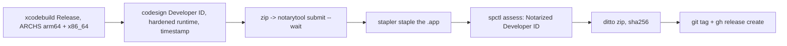

2026-08-23

# sharik-native: notarized releases

`release.sh <version>` turns the repo into a distributable, notarized
`Sharik-<version>.zip` and publishes it as a GitHub release; v1.0.0 is the
first one (https://github.com/plateaukao/sharik-native/releases/tag/v1.0.0).

Choices:

- Version and build number are build settings (`MARKETING_VERSION`,
  `CURRENT_PROJECT_VERSION` = git commit count) substituted into Info.plist,
  so the script is the single place a version is typed; `project.yml` keeps
  no literal.
- Dev builds stay ad-hoc signed without hardened runtime for fast iteration;
  the release build is re-signed with `--options runtime`. The app needs no
  entitlements under hardened runtime (plain sockets, no sandbox, no JIT).
- The artifact is a zip of the stapled `.app`, not a pkg: there is nothing
  to install beyond dragging to Applications, and Gatekeeper accepts a
  stapled app offline. The same Developer ID and `notarytool` keychain
  profile as OhMyBias's installer pipeline are reused.
- The universal binary costs ~0.8 MB; total app 1.7 MB.
