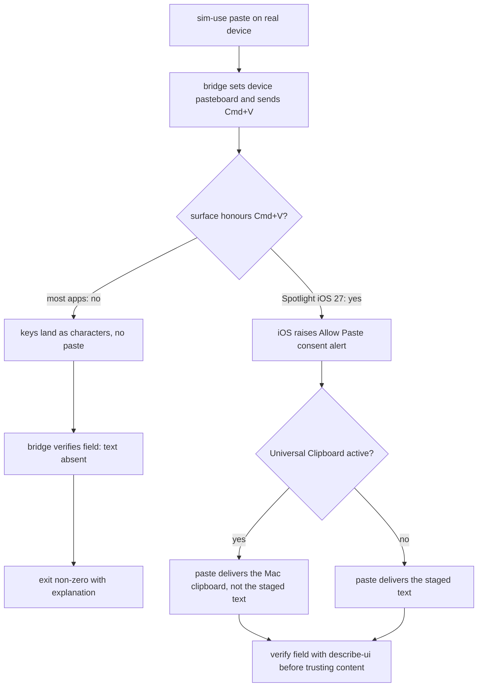

2026-07-27

# sim-use: the top-level forwarders were silently degrading real-device answers

The iOS-bridge work record left two items flagged "compiled but not re-verified
on device": the `keyboard-state` four-signal detection ladder, and `paste`
(never exercised against a field). Re-running both live on the iPhone 17 Pro
verified the bridge side — and exposed that the *host-side top-level
forwarders* were quietly throwing the bridge's answers away.

## What was broken

Both bugs had the same shape: the namespace verb (`sim-use ios-device <verb>`)
did the right thing, and the cross-platform forwarder (`sim-use <verb>`)
degraded it in the copy step.

- **`keyboard-state`** — the forwarder built its result as
  `ExecutionResult(platform: "ios-device", visible: state.visible)`,
  discarding `owner`, `top`, and `detection`. So `sim-use ios-device
  keyboard-state` printed `soft (occludes below y=590)` with a full JSON
  envelope, while `sim-use keyboard-state` printed bare `soft` — the
  occlusion edge (the actionable number) and the detection signal (the whole
  point of the ladder fix) never reached the surface agents actually use.
- **`paste`** — the forwarder called `_ = try client.paste(...)` and returned
  success unconditionally. The namespace verb's contract ("a paste the device
  demonstrably ignored is a failure, not a footnote") was implemented once
  and bypassed by the layer above it.

The diagnosis step worth keeping: when the CLI's answer looked wrong,
querying the bridge's `/keyboard/state` directly with curl showed a complete,
correct payload — which pinned the loss to the host side in one request, the
same move the bridge's `/diag` endpoint was built for.

Both are fixed by sharing one entry point per verb (the tagged-union result
gained the device fields; `performPaste` now backs both paste surfaces), so
the two forms can no longer disagree.

## What live paste testing actually showed

The prior understanding was "iOS will not apply a synthesized Cmd+V on real
hardware, period". Reality is more conditional:

Two discoveries, both now in the README and the skill's pitfalls table:

1. **Spotlight on iOS 27 honours the synthesized Cmd+V** and raises the iOS
   "Allow Paste" consent alert. The alert belongs to SpringBoard, shows up in
   `describe-ui`, and is tappable like any button — so the verb is not
   strictly clipboard-only on every surface, and the README's wording moved
   from "clipboard-only" to "best-effort with verification".
2. **Universal Clipboard can shadow the staged text.** On this Mac-paired
   phone, the consent alert named the *Mac* ("macstudio") as the pasteboard
   source, and allowing the paste delivered the Mac's clipboard content — not
   the string `paste` had staged seconds earlier. On a paired device, even a
   consented paste can deliver the wrong text, which is exactly why the
   verify-after contract reports "unverified" honestly instead of assuming.

(The pasted personal content was cleared from the field immediately, in
keeping with the repo's real-device privacy posture.)

## Ladder re-verification results

| State | Answer |
|---|---|
| Home screen, no keyboard | `hidden` |
| Spotlight focused, keyboard up | `soft (occludes below y=590)`, `detection: query`, `owner: com.apple.Spotlight` |
| No focused field at paste time | `Pasted … (unverified)` + hint, exit 0 — "could not check" is reported as such, not as failure or success |

The `focus`-only detection rung (third-party keyboard extension invisible to
the tree) did not trigger this session — the active keyboard was visible to
the `query` rung — so that specific rung remains verified only by its
original discovery session.
