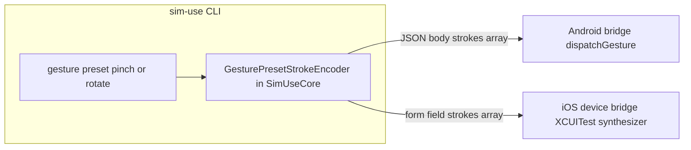

2026-07-27

# sim-use: gesture presets on real iOS devices via a shared stroke encoder

The real-iOS-device backend shipped with `gesture` deliberately unimplemented:
the on-device bridge's `/gesture` endpoint already worked (it was exercised
with a hand-built two-finger payload during the original bring-up), but the
host-side translation of the preset vocabulary — pinch-in/out, rotate-cw/ccw,
scroll-\*, swipe-from-\*-edge — into stroke trajectories only existed inside
the Android backend. This change closes that gap by extracting the translation
into `SimUseCore` and wiring a new `IOSDeviceGestureCommand` on top of it.

## The design that made this cheap

When the iOS bridge was designed, its `/gesture` wire format was deliberately
made byte-identical to the Android bridge's: a JSON array of
`{startX, startY, endX, endY, startTime, duration, path?}` objects, times in
milliseconds, with `path` carrying arc-shaped strokes (rotate) as a sampled
polyline. That decision pays off now: the encoding moved from a private helper
inside `AndroidGestureCommand` to a public `GesturePresetStrokeEncoder` in
`SimUseCore`, and both platforms call it unchanged. Pinch and rotate are
expressed once; the two bridges only differ in envelope (Android takes a JSON
body, the iOS runner takes the array as a form field).

Single-finger presets don't touch `/gesture` at all — they resolve to a start
and end point and ride the existing `/swipe`, which interpolates at 60 Hz on
the device.

## Decisions worth recording

**Screen size comes from the outline cache, not a fresh query.** Android
auto-detects the display per gesture through a cheap bridge endpoint. The iOS
bridge has no cheap equivalent — display size arrives with the accessibility
snapshot, which costs 2–4 s on a real phone. Since the skill's observe → act
cycle means a `describe-ui` almost always precedes a gesture, the command
reads the screen size from the outline cache that `describe-ui` writes, and
only falls back to a fresh (slow) snapshot when no cache exists. Explicit
`--screen-width / --screen-height` overrides both, e.g. after rotating the
device without re-observing. There is deliberately no fall-back to the
Simulator's 390×844 default: a pinch centered on the wrong point of a real
phone is not recoverable the way it is on a simulator.

**No display-bounds pre-flight, also deliberately.** Android's
`GestureDescription` constructor rejects out-of-bounds paths with an opaque
error, so that backend pre-flights stroke geometry to produce an actionable
message. iOS clamps silently, so the device backend adds no check — the
encoder's doc comment pins this as per-backend policy rather than something
the shared code should own.

## Rebase fallout that had to be fixed first

The feature branch predated main's idb migration to **static** FB\*
XCFrameworks. After rebasing, `iOSDeviceBackend` — which compiles against
`iOSSimBackend`'s swiftmodule to reuse the outline stack — failed to build:
that swiftmodule now pulls in the FB\* Clang modules, so every consumer needs
the private-framework module maps on its compiler path. Two Package.swift
edits:

- `iOSDeviceBackend` and `iOSDeviceBackendTests` gain
  `privateModuleMapFlags`.
- `iOSDeviceBackendTests` must **not** repeat `fbLinkerFlags`: SwiftPM links
  every test target into one binary, `SimUseTests` already contributes the
  per-archive `-force_load`s, and duplicating them trips the Swift
  task-allocator abort ("freed pointer was not the last allocation") that
  Package.swift's header comment documents.

While verifying that abort, a baseline run showed `make test` on origin/main
*also* dies with the same allocator abort on this machine (Xcode 26.3) even
though CI is green — a pre-existing environment issue, not fallout from this
change. Targeted suites (`GesturePresetStrokeEncoderTests`, `BridgeWireTests`,
`IOSDevicePlatformRoutingTests`, `AndroidBackendTests`) all pass.

## Live verification (iPhone 17 Pro, iOS 27, Wi-Fi transport)

| Check | Signal |
|---|---|
| `sim-use gesture scroll-down` (top-level routing) | Spotlight opened — foreground app flipped SpringBoard → Spotlight |
| `sim-use ios-device gesture rotate-cw --angle 90` in Maps | Compass button appeared in the tree (only shown when the map is off north) |
| `sim-use gesture pinch-out --scale 3.0` in Maps | Visible POI set changed (hash of point-feature labels differed before/after) |
| Screen-size auto-detect | No `--screen-width/--screen-height` passed anywhere above |

Verification stuck to the repo's real-device privacy posture: no screenshots
of the user's map location; assertions were made against outline hashes and
presence/absence of named controls.
