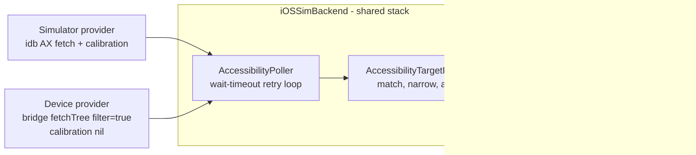

2026-07-27

# sim-use: live AX selectors on real iOS devices

The real-device backend refused `--label` / `--id` / `--element-type` with
"refusing beats degrading": honouring them would have meant silently
resolving against the *cached* outline and tapping wherever the element was
during the last `describe-ui` — unacceptable on a phone where a wrong tap is
not recoverable. This change removes the refusal by removing the staleness:
selector resolution now fetches a **fresh** accessibility snapshot at act
time, which is exactly what "live" means on the Simulator too.

## Reuse, not reimplementation

The enabling discovery was that `AccessibilityPoller` — the Simulator's
selector-resolution engine — already takes an injectable roots provider
(added for the batch verb's snapshot cache). The device path plugs in a
bridge-backed provider and inherits everything else unchanged: the
`--wait-timeout` retry loop (fresh fetch per tick, retry on
not-found/ambiguous), the ambiguity errors with candidate-label hints, the
`--frame` / `--element-type` narrowing, and the full-screen-wrapper
advisory. The calibration slot stays nil because device coordinates are
already in the tree's own UI space — there is no framebuffer transform on
this backend.

Routing rules: pure selector forms go live; bare `@N` / `#N` aliases stay on
the instant outline-cache path (a fresh snapshot is 2–4 s on device, and the
observe → act loop already guarantees cache freshness); a `#<id>` alias
*combined with* `--frame` / `--element-type` goes live, matching the
Simulator's treatment. While in there, the device tap/long-press paths also
gained `--pre-delay` / `--post-delay` (previously silently ignored — the
same flag-drop class as the `--fingers` bug fixed earlier) and advisory
pass-through into the envelope.

## The phantom-duplicate discovery

First live run: `tap --id 時鐘` failed with "Multiple (2) accessibility
elements matched" — while `describe-ui` showed exactly one Clock icon.
Dumping the raw tree explained it: SpringBoard gives every home-screen icon
a **second, zero-size copy** of its `AXUniqueId` (an `Icon` at `0,0 0×0`
elsewhere in the tree). The outline formatter folds it away; the resolver's
flatten does not, so every `--id` on a home-screen icon was born ambiguous.

The fix is on-device filtering: the provider fetches with `filter=true`,
which drops zero-size leaves before they leave the phone. This is strictly
safe for matching — a zero-size element can never win anyway (the resolver
rejects a zero-size frame as untappable) — so keeping such nodes in the
pool could only ever create phantom ambiguity. Payload shrinks as a bonus.

## Live verification (iPhone 17 Pro, iOS 27, SpringBoard home screen)

| Check | Signal |
|---|---|
| `tap --id 時鐘` | Clock opened; ~1.4 s round trip including the fresh fetch |
| `tap --label zz-not-there --wait-timeout 2` | Polled ~3 s, then failed with the top-10 on-screen candidate labels |
| `long-press --label-contains 時鐘 --element-type Icon --duration 0.8` | Home-screen context menu appeared |
| Ambiguity UX (pre-fix) | Shared resolver's "Multiple (2) matched … prefer --id" verbatim from the device path |

With this, the real-device backend's only remaining gap is `record-video`
(needs the device screen-recording service — a separate code path from
anything the bridge does).
