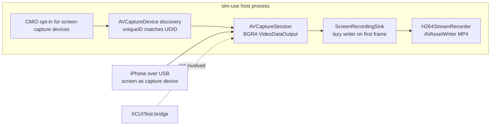

2026-07-28

# sim-use: record-video on real iOS devices via CoreMediaIO

The last unimplemented verb on the real-device backend. Unlike everything
before it, this one never touches the XCUITest bridge: macOS can capture a
USB-connected iPhone's screen natively through CoreMediaIO — the mechanism
behind QuickTime's "Movie Recording from iPhone" — so the implementation is
wholly host-side. `record-video` on a real device works even with no
`ios-device init` session running.

## How it works

The process flips `kCMIOHardwarePropertyAllowScreenCaptureDevices` (the same
switch QuickTime uses), after which a cabled iPhone enumerates as an external
`AVCaptureDevice` whose `uniqueID` is the device UDID — matched
hyphen-insensitively, since the format has varied across macOS releases. An
`AVCaptureSession` with a BGRA `AVCaptureVideoDataOutput` then delivers the
screen as frames.

The encoder is the existing `H264StreamRecorder` (AVAssetWriter, realtime
mode, stall watchdog), extended with a direct pixel-buffer append: at full
scale the captured IOSurfaces go straight to the writer with no per-frame
redraw; only `--scale < 1` takes the CGImage redraw path for its implicit
scaling. The writer is created lazily on the first frame, because that is
what reveals the native dimensions.

## Deliberate semantic mirroring of Android

Every behavioural decision copies the Android `record-video` contract so the
two platforms feel identical:

- Native **variable frame rate**; `--fps` accepted but ignored with a stderr
  note.
- `--quality` maps to bitrate, `--scale` to output size.
- Ctrl+C stop, with the same `RecordingFinishWatchdog` so a wedged writer
  cannot hang the process after the user asked it to stop.
- **Rotation stops the recording** (an MP4 track cannot change frame size)
  and preserves the partial file, as does yanking the cable
  (`AVCaptureDeviceWasDisconnected` → the Android disconnect path's shape).

## Constraints worth knowing

- **USB only.** The screen-capture device does not materialise for
  Wi-Fi-connected phones; the discovery timeout produces an actionable
  "plug the cable in" error rather than a hang.
- **Camera permission.** macOS files iOS screen capture under the camera TCC
  category; the first run prompts once, attributed to the terminal. The verb
  bypasses the per-UDID daemon so both the prompt attribution and the Ctrl+C
  lifetime belong to the foreground CLI process.

With this change, `IOSDeviceVerbSupport.unimplemented` emptied out and the
type was deleted — every cross-platform verb now routes on real devices.

## Verification status

Unit tests cover the even-dimension rounding and UDID normalisation, and the
error path ran live. The happy path could **not** be verified on this
hardware — and the reason is the interesting part.

### macOS refuses to publish this device, and QuickTime agrees

With the iPhone 17 Pro (iOS 27) cabled to the Mac (macOS 26, Darwin 25.5) and
`devicectl` reporting `transportType = wired, pairingState = paired`,
recording still failed. Layer by layer, everything on our side works:

- the CMIO opt-in returns status 0;
- `iOSScreenCapture.plugin` genuinely loads into the process (confirmed via
  `DYLD_PRINT_LIBRARIES`);
- discovery runs and finds **zero** CMIO devices.

The system log names the culprit. `iOSScreenCaptureAssistant` — the
system-wide daemon behind this path — starts, subscribes to usbmuxd, connects
to the phone on usbmux **port 32498** (the screen-capture service) five
times, then logs:

    CMIO_DPA_ISR_Server_Assistant.cpp:2070:UnsupportedAMDevice_block_invoke
        initializing sSupportAllDevices to F

…and publishes no device (`devicesArrived ()` empty). The binary carries a
matching feature-flag string, `iOSScreenCaptureAssistant.allow_all_devices`,
alongside `GetAMDeviceValeriaMode` — "Valeria" being Apple's internal name
for the iPhone-over-USB capture feature.

The decisive control: **QuickTime Player produces the identical log** — same
port-32498 connects, same `UnsupportedAMDevice` evaluation, no device. Since
the assistant is system-wide, Apple's own app cannot record this phone
either. The gate is Apple's device-support policy (plausibly an iOS-27
handset against a macOS-26 host), not a sim-use defect.

### What that changed in the code

The original error text said "plug in USB" — actively misleading when the
cable is already in. It now ranks the three real causes (not on USB / another
app holds the device / macOS refuses this device), and hands the user the
QuickTime cross-check that distinguishes a local problem from a gated device,
plus the fallbacks that do work: `screenshot`, or recording from the phone's
own Control Center.

The implementation is kept as-is rather than reverted: it is correct up to
the OS boundary and will record on any Mac + device pairing macOS admits.
Flipping the `allow_all_devices` feature flag was deliberately **not**
attempted — it needs root, changes system state on the user's machine, and
the evidence does not say it would help.
