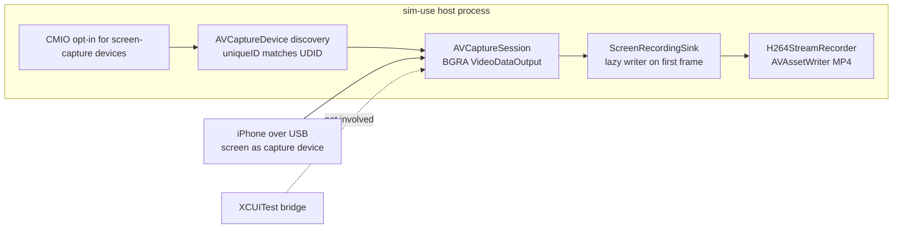

2026-07-28

# sim-use: record-video on real iOS devices via CoreMediaIO

The last unimplemented verb on the real-device backend. Unlike everything
before it, this one never touches the XCUITest bridge: macOS can capture a
USB-connected iPhone's screen natively through CoreMediaIO — the mechanism
behind QuickTime's "Movie Recording from iPhone" — so the implementation is
wholly host-side. `record-video` on a real device works even with no
`ios-device init` session running.

## How it works

The process flips `kCMIOHardwarePropertyAllowScreenCaptureDevices` (the same
switch QuickTime uses), after which a cabled iPhone enumerates as an external
`AVCaptureDevice` whose `uniqueID` is the device UDID — matched
hyphen-insensitively, since the format has varied across macOS releases. An
`AVCaptureSession` with a BGRA `AVCaptureVideoDataOutput` then delivers the
screen as frames.

The encoder is the existing `H264StreamRecorder` (AVAssetWriter, realtime
mode, stall watchdog), extended with a direct pixel-buffer append: at full
scale the captured IOSurfaces go straight to the writer with no per-frame
redraw; only `--scale < 1` takes the CGImage redraw path for its implicit
scaling. The writer is created lazily on the first frame, because that is
what reveals the native dimensions.

## Deliberate semantic mirroring of Android

Every behavioural decision copies the Android `record-video` contract so the
two platforms feel identical:

- Native **variable frame rate**; `--fps` accepted but ignored with a stderr
  note.
- `--quality` maps to bitrate, `--scale` to output size.
- Ctrl+C stop, with the same `RecordingFinishWatchdog` so a wedged writer
  cannot hang the process after the user asked it to stop.
- **Rotation stops the recording** (an MP4 track cannot change frame size)
  and preserves the partial file, as does yanking the cable
  (`AVCaptureDeviceWasDisconnected` → the Android disconnect path's shape).

## Constraints worth knowing

- **USB only.** The screen-capture device does not materialise for
  Wi-Fi-connected phones; the discovery timeout produces an actionable
  "plug the cable in" error rather than a hang.
- **Camera permission.** macOS files iOS screen capture under the camera TCC
  category; the first run prompts once, attributed to the terminal. The verb
  bypasses the per-UDID daemon so both the prompt attribution and the Ctrl+C
  lifetime belong to the foreground CLI process.

With this change, `IOSDeviceVerbSupport.unimplemented` emptied out and the
type was deleted — every cross-platform verb now routes on real devices.

## Verification status

Unit tests cover the even-dimension rounding and UDID normalisation; the
no-USB error path ran live end-to-end (CMIO opt-in → discovery timeout →
actionable error). The happy path — actual footage — still needs a cabled
device; that run will also answer the one genuine unknown, whether the
legacy CMIO opt-in still surfaces DAL devices on this macOS release.
