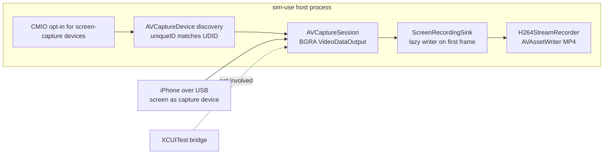

2026-07-28

# sim-use: record-video on real iOS devices via CoreMediaIO

The last unimplemented verb on the real-device backend. Unlike everything
before it, this one never touches the XCUITest bridge: macOS can capture a
USB-connected iPhone's screen natively through CoreMediaIO — the mechanism
behind QuickTime's "Movie Recording from iPhone" — so the implementation is
wholly host-side. `record-video` on a real device works even with no
`ios-device init` session running.

## How it works

The process flips `kCMIOHardwarePropertyAllowScreenCaptureDevices` (the same
switch QuickTime uses), after which a cabled iPhone enumerates as an external
`AVCaptureDevice` whose `uniqueID` is the device UDID — matched
hyphen-insensitively, since the format has varied across macOS releases. An
`AVCaptureSession` with a BGRA `AVCaptureVideoDataOutput` then delivers the
screen as frames.

The encoder is the existing `H264StreamRecorder` (AVAssetWriter, realtime
mode, stall watchdog), extended with a direct pixel-buffer append: at full
scale the captured IOSurfaces go straight to the writer with no per-frame
redraw; only `--scale < 1` takes the CGImage redraw path for its implicit
scaling. The writer is created lazily on the first frame, because that is
what reveals the native dimensions.

## Deliberate semantic mirroring of Android

Every behavioural decision copies the Android `record-video` contract so the
two platforms feel identical:

- Native **variable frame rate**; `--fps` accepted but ignored with a stderr
  note.
- `--quality` maps to bitrate, `--scale` to output size.
- Ctrl+C stop, with the same `RecordingFinishWatchdog` so a wedged writer
  cannot hang the process after the user asked it to stop.
- **Rotation stops the recording** (an MP4 track cannot change frame size)
  and preserves the partial file, as does yanking the cable
  (`AVCaptureDeviceWasDisconnected` → the Android disconnect path's shape).

## Constraints worth knowing

- **USB only.** The screen-capture device does not materialise for
  Wi-Fi-connected phones; the discovery timeout produces an actionable
  "plug the cable in" error rather than a hang.
- **Camera permission.** macOS files iOS screen capture under the camera TCC
  category; the first run prompts once, attributed to the terminal. The verb
  bypasses the per-UDID daemon so both the prompt attribution and the Ctrl+C
  lifetime belong to the foreground CLI process.

With this change, `IOSDeviceVerbSupport.unimplemented` emptied out and the
type was deleted — every cross-platform verb now routes on real devices.

## Verification status

Verified live on the cabled iPhone 17 Pro: 8.4 s of real footage — H.264 at
1206×2622 (the native 3× of the 402×874 point grid), 337 frames at ~40 fps
native VFR, ~5.1 Mbps, clean SIGINT stop with the moov atom finalized, and an
extracted frame showing the actual home screen.

Getting there took a wrong diagnosis and three real bugs, all worth
recording.

### The false "macOS gates this device" diagnosis

The first cabled run found zero capture devices, and the system log seemed to
explain why: `iOSScreenCaptureAssistant` connected to the phone over usbmux
(port 32498) and logged `UnsupportedAMDevice_block_invoke initializing
sSupportAllDevices to F`. QuickTime produced the identical log, which was
read as "Apple's own app can't record this phone either — OS-level device
gate". The user then recorded the phone in QuickTime just fine.

The misread: that daemon line is printed on **every normal startup** (it is a
static being initialized, not a verdict), and the QuickTime "control" only
reproduced the same normal startup. The real lesson: *a control experiment
that produces the same log as the failing case proves nothing unless the log
line is known to be a failure marker.* What settled it in the end was a
positive control — the user's screenshot of QuickTime happily recording.

### The three actual bugs

1. **Run-loop starvation.** CMIO delivers device arrivals through
   main-run-loop callbacks. Discovery slept on `Task.sleep` and never
   serviced the run loop, so the in-process device list stayed empty forever
   — indistinguishable from an unsupported phone. A probe that pumped
   `CFRunLoopRunInMode` saw the iPhone on its first tick. Discovery and the
   record waits now run on the main actor and pump the run loop.
2. **Stale identity assumption.** The capture device's `uniqueID` used to be
   the phone's UDID; current macOS mints a fresh UUID (`modelID` is just
   "iOS Device"). The only surfaced link back to the phone is its **name**,
   so matching now goes uniqueID → devicectl-reported name → sole connected
   iOS device (after a settling period, with a note).
3. **Ctrl+C starvation.** Pumping the run loop in a tight main-actor loop
   blocks the main *dispatch* queue — exactly where `SignalObserver`
   schedules its SIGINT DispatchSource. The first live stop hung
   indefinitely: the cancellation flag never set, and the finish watchdog
   (armed inside that same starved handler) never armed. Each pump slice is
   now followed by `Task.yield()`, which lets main-queue jobs land between
   slices. The stop then worked: flag set, session torn down, MP4 finalized.

The bugs compounded: #1 made the phone invisible, which made the wrong
diagnosis available; #3 only became observable after #1 and #2 were fixed.
