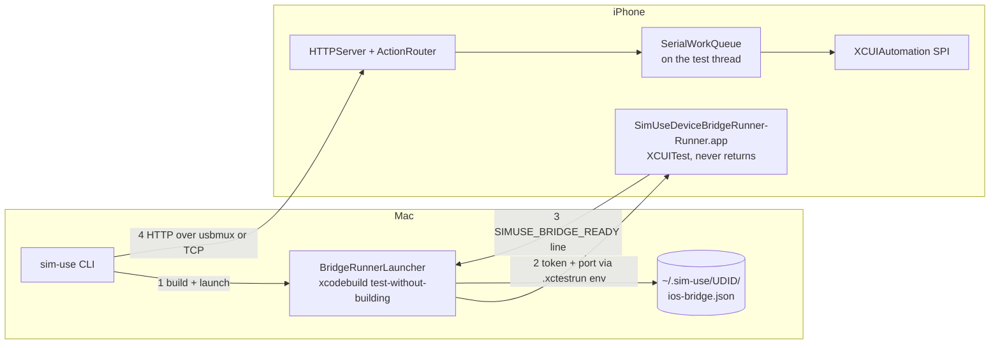

2026-07-27

# sim-use on real iPhones: an on-device XCUITest bridge

sim-use could drive iOS Simulators and Android devices. This adds the third
platform — a physical iPhone or iPad — so the same verbs (`describe-ui`, `tap`,
`swipe`, `type`, `screenshot`) work against hardware. Real devices now show up
in `sim-use devices` as `ios-device`, and the cross-platform verbs route to them
by UDID shape.

```
sim-use ios-device init --team-id ABCDE12345
sim-use ui   --device 00008150-000E242411D9401C
sim-use tap  @3 --device 00008150-000E242411D9401C
sim-use ios-device stop
```

## Why it could not be a port of the Android bridge

The Android side is an APK: Android publishes `AccessibilityService`, so an
ordinary installed app can read another app's view tree and dispatch gestures.
Install once, talk to it over `adb forward`, done.

iOS has no equivalent. No entitlement available to a third-party app grants
cross-app accessibility reads or synthetic touch injection. The only process on
a non-jailbroken device that has them is one `testmanagerd` is supervising — an
XCUITest runner — and it has them only while its test method is executing.

So the counterpart of the APK is not an app. It is a UI-test bundle whose single
test starts an HTTP server and never returns, with the host holding an
`xcodebuild test-without-building` process open for the session. WebDriverAgent
has this exact design, arrived at from the same dead end.



Three consequences follow, and they are the whole reason the two backends differ in
shape: the bridge ships as **source** (a runner must be signed with the user's
own team, so `init` builds it locally), its lifetime is **the host process**, and
the auth token flows **host → device** (a test runner has no inbound channel, so
the host mints it and injects it through the `.xctestrun` environment).

## The decision that paid for itself

`/a11y_tree_full` returns the **Simulator's** accessibility-tree shape — an array
of elements with `type` / `frame` / `children` / `AXLabel` / `AXUniqueId` /
`AXValue` — rather than inventing a device schema or reusing Android's.

That single choice means `OutlineFormatter`, `ListDetector`,
`AccessibilityTargetResolver` and every `@N` / `#N` alias work on hardware with
no new normalizer code, and the outline is comparable between a simulator and a
phone. `iOSDeviceBackend` depends on `iOSSimBackend` purely to reuse that stack.

A bonus falls out: the bridge knows the foreground bundle id first-hand and
returns it with the tree, so `ForegroundLabel.reconcile` gets an authoritative
answer. The Simulator path has to recover it from the AX root's pid via
launchctl, which is why that path can disagree with what is on screen (#81) and
this one cannot.

## What only a real device could teach

Everything below was found by running against an iPhone 17 Pro (iOS 27,
Xcode 26.3). None of it was visible from the simulator or from reading headers.

### Introspecting the wrong slice

The first cut submitted events with `-[XCUIDevice performDeviceEvent:error:]`,
which is what the **macOS** slice of `XCUIAutomation.framework` advertises. On
iOS that selector exists but sends `-duration` to the event record, which the
iOS class does not implement. It raised `NSInvalidArgumentException`, which
unwound out of the test method and killed the session: `/button home` succeeded,
then every later request timed out with nothing in any log the user could see.

Two fixes, both load-bearing. `SimUseSubmitEvent` now tries
`-[XCSynthesizedEventRecord synthesizeWithError:]` (the working iOS route)
first. And **every handler runs inside an ObjC exception trap** — Swift cannot
catch `NSException`, so without it any raise anywhere ends the session.

The generalisable lesson: the macOS framework is convenient to `dlopen` and
introspect, but it is not authoritative for iOS. `otool -oV` on the iPhoneOS
binary is.

### Four bugs of one shape

The rest of the defects were the same mistake wearing different clothes — **code
reporting success for something that did not happen**:

| Symptom | Cause |
|---|---|
| `--replace` typed `å√` into the URL bar, reported success | Command modifier written as `1 << 3`, which is `XCUIKeyModifierOption`. Command is `1 << 4`. |
| `paste` reported success, nothing arrived | iOS never applies a synthesized Cmd+V. Key events land on the text-input stream as characters and never become the `UIKeyCommand` UIKit needs. |
| `type --clear` said "field cleared first", then appended | Compose Multiplatform exposes a field's contents in `AXLabel` with `AXValue` nil (native UIKit is the reverse). The length probe read 0 and sent no backspaces. |
| `keyboard-state` said `hidden` with the keyboard plainly up | A third-party keyboard runs out-of-process and contributes no elements to the host app's snapshot. |

Each is now fixed *and verified*: paste checks the field afterwards and exits
non-zero with the real reason; clear treats "unreadable" as unknown rather than
empty, reads both attributes, and re-checks; keyboard detection is a ladder of
four independent signals (`query` / `snapshot` / `keys` / `focus`) that reports
which one answered. The `focus` rung is the one that catches the out-of-process
IME — it proves a keyboard is up without seeing any of its elements.

The pattern worth carrying forward: when an action cannot be confirmed by its
own return value, verify the side effect. All four bugs would have shipped
silently otherwise.

### Two corrections I had to make to myself

I blamed the third-party IME for the paste failure. Switching to the system
keyboard disproved it — the failure is unconditional — and the hint text would
have sent users down a dead end. I also claimed `isIdleTimerDisabled` would stop
the phone auto-locking; a session with that code in place still locked during a
rebuild, because the property only holds while its app is foreground and the
runner is backgrounded. Both claims are now corrected in the source comments,
which matters more than the code: a wrong explanation in a comment outlives the
bug.

The auto-lock problem did get a genuine mitigation — `init` builds the
replacement runner *before* stopping the running one, so a rebuild is covered by
the live session instead of by a locked screen. For long unattended sessions
there is no software answer; Auto-Lock → Never is what Appium and device farms
require too.

## Release-path defects

Two gaps would have shipped a broken release:

- The payload never staged `SimUse_iOSDeviceBackend.bundle`, so a release would
  have had **no real-device support at all**. `verify-stage` now fails the build
  if it or the bridge sources are absent — the analogue of the existing APK
  contract.
- `.gitignore`'s blanket `*.xcodeproj` / `*.xcworkspace` rules silently excluded
  the bridge's Xcode project, so a fresh clone could not have built the runner.
  It is a shipped source artifact, not build output, and is now re-included.

Also worth remembering in the dev loop: the per-UDID daemon is version-gated,
and a dev build whose version string does not change will keep a **stale daemon**
serving old response shapes. `pkill -f 'sim-use daemon'` after `dev-install.sh`.

## Scope left open, deliberately

`gesture` and `multi-touch` (the bridge endpoint works; the host-side preset
vocabulary is unwired), `touch` (raw phases cannot be held open across CLI
invocations by a one-shot event API), `record-video`, and live AX selectors —
those need a point-query the bridge does not expose, and falling back to a stale
cached frame would mean a wrong tap on real hardware. Each raises a specific
error naming what to use instead.

Branch: `feat/ios-real-device-bridge` on `plateaukao/sim-use`.
