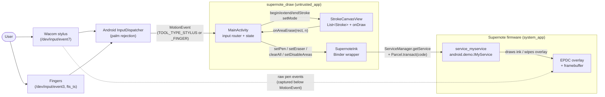
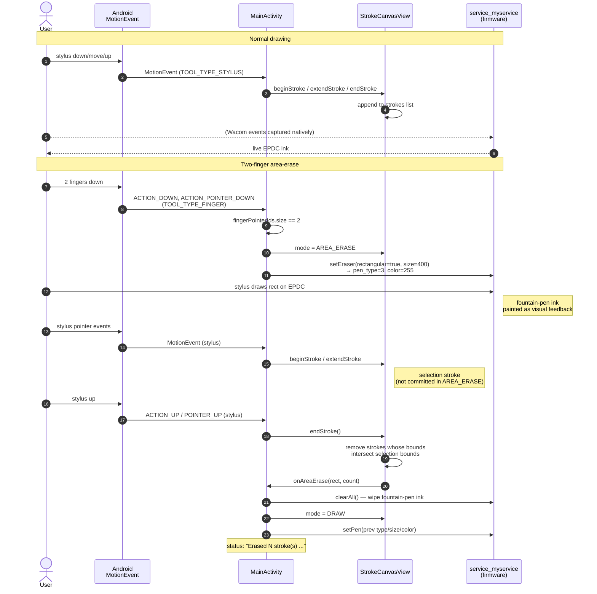

# supernote_draw — Stylus ink demo + two-finger area eraser

## Summary

A minimal Android Kotlin app that reproduces the Supernote firmware ink
protocol used by `com.supernote.document` (decompiled from
`/system_ext/app/SupernoteDocument.apk`). The demo talks to the firmware's
custom Binder service `service_myservice` to drive low-latency stylus drawing,
and supports the two-finger **area eraser** gesture exactly the way the
official Document app does for the default `twoFingerGesture == 0` setting:
the next stylus stroke is treated as a bounding-box selection, and strokes
intersecting that box are removed.

## Approach

The hard part wasn't the firmware protocol — that's just `Parcel`s over Binder
with a discovered interface token (`android.demo.IMyService`) and a small set
of transaction codes. The hard part was that **the firmware doesn't track
strokes** — its overlay is paint-on-glass with only a wholesale `clearAll`
mutation. The original Document app keeps its own stroke storage (and edits a
`.note` file via `JniOperateTrails`); we keep an in-memory `ArrayList<Stroke>`
in a custom `View`.

### Components

Three Kotlin files do the work:

- **`SupernoteInk`** — looks up `service_myservice` via reflected
  `ServiceManager.getService` (with `service.myservice` legacy fallback), opens
  parcels with the `android.demo.IMyService` interface token, and exposes
  `sendWriteAppInfo` / `setDisableAreas` / `setPen` / `setEraser` / `clearAll` /
  `enableFullUiAuto`. Wire format is taken from the decompiled
  `com.supernote.document.handwrite.HandWriteClient`.
- **`StrokeCanvasView`** — `View` that owns the stroke list. `Mode.DRAW`
  appends each stylus stroke as a `Path` + `Paint` + bounds. `Mode.AREA_ERASE`
  uses the next stroke's bounds to filter out intersecting strokes and fires
  `onAreaErase`. Does no touch handling itself; MainActivity feeds it.
- **`MainActivity`** — single `OnTouchListener` that routes by `getToolType`:
  finger pointer IDs land in a `HashSet` for two-finger detection, stylus
  pointer drives stroke begin/extend/end on the canvas. Owns the gesture state
  transitions and the firmware tool switch.

### Two-finger area-erase sequence

### Constraints discovered during implementation

- **`service_myservice` vs `service.myservice`** — the current Nomad firmware
  registers the binder under the underscore name. The decompiled
  `com.ratta.supernote.eventlibrary.HandWriteClient` still looks up the dotted
  legacy name; the newer `com.supernote.document.handwrite.HandWriteClient`
  uses the underscore. `SupernoteInk.binder()` tries the current name first
  and falls back.
- **Why we can't read `/dev/input/event3` directly.** The original APK's
  `NativeEventCallBack` reads raw kernel input events via `libreadEvent.so`
  JNI, which is how it tracks finger gestures unaffected by stylus events or
  Android palm rejection. The device file is `crw-rw-rw-` (DAC permits read),
  but SELinux denies `untrusted_app` the `input_device:chr_file open`
  permission — verified by `run-as` succeeding while the actual app gets
  `EACCES`. The original APK escapes this by declaring
  `sharedUserId="android.uid.system"` and shipping in `/system_ext/app/`,
  i.e. running as system. A normal-install demo can't.
- **MotionEvent palm rejection.** When the stylus lands on the Wacom
  digitizer with fingers already on the screen, Android sends `ACTION_CANCEL`
  to the touch stream and may stop delivering events for the still-pressed
  fingers. We track only `TOOL_TYPE_FINGER` pointer IDs (so the stylus
  appearing as a third pointer with `TOOL_TYPE_STYLUS` doesn't trip exit on
  its `POINTER_UP`) and ignore `ACTION_CANCEL` while engaged. The natural end
  of the gesture is the stylus-up that completes the selection stroke, which
  arrives reliably and triggers exit immediately — no timer dependency on the
  happy path.
- **Firmware ink + Canvas ink coexist visibly.** The firmware paints the
  active stroke on its own EPDC overlay; `StrokeCanvasView.onDraw` does *not*
  render the active stroke to avoid double-drawing. After `endStroke`, the
  committed stroke is rendered via `Canvas.drawPath`, and on the next
  composite the firmware overlay's copy lines up with it. After an area-erase
  we call `clearAll()` so only the post-erase `Canvas` state is visible.

## Trade-offs

- **No region clear for in-flight firmware ink.** `service_myservice`
  transaction 6 (`SET_DRAW_BUFFER_VALUE`) only clears the whole overlay.
  Surgical erase is done entirely in the app's stroke storage; we wipe the
  overlay and rely on `Canvas` re-render. This is the same model the official
  app uses, just with a much smaller stroke model.
- **Two-finger gesture is best-effort on MotionEvent.** We can't perfectly
  replicate the original's raw-input gesture rules (e.g. raw-event-units
  `isMoved` threshold inside `NativeEventCallBack.twoFingerCheck`); we
  approximate "≥ 2 finger pointers tracked" and exit on stylus-stroke
  completion. Loosening the original's move-cancel rule was a deliberate
  choice — without it the gesture cancelled itself from natural finger jitter
  on first try.
- **Demo APP_NAME differs from the system app.** Parcels carry
  `"supernoteDrawDemo"` instead of `"superNoteDocument"`. The firmware
  accepts it (replies `realTimeHandWriting`) and behavior so far matches; if
  any feature turns out to be gated on a known app name we can change the
  constant.
- **No persistence.** Strokes live only in memory; the `Clear` button or
  process death wipes them. The original `.note` format and `JniOperateTrails`
  pipeline is out of scope for a demo.

## Key Files

- `app/src/main/java/com/example/supernotedraw/SupernoteInk.kt` — Binder
  wrapper for `service_myservice` (transactions 0/1/2/5/6, pen type and color
  constants).
- `app/src/main/java/com/example/supernotedraw/StrokeCanvasView.kt` — stroke
  list + `Mode.DRAW`/`Mode.AREA_ERASE` + onDraw renderer.
- `app/src/main/java/com/example/supernotedraw/MainActivity.kt` — single
  MotionEvent router (tool-type filtered), two-finger state machine,
  toolbar button wiring.
- `app/src/main/res/layout/activity_main.xml` — horizontal toolbar +
  status bar + `StrokeCanvasView` filling the rest.
- `apktool_out/` and `jadx_out/` (gitignored) — decompiled
  `SupernoteDocument.apk`, the reference for every parcel layout and the
  `DocumentActivity.eraserGesture` / `HandWriteClient.sendEraserInfo` paths
  this demo mirrors.
