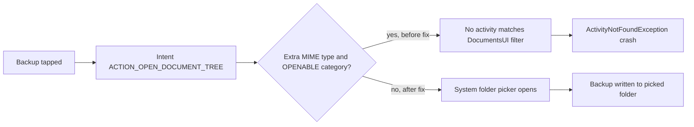

2026-07-31

# Sweet LIME: backup crashed when picking the destination folder

Tapping **Backup** in Sweet LIME's data settings crashed the app immediately with
`ActivityNotFoundException: No Activity found to handle Intent
{ act=android.intent.action.OPEN_DOCUMENT_TREE cat=[android.intent.category.OPENABLE] typ=*/* }`.

## Root cause

`SetupImFragment.launchBackupFilePicker()` built the folder-picker intent like a
file-picker intent:

```java
Intent intent = new Intent(Intent.ACTION_OPEN_DOCUMENT_TREE);
intent.setType("*/*");                        // wrong
intent.addCategory(Intent.CATEGORY_OPENABLE); // wrong
```

`ACTION_OPEN_DOCUMENT_TREE` is a *folder* picker: the system DocumentsUI
declares its intent filter for that action with no MIME type and no
`OPENABLE` category. Android's intent resolution requires the filter to match
every category on the intent and to declare a matching MIME type when one is
set — so with those two extras, *nothing* matches and
`startActivityForResult()` throws. The restore path legitimately uses
`ACTION_GET_CONTENT` + `setType("*/*")`; the backup code was almost certainly
copied from it.

This was verified directly on the Onyx Go Color 7: `pm resolve-activity` with
a bare `OPEN_DOCUMENT_TREE` resolves to
`com.android.documentsui.picker.PickActivity`, while the same action with a
type returns "No activity found". So the crash was not device-specific — the
malformed intent fails on any Android device.



## Fix

Delete the two lines. The bare `ACTION_OPEN_DOCUMENT_TREE` intent opens the
system folder picker and the existing `onActivityResult` handling proceeds
unchanged. Shipped in v7.2.1.
