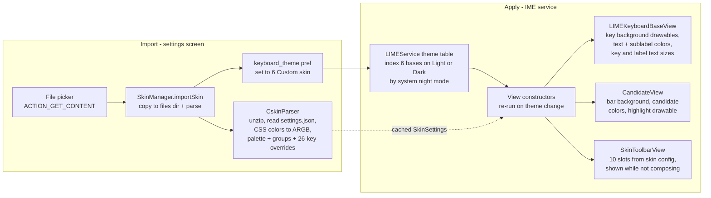

2026-07-31

# Sweet LIME: keyboard style customization from .cskin skin files

Sweet LIME can now import a `.cskin` file — the skin format exported by the 蝦米
(Liu) input method's web skin designer at ggininder.work/r/Ryan, documented in
the `ryanwuson/rime-liur-ios-skin` repo — and apply it as a keyboard theme.
Users design a skin visually in the browser (originally for the 元書/Hamster
iOS app), export it, and import the same file on Android. This adds real
keyboard style customization to Sweet LIME, which previously offered only six
hard-coded themes.

## What a .cskin actually is

Decoding the designer's source settled the approach. A `.cskin` is a **zip**
containing three layers of the same data:

- `jsonnet/settings.json` — a flat JSON dump of every designer choice. The
  designer itself uses this file to re-import a skin, and rejects zips without
  it as "old format", so it is a stable, canonical representation.
- `jsonnet/main.jsonnet` + `Settings.libsonnet` — the same data as Jsonnet,
  compiled on-device by the iOS app.
- `light/` and `dark/` PNG/SVG assets for the iOS toolbar and bubbles.

Sweet LIME reads **only `settings.json`**, so no Jsonnet interpreter is needed
and the iOS artwork is ignored. One conversion trap: the designer stores CSS
colors (`#RRGGBBAA`, alpha last) while Android wants `#AARRGGBB` — the parser
reorders the alpha byte. A second trap: iOS skins routinely use
near-transparent keyboard backgrounds (alpha 0x01) because iOS layers them
over a system blur; Android has no such backdrop, so translucent backgrounds
are composited over an opaque base color (light `#D0D3DA` / dark `#1C1C1E`).

## How it is applied

The six built-in themes work by inflating views from a `ContextThemeWrapper`
whose style resolves static drawables and color attrs. Rather than invent a
parallel theming path, the custom skin becomes a **7th theme index** that
bases on the Light or Dark built-in style (chosen by system night mode, so
unskinned corners fall back sensibly), and each themed view overrides its
resolved attrs immediately after `obtainStyledAttributes` when
`SkinManager.getActiveStyle()` is non-null. The original key faces are flat
rounded rects (`<shape>` with solid fill, 3dp radius, stroke), so
`SkinDrawables` rebuilds pixel-equivalent `GradientDrawable` state lists with
the skin's normal/pressed/function-key colors — including the
`state_single` distinction the theme selectors use for function keys.

Views are recreated through the existing theme-change path; day/night flips
and re-imports are detected in `initialViewAndSwitcher` via a night-mode flag
plus a `SkinManager` generation counter, forcing the same rebuild.

## Toolbar

元書 shows a utility toolbar in the candidate row while nothing is being
composed; the skin defines its 10 button slots (from 26 function ids) plus
icon color, size and background. Sweet LIME's candidate bar always lives
inside the input view (`inputcandidate.xml`, fixed-candidate mode is
hard-coded on), so a `SkinToolbarView` sits next to `CandidateView` in that
row and the two swap visibility: candidates appear → toolbar hides;
suggestions clear → toolbar returns. While the toolbar is active it takes
priority over the idle-time auto Chinese-symbol list.

Function mapping reuses existing service entry points: settings, collapse,
中英 toggle, 簡繁 (opens the existing Han-conversion picker), symbol and
number keyboards, cursor keys via the existing `keyDownUp`, and
select-all/copy/cut/paste via `performContextMenuAction`. Undo/redo are sent
as best-effort Ctrl+Z / Ctrl+Shift+Z key events. Functions with no Android
equivalent (常用語, clipboard panel, emoji keyboard, one-hand mode, iOS
skin shortcuts) render as blank spacers, so any skin's toolbar layout
imports without error.

## Gestures

The skin's swipe/long-press flags map onto what Sweet LIME actually has:

- Long-press popups are gated **per row**. The designer numbers rows for a
  4-row layout, so rows are counted from the bottom (space row = row 4) —
  this keeps letter rows aligned even on Sweet LIME layouts with an extra
  number row.
- Swipe up/down in Sweet LIME are whole-keyboard gestures (options dialog /
  hide keyboard), not per-key inputs, so they are disabled only when every
  row disables that direction.
- Swipe hint text flags are ignored — Sweet LIME draws no swipe hints, and
  hiding its key sub-labels (IM code hints) instead would be wrong.

## Round 2: the real export format, icons, and per-key swipe

Testing with a genuinely exported skin (not the repo docs) surfaced that the
live designer 2.0.0 writes **schemaVersion 2**: palette and groups moved
under `globalSettings`, toolbar buttons under `toolbar`, and gestures became
feature-name lists under `swipe` (`globalEnabledFeatures`, per-feature
`row1..row4` membership lists). The first-pass parser silently defaulted
every field — the skin "applied" but looked identical to the Light theme.
The parser now branches on `schemaVersion` and supports both, plus v2-only
fields e-ink skins lean on: `textSystem` (function-key text), per-class
border colors/sizes, and `toolbarBg`.

Two fidelity gaps against the 元書 reference were closed at the same time:

- **Toolbar icons.** Text labels clipped at skin font sizes and read poorly;
  the toolbar now uses bundled Material vector drawables (settings, globe,
  translate, keyboard, dialpad, select-all, copy/cut/paste, undo/redo,
  arrows, collapse) tinted with the skin's `toolbarColor`, and spans the
  full keyboard width — the candidate bar's voice/expand block hides while
  the toolbar is visible.

- **Per-key swipe.** The `.cskin` also ships the 元書 keyboard definitions;
  `lib/swipeData.libsonnet` is regular enough to line-scan without a Jsonnet
  engine. Its swipe_up/swipe_down maps now drive two things: hint glyphs
  drawn in the key corners (swipe-up output top-left, swipe-down output
  bottom-right, using the skin's hint color/size and row visibility flags),
  and actual vertical-swipe input on letter keys, detected in PointerTracker
  from the down-key travel. `character` actions route through the IM like a
  keypress, `symbol` actions commit directly, and `shortcut` actions map to
  cut/copy/paste/select-all/line-start/line-end/tab. The row gesture flags
  gate both the hints and the actions, so the earlier "flags with nothing to
  gate" situation resolved itself: the flags now control real per-key swipes.

Verified on the emulator with the user's own e-ink-oriented export: 2px
black key borders and white keys applied, icon toolbar swaps with the
candidate strip, and swiping down on Q feeds `1` into the composing buffer.

One cold-start race followed: `CandidateInInputViewContainer.requestLayout()`
recomputes the voice/expand block's visibility on every layout pass, and an
empty candidate view forced that block (weight 1) visible again after
`showSkinToolbar()` had hidden it — squeezing the toolbar into half the row
on first launch. The container now keeps the right-button block hidden
whenever the skin toolbar is visible, making the toolbar's full-width state
authoritative rather than racing the relayout.

## Round 3: toolbar functions replace bottom-row keys

Like 元書, a toolbar that already offers 中英 switching makes the bottom-row
EN/中 key redundant. `SkinKeyboardTweaker` now post-processes every keyboard
`LIMEKeyboardSwitcher` builds while the skin is active: if the toolbar
config contains the 中英 function, the EN (code -9) and 中 (code -10) keys
are removed; if it contains the symbol or number-keyboard function, the
bottom-row 123 key (code -2) goes too. A removed key's footprint is handed
to the space bar (keys between shift over, space widens), so the row stays
flush. Only keyboards containing letter keys are touched — symbol and
number layouts keep their return keys. The toolbar's 中英 button was also
rerouted through the same soft-key switch path the removed keys used, so
behavior is identical to pressing the key it replaces.

## Round 4: toolbar keyboard modes and nav-bar-aware hide key

The toolbar's keyboard buttons were split to match 元書 semantics: the
keyboard icon (function 7) toggles the symbol keyboard exactly like the
bottom-row 123 key, while the dialpad icon (function 9) opens the numeric
phone keypad (`MODE_PHONE`); the toolbar stays visible in both, so there is
always a way back to the text keyboard.

The bottom-left hide-IME key (code -3, long-press = IME picker) joined the
removal set with a twist: it goes away only when the system shows a
*button* navigation bar — detected via `Settings.Secure navigation_mode`
(gesture mode = 2 keeps the key) with `config_showNavigationBar` as the
pre-Android-10 fallback — AND the skin toolbar has its own collapse
button, since back on a button nav bar already dismisses the keyboard.
Removed keys hand their edge flags to the row's new outermost keys so
edge touch detection is preserved, and navigation-mode changes trigger
the same view rebuild as night-mode flips.

## Scope decisions

- Symbol/emoji side-panel styling and one-hand mode: intentionally skipped.
- Key preview bubble colors parse but are unused — the preview is disabled
  in this fork (`showPreview` is a no-op).
- The `keyboard26Chinese` per-mode overrides are honored on top of the
  palette when their enable flags are set; numeric/symbolic/emoji override
  blocks are ignored.
- Space-row width variant (`spaceKeyLayout`) is not applied; it would need
  alternate bottom-row layout XMLs and is orthogonal to skin plumbing.
