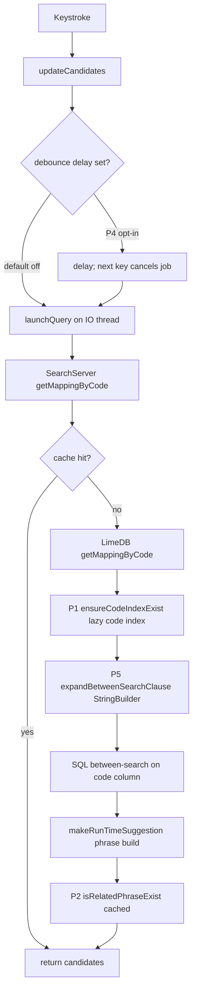

2026-06-21

# Sweet LIME: speed up candidate composition on weak-CPU / e-ink devices

Typing on e-ink devices (Boox GoColor7, Hisense HLTE202N) is bottlenecked by CPU, not rendering — the screen refresh is already tuned, but every keystroke triggers a SQLite candidate lookup that can stall on a weak processor. This change attacks the candidate-composition CPU/latency path with four targeted optimizations, all behaviour-preserving (the one user-visible knob defaults to off).

## What changed

Branch `eink-candidate-perf` (commit `56c12b4`), 9 files, +176 / −16. Four live optimizations plus one that turned out to be a no-op:

- **P1 — lazy `code` index** (`LimeDB.ensureCodeIndexExist`). Three built-in tables — `cj5`, `ecj`, `wb` — shipped in `lime.db` *without* an index on the `code` column, so their between-search query degrades to a full table SCAN on every cache miss (confirmed with `EXPLAIN QUERY PLAN`). The fix creates the missing index lazily, once per table per process, on the IO thread. It detects existing coverage via `PRAGMA index_info` (matching the first indexed column == `code`) so it never duplicates an index that exists under a different name — e.g. `pinyin` uses `imtable1_idx_code`.

- **P2 — memoize `isRelatedPhraseExist`** (`SearchServer.relatedExistCache`). `makeRunTimeSuggestion()` re-checked the same `(pword, cword)` pairs on every keystroke of a multi-char composition, each an uncached SQLite query. Now memoized — negatives too, via a `RELATED_NOT_FOUND` sentinel — scoped to a single composition (cleared in `clearRunTimeSuggestion`) so phrases learned at the previous commit are always picked up.

- **P4 — optional candidate-query debounce** (`QueryDispatcher.launchQuery(delayMs, block)` + new `candidate_query_debounce` ListPreference, values 0/20/30/40/60 ms, **default 0 = off**). Because each keystroke calls `cancel()` before launching, a delayed job is cancelled during its cancellable `delay()` when the next key arrives — so only the last key of a fast burst hits the DB. Opt-in, so existing users see no behaviour change.

- **P5 — `StringBuilder` in `expandBetweenSearchClause`**. Output is byte-identical; just replaces repeated string concatenation + `replaceAll()` with a single builder and one escape pass.

- **P3 — no change needed.** Building the remap / dual-code maps once was already handled by the existing `keysReMap` / `keysDualMap` caches.

## Candidate flow and where the optimizations sit

## Does the index help custom IMs?

A natural question, since some users only run custom mapping tables and no built-in IM. The answer is **no, and that's fine** — custom tables were never the problem. Inspecting the shipped `lime.db` with the patch's own criterion (an index whose first column is `code`):

| Has a `code` index | Missing it (what P1 targets) |
|---|---|
| `custom`, `imtable2`…`imtable10`, cj, dayi, ez, array, array10, phonetic, scj, pinyin, hs | **cj5, ecj, wb**, related, dictionary_* |

Custom IMs live in the fixed slots `custom` / `imtable2`…`imtable10`, all of which already carry `*_idx_code`; the `blank.db` template also ships `custom_idx_code`, and reloading a custom mapping uses `DELETE FROM` (`deleteAll → db.delete`), not `DROP TABLE`, so the index survives. `ensureCodeIndexExist` still runs on a custom table — it does one cheap `PRAGMA` probe, sees the index, and no-ops (also acting as a safety net). For custom-IM users the real win is **P4 (debounce)**, with P2/P5 helping marginally.

## How it landed

The implementation was produced by a `/ultraplan` cloud session, but that sandbox lacked GitHub push/PR credentials. The work was exported as a **git bundle + patch** (`~/Downloads/einkcandidateperf.{bundle,patch}`) and brought into the local repo:

1. `git bundle verify` — valid; its single prerequisite was exactly local `master` HEAD (`e30e1db`), so it applied cleanly.
2. The working tree already held an unrelated, uncommitted `VibrationEffect` modernization in `LIMEService.java` — the *same* change is committed inside the branch, so a plain checkout would conflict. Stashed it (`stash@{0}`, kept) before fetching.
3. `git fetch <bundle> eink-candidate-perf:eink-candidate-perf` + `git checkout`.
4. Reviewed the full diff (API-level care is correct: `Collections.synchronizedSet` for API 21, `VibrationEffect` guarded for API 26+; localization covers zh-rCN + default and both `xml/` + `xml-v17/` preference variants).
5. Built a signed release (`assembleRelease` with `browser.keystore` — cert SHA-256 verified to match the installed app) and installed on both the GoColor7 and the Hisense HLTE202N.
6. Pushed the branch to `origin`.

## Verifying on device

- **P1:** switch to cj5/ecj/wb and type — `adb logcat -s LimeDB | grep ensureCodeIndexExist` shows one `index created … Elapsed time = …ms` line per table, then never again.
- **P4:** set `候選查詢延遲 / candidate_query_debounce` to 20–40 ms and type fast; only the last key of a burst queries the DB.
