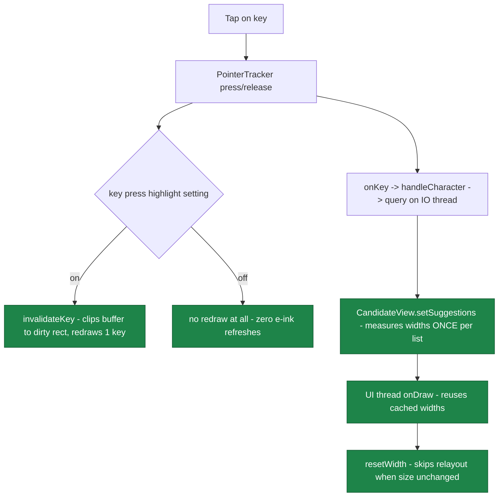

2026-07-12

# Sweet LIME: cut per-keystroke rendering and commit-path cost on e-ink devices

Follow-up to the June candidate-composition work (`56c12b4`), which optimized the
DB/query side and assumed the UI layer was already fine. A fresh audit of the whole
keypress-to-pixels pipeline showed the opposite: after that commit, the dominant
per-keystroke costs were all in the rendering layer. This change (`3719818`) removes
them.

## The headline bug: single-key redraw was silently disabled

`LIMEKeyboardBaseView.onBufferDraw()` inherited AOSP LatinIME's design: keys are
rasterized into an offscreen buffer, and `invalidateKey(key)` is supposed to redraw
just the one key by clipping the buffer canvas to a dirty rect. The clip call used
`Region.Op.REPLACE`, which Android P banned, so at some point it was commented out
("will cause crash") - and with no clip, `getClipBounds()` returns the full bitmap,
the single-key containment test never passes, and every press/release cleared and
re-rasterized all about 40 keys. About 3 full keyboard rasters per tap, synchronously
inside the touch handler, each one triggering a large e-ink panel refresh.

The fix is the modern idiom for the same thing: `canvas.save()` +
`canvas.clipRect(mDirtyRect)` + `canvas.restore()`, with an empty-rect guard. The
existing `drawSingleKey` logic works again unchanged. The mini-keyboard dim overlay
is safe because its show/dismiss paths already call `invalidateAllKeys()`.

Before this change, the `invalidateKey` box redrew all keys 3x per tap, and the
measure/draw boxes each re-measured every candidate on every pass.

## New setting: key press highlight (default on)

Even with the clip fixed, a tap still costs two panel refreshes purely for the
press-flash (highlight on at DOWN, off at UP) - ghosting and perceived lag on
e-ink. A new checkbox under the keyboard settings ("按鍵按下強調效果", default on =
stock behavior) disables it: `invalidateKey()` becomes a no-op and `onBufferDraw`
draws keys via a new `Key.getNormalDrawableState()` that ignores the transient
pressed flag while preserving sticky/caps state. The state-masking half matters:
without it, a full redraw landing mid-press (e.g. shift auto-toggle) could bake a
pressed highlight into the buffer with nothing scheduled to remove it.

## Candidate bar: measure once, stop thrashing

`CandidateView` ran the identical measurement loop twice per keystroke - once on
the query thread (`prepareLayout`) and again in the UI thread's `onDraw` - with
`measureText` called twice per candidate (the constant "。" min-width reference was
re-measured per candidate), plus a SharedPreferences read + 4 dimension lookups per
draw in `updateFontSize()`, plus an unconditional `setLayoutParams`+`requestLayout`
per update, plus a clipboard `getPrimaryClip()` binder IPC inside `requestLayout`.

Now: widths are computed once per suggestion-list/font change
(`computeCandidateWidths`) and every draw reuses them; `updateFontSize()` caches by
pref value; `resetWidth()` skips the relayout when the size is unchanged; and the
clipboard state is cached and invalidated by an `OnPrimaryClipChangedListener` -
which as a side effect fixes the paste button not appearing when you copy text
while the bar is empty (previously nothing triggered a relayout).

Two archaeology finds along the way:

- The "emoji paint" was an alias of the shared candidate paint, shrinking it 0.9x
  on every draw; `updateFontSize` reset it at the top of each pass, so in practice
  *all* main-bar text has always rendered at 0.9x. The refactor keeps 0.9x as the
  explicit main-bar scale (`candidateTextScale()`), with the expanded grid
  overriding to 1.0x - because it never went through the alias - so nothing
  changes visually.
- The suggestion list copy was a `LinkedList` indexed with `get(i)` in every loop;
  it is now an `ArrayList`.

## Learning path: one worker, WAL, cached related phrases

Every candidate commit used to spawn a fresh `Thread` at default priority for score
learning (and another per runtime-phrase pick, and another at input-finish). All
learning now runs on a single shared `learningExecutor` at
`THREAD_PRIORITY_BACKGROUND` - which also serializes DB writes in commit order.
The reverse-lookup query (an unindexed word-column scan that ran synchronously on
the UI thread on every commit when enabled) moved onto the same worker.

`enableWriteAheadLogging()` is now on, so keystroke reads proceed while learning
writes commit instead of blocking behind the rollback journal's exclusive lock.
WAL has two file-handling consequences handled in `DBServer`: backups include
`-wal`/`-shm` side files when present (they only exist after a crash, and then
they hold the last un-checkpointed writes), and restore deletes stale side files
before unzipping so a leftover WAL can't be "recovered" into the restored
database. The ATTACH-based import/export flows are safe under Android's WAL
connection pool because they use `execSQL` exclusively, which always runs on the
primary write connection.

`getRelatedPhrase()` results are now cached per committed word (resolving the
code's own 2015 TODO), invalidated after each learning batch - removing the DB
round-trip between committing a character and the related-phrase bar appearing,
a gap that was very visible on e-ink.

## Deliberately not done

The audit's remaining idea - an exact-match-first two-phase query to shorten
cache-miss latency - was skipped on purpose: it would paint the candidate bar
twice per keystroke, which is precisely the wrong trade on e-ink. The existing
prefetch + cache + optional debounce already cover that path.

## Verification

Signed release built and installed on the Boox Go 6 over the existing install
(user data preserved). For the full effect on e-ink, the new key-press-highlight
setting should be turned off on the device.
