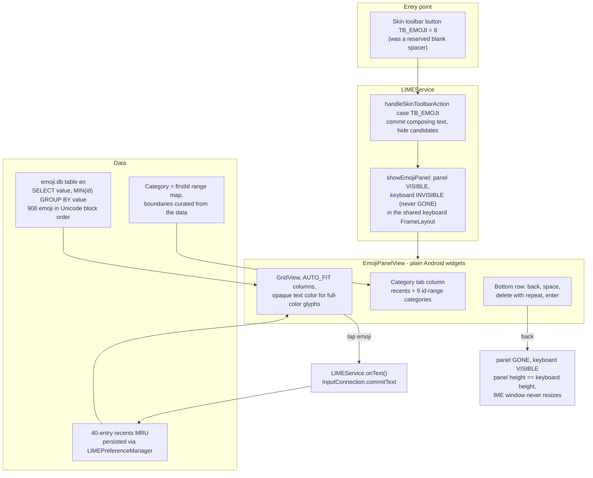

2026-08-02

# Emoji picker panel launched from the skin toolbar

Sweet LIME now has an emoji mode, switchable like the symbol or numeric
keyboards: tapping the toolbar's emoji button replaces the keyboard with a
picker panel — category tabs on the left (常用 recents plus 表情/人物/動物/
植物/食物/旅遊/活動/物品/符號), a scrollable grid, and a bottom row with
返回/空格/⌫ (hold to repeat)/換行. Tapping an emoji commits it directly to
the editor; recently used emoji persist across sessions in a 40-entry MRU.

The groundwork was surprisingly complete before this change. The skin
toolbar already reserved a `TB_EMOJI = 8` function id (rendered as a blank
spacer), emoji.db already shipped 908 emoji for the keyword-to-emoji
candidate feature, and the recent toolbar-overlay refactor left a
`FrameLayout` wrapping the keyboard view — a ready-made place to drop an
alternate panel. The feature is mostly wiring these pieces together plus one
new view class.

## How it was built

- **Panel placement.** `inputcandidate.xml`'s keyboard `FrameLayout` got an
  id; `EmojiPanelView` is added as a sibling of the keyboard view and
  toggled with the same VISIBLE/INVISIBLE technique the toolbar overlay
  uses, so no relayout happens on entry/exit (matters on e-ink). The panel
  is given an explicit height equal to the keyboard view's, which already
  accounts for key-size scale, orientation and split-keyboard settings.
- **Widget choice.** The only existing multi-row grid,
  `CandidateExpandedView`, is a variable-width flow layout hard-capped at
  200 items — not reusable for 900+ uniform cells. A plain `GridView`
  (no new dependencies) inside ordinary LinearLayouts was simpler;
  `SkinToolbarView` had already proven standard widgets compose fine in
  this canvas-drawn IME.
- **Categories without category data.** emoji.db has no category column,
  but its `en` table follows Unicode block order, so
  `SELECT value, MIN(id) ... GROUP BY value ORDER BY MIN(id)` yields
  natural category runs. Boundaries were read off the actual data
  (👦 at id 492 starts people, 🐒 1241 animals, 💐 1542 plants, 🍇 1633
  food, 🌍 2066 travel, 🎃 3192 activities, 🔇 3583 objects, 🏧 4454
  symbols) and live in a static range map.
- **Commit path.** `LIMEService.onText()` already flushes any composition
  and commits multi-codepoint text, so picking an emoji is one call.
  Space/enter reuse `sendKeyChar`, delete reuses `keyDownUp(KEYCODE_DEL)`.
- **Recents.** No MRU infrastructure existed anywhere in the app. The panel
  keeps the list in memory and persists a comma-joined string through
  `LIMEPreferenceManager` only when the panel hides (the setters use
  synchronous `commit()`, so per-tap writes would jank). The recents grid is
  snapshotted on tab selection so picking from it never reorders cells
  under the user's finger.

## Constraints discovered during verification

- **The button only appears if the skin asks for it.** A skin's
  `toolbar.toolbarButtons` array must contain `8`; the 蝦米輸入法 skin has a
  spacer (`0`) in that slot, so a patched copy
  (`~/Downloads/蝦米輸入法-emoji.cskin`) was made for real-device use.
- **Re-importing a skin needs an IME restart.** When the custom theme is
  already active, the skin-generation check that rebuilds the views is
  never reached on re-import — pre-existing behavior, discovered while
  testing the patched skin.
- **Color emoji fade under translucent text colors.** The theme's default
  TextView color carries alpha, and the paint alpha dims color-emoji
  glyphs; grid cells force an opaque color.
- The bundled set is 2015-era (908 emoji, no skin tones or ZWJ sequences).
  A fresher bundled list is a possible follow-up that would not change this
  architecture.
