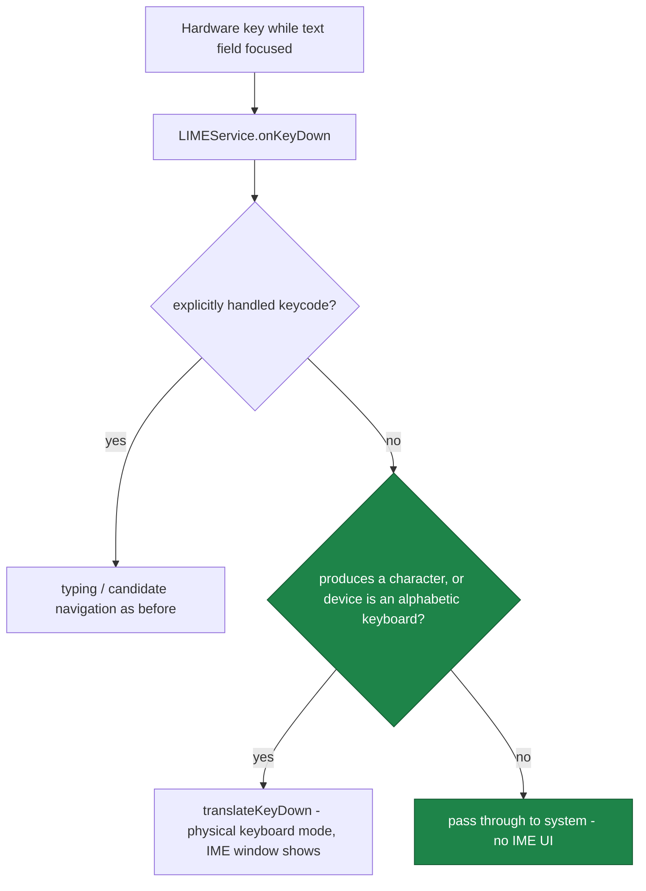

2026-07-12

# Sweet LIME: IME UI popped up on volume / page-turn / vendor hardware keys

Released in v7.1.3 (`2f977a7`).

## What was broken

On tablets and e-readers (Boox Go 6, HyRead M08P), pressing volume keys or other
physical buttons while the cursor was in a text field would sometimes bring up the
input method UI out of nowhere. Very annoying on e-ink, where the window appearing
means a big panel refresh.

## Root cause

While a text field has focus, Android routes every hardware key event through the
current IME before the app sees it - that is how physical-keyboard typing support
works. `LIMEService.onKeyDown()` handled the typing-related keycodes explicitly,
passed through a small hardcoded allowlist of system keys (volume, home, power,
camera...), and sent *everything else* to `translateKeyDown()` - which, on the
first such key, flips the service into physical-keyboard mode and force-shows the
IME window via `requestShowSelf(SHOW_FORCED)`, before ever checking whether the
key produces a character.

E-ink devices are full of hardware keys that are not in any allowlist: page-turn
buttons reporting `PAGE_UP`/`PAGE_DOWN`, media or vendor-specific keycodes,
Bluetooth page clickers. Reader firmwares also remap buttons between "volume" and
"page turn" per app, which is why the symptom was intermittent. A previous fix
(`2f9103f`, March 2026, "volume key blink") had added the allowlist - but a
blocklist cannot win against an open-ended set of vendor keycodes.

## The fix

Invert the logic. `translateKeyDown()` now bails out immediately unless the key
plausibly *is* typing:

Concretely: `event.getUnicodeChar() != 0`, or `event.getDevice().getKeyboardType()
== InputDevice.KEYBOARD_TYPE_ALPHABETIC`. Hardware buttons report vendor keycodes
with no character from non-keyboard input devices (`gpio-keys` style,
`KEYBOARD_TYPE_NON_ALPHABETIC`), so they now fall straight through to the system
regardless of which keycode the vendor chose. Real external keyboards identify as
alphabetic, and synthesized events (`KeyCharacterMap.VIRTUAL_KEYBOARD`, used by
LIME's own `keyDownUp` send-to-self path and by adb input) also pass, so:

- composing with a physical Bluetooth/USB keyboard still enters physical mode and
  shows the floating mini candidate bar as before;
- function keys on a real keyboard behave as before (device check passes);
- the old volume-key allowlist stays as a fast path but is no longer the only
  defense.

Verified on the HyRead M08P: with a text field focused, page-turn/volume buttons
no longer summon the keyboard, and their normal function is untouched.
