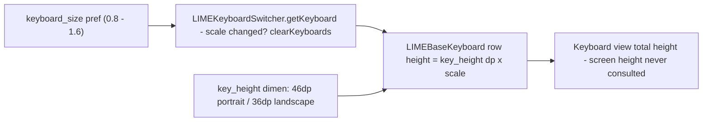

2026-08-10

# Sweet LIME: 超大 (1.4×) / 極大 (1.6×) keyboard size options

## What and why

On the Pixel 9 the keyboard looked noticeably smaller than other IMEs even with 鍵盤大小 set to its largest value. The cause is architectural: Sweet LIME's key rows are **fixed dp dimensions** — `key_height` = 46dp portrait / 36dp landscape — inherited from 2011-era LIME, when phone screens were ~533–640dp tall and 46dp × 4 rows filled 35–40% of the screen. The Pixel 9's screen is 448 × 997dp, so the same keyboard covers only ~25%. Modern IMEs (Gboard, AOSP LatinIME) compute their height as a *fraction of screen height*, so they stay proportionally large on tall screens; Sweet LIME does not, and its size setting capped out at 特大 = 1.2×.

The fix chosen is deliberately additive: two new scale options, **超大 (1.4×)** and **極大 (1.6×)**, above the existing 特大 (1.2×). No existing user's stored value or rendering changes unless they pick a new option.

## How it was built

`keyboard_size` previously shared its `five_size_scale_options/values` arrays with `font_size`. Growing the shared arrays would have added jumbo options to font size too, so `keyboard_size` got its own pair — `keyboard_size_scale_options` / `keyboard_size_scale_values` (7 entries: 1.6, 1.4, 1.2, 1.1, 1, 0.9, 0.8) — in `values/strings_settings.xml`, with localized labels (极大/超大) in `values-zh-rCN`. Both `xml/preference.xml` and `xml-v17/preference.xml` were rewired (devices resolve the `-v17` overlay, so both copies must match). No Java changes: `LIMEPreferenceManager.getKeyboardSize()` parses the value as a float with no clamping, and the scale multiplies through `LIMEBaseKeyboard`'s row heights untouched.

A deeper fix exists for later: `getDimensionOrFraction()` already supports fraction values against display height — switching layouts' `keyHeight` to e.g. `6.5%p` would make sizing proportional on every screen with zero Java changes (46dp on a 640dp screen ≈ 7.2%). Deferred to avoid changing existing users' rendering.

## Verification

- Emulator (1080×2400 @ 420dpi, cskin active): settings dialog renders all 7 options; at 極大 the IME window measured 1145px vs Gboard's 883px on the same screen — 極大 now overshoots Gboard's default, 超大 lands near it.
- Long-press-space options dialog confirmed still working (fires `onLongPress` keycode 32 → LIME-HD options dialog).
- Installed release-signed build to the Pixel 9; Sweet LIME stayed selected as active IME.

## Observed during testing (separate, pre-existing issue)

Changing 鍵盤大小 while the IME process is alive can make the cskin toolbar row disappear until something rebuilds the IME views (process restart, day/night flip, rotation) — it then reappears on its own. Reproduced on the emulator independently of the new values; the input-view tree (toolbar included) is only wired in `initialViewAndSwitcher()`, which a size change does not re-run. Tracked as a follow-up; not caused by this change.
