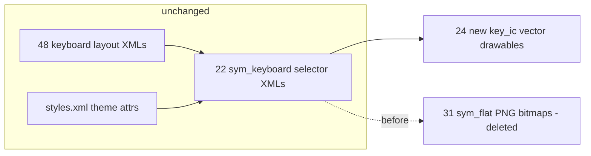

2026-07-31

# Sweet LIME: modern vector icons for shift / backspace / enter / search / hide-keyboard

The function-key glyphs were 2015-era PNG bitmaps (`sym_flat_keyboard_*.png`,
102x136 px in `drawable-xxhdpi`, one hand-colored file per theme). After the
skin toolbar gained modern Material vector icons in 7.2.0, the old key glyphs
looked visibly dated next to it. 7.2.1 replaces them with Material vector
drawables across every theme.

## Design

- **Glyphs**: Material path data for backspace (outlined), keyboard-return,
  search, and keyboard-hide; a Gboard-style shift arrow drawn for this change.
- **Shift states are now shape-differentiated** instead of color-only:
  outline arrow = off, filled = shifted, filled + underline bar = caps lock.
  This also reads better on e-ink where color barely differentiates.
- **Colors** keep the existing theme system: `#717171` normal, `#4DB6AC`
  pressed-flash and caps-lock accent, white glyphs plus per-skin accents
  (pink `#C74A72`, tech-blue `#3F66B1`, relax-green `#056839`,
  fashion-purple `#8F52A0`).

## Why the swap was cheap: everything routes through selectors

All ~48 keyboard layout XMLs and the theme attrs in `styles.xml`
(`enterKeyIcon`, `searchKeyIcon`, `shiftKeyIcon`, `shiftKeyShiftedIcon`)
reference 22 state-list selector drawables (`sym_keyboard_*`), never the
bitmaps directly. Re-pointing the selector items at the new vectors updated
every layout and the dynamic enter/search/shift-state swapping in
`LIMEKeyboard.java` with zero Java or layout changes. minSdk 21 means
`VectorDrawable` works natively, including inside `StateListDrawable`.

## The sizing constraint

`LIMEKeyboardBaseView` draws a key icon scaled to the **full key height**,
with width from the drawable's aspect ratio — so the glyph-to-padding ratio
*inside* the asset is what controls the on-key size, not the intrinsic dp.
The new vectors therefore keep the old assets' geometry: a 24x32 viewport
(same 3:4 aspect as 102x136) with the standard 24x24 Material glyph wrapped
in a `<group>` scaled to 0.70 and centered, reproducing the old ~68% glyph
coverage. Icons land in exactly the same spot at the same size, just crisp.

The 24 vector files and 22 selector rewrites were emitted by a generator
script, and every glyph was render-verified (vector converted to SVG,
rasterized, and inspected) before building. The 31 obsolete PNGs were
deleted; only the space-bar and arrow-key bitmaps remain in use.
