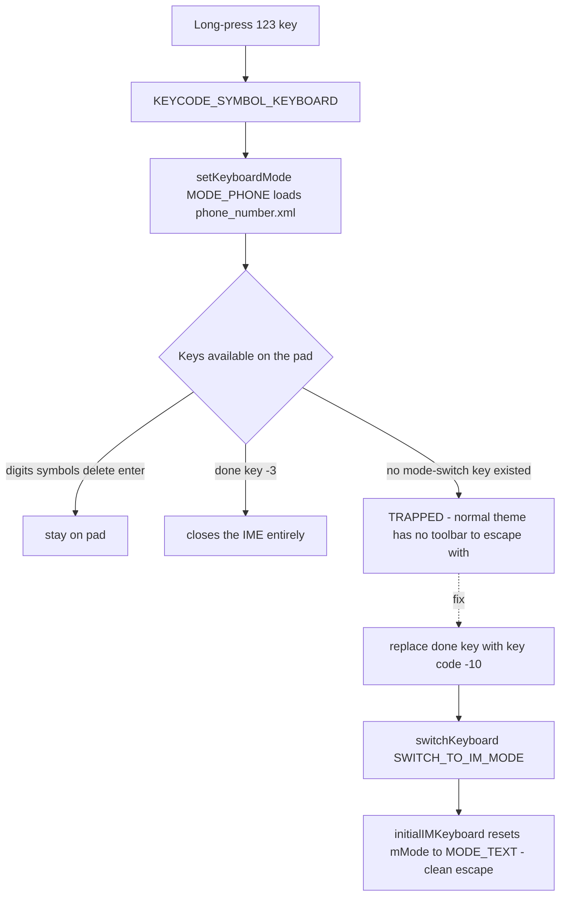
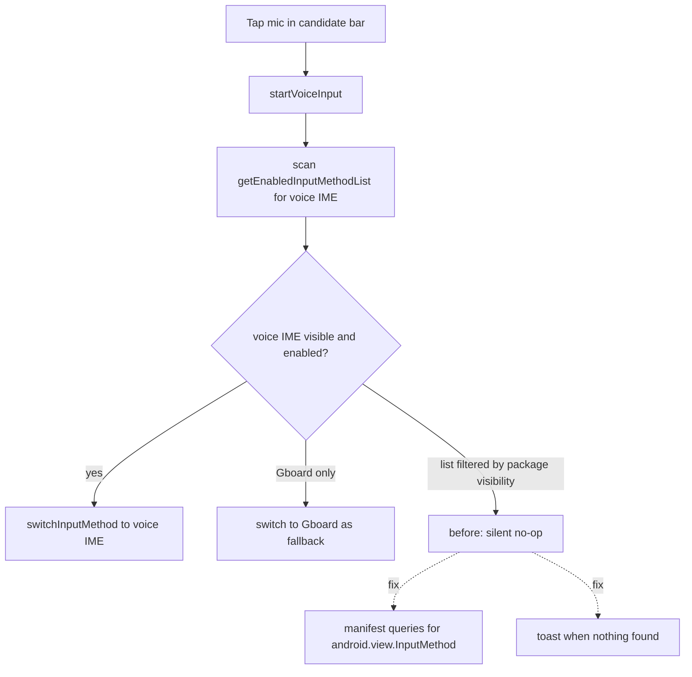

2026-08-10

# Sweet LIME: escape key for the long-press number pad, and the silently dead mic button

Two user-reported bugs, fixed in `e58cb2d` and `97fac7a` (on top of 7.5.0).

## 1. No way back from the 9-key number pad (normal theme)

Long-pressing the `123` key switches the keyboard to `MODE_PHONE`, which loads
`phone_number.xml` — a 9-key numeric pad. That layout contained only digits,
symbols, delete, enter, and a "done" key that closes the IME entirely. There was
no mode-switch key at all, so once you entered the pad you could not return to
the normal keyboard. cskin users escape via the skin toolbar (the code even has a
comment "the toolbar stays available to leave it"), but the normal theme has no
toolbar — those users were simply trapped.

The fix replaces the redundant "done" key (bottom-left) with a `中` key using
code `-10` (`KEYCODE_SWITCH_TO_IM_MODE`). XML-only; the Java handler already
existed. The interesting constraint is *which* keycode works:

- `-10` routes through `switchKeyboard()` → `initialIMKeyboard()`, which calls
  `setKeyboardMode(activeIM, MODE_TEXT, …)` and therefore resets the switcher's
  stored `mMode` back to `MODE_TEXT`. Clean escape.
- `-9` (toggle Chinese/English) looks equivalent but is a trap: `toggleChinese()`
  passes mode `0`, which *preserves* the stored `mMode = MODE_PHONE`. The
  keyboard would visually escape, but the next shift press calls
  `setKeyboardMode(imtype, mMode, …)` and bounces the user straight back onto
  the number pad.



## 2. The mic button did nothing on Pixel 9 (Android 17) and Moto (Android 16)

Tapping the candidate-bar mic calls `startVoiceInput()`, which scans
`InputMethodManager.getEnabledInputMethodList()` for a voice IME
(`isVoiceSearchServiceExist()`, already broadened twice: `66d06ba` for
Android 13, `e30e1db` adding subtype/heuristic passes and a Gboard fallback)
and switches to it. If nothing is found it returned silently — exactly the
reported symptom.

### Root cause

With `targetSdk 33` and **no `<queries>` declaration in the manifest**, Android
package-visibility filtering applies. The `InputMethodManager` docs state that
for apps targeting API 30+ its list methods return filtered results — unless the
app declares a query for `android.view.InputMethod`, in which case it sees all
IMEs. On the user's retail Pixel 9 the app could not see Gboard or Google voice
typing in the enabled-IME list, so every detection pass (including the Gboard
fallback) came back empty.

The diagnosis needed a control experiment, because the failure does not
reproduce everywhere:

- On a stock Android 16 emulator, the *unfixed* build worked: the mic switched
  to Google voice typing. `dumpsys package queries` confirmed the app could not
  see `com.google.android.tts` at the package level, yet the emulator's IMM
  still returned it — the emulator image does not enforce the filtering for
  this API. This is why the bug survived local testing.
- On the real Pixel 9: `ime list -a` shows Google voice typing installed but
  **not enabled**, and Gboard enabled. The installed 7.4.0 includes the Gboard
  fallback, so if the app could see Gboard, tapping the mic would have visibly
  switched keyboards. It did nothing — proving the app saw an empty filtered
  list. Retail builds enforce what the emulator does not.

### Fix

1. Declare the documented query in `AndroidManifest.xml`:

   ```xml
   <queries>
       <intent>
           <action android:name="android.view.InputMethod" />
       </intent>
   </queries>
   ```

2. Never fail silently again: if no voice IME is found, show a toast
   (`找不到可用的語音輸入法，請在系統設定中啟用「Google 語音輸入」`, plus a
   zh-rCN variant). This also doubles as field diagnostics — if a user reports
   the toast, the cause is a disabled/absent voice IME, not visibility.



### Behavior on the Pixel 9 after the fix

The mic now reaches the Gboard fallback immediately. For direct dictation the
user should enable **Google 語音輸入** (Settings → System → Keyboard →
On-screen keyboard) — it ships on the device but is disabled by default; once
enabled, pass 1 of the detection matches it and the mic jumps straight into
voice typing.

Verified on the Android 16 emulator (before/after builds) and installed as a
release-signed 7.5.0 on the Pixel 9 Pro XL.
