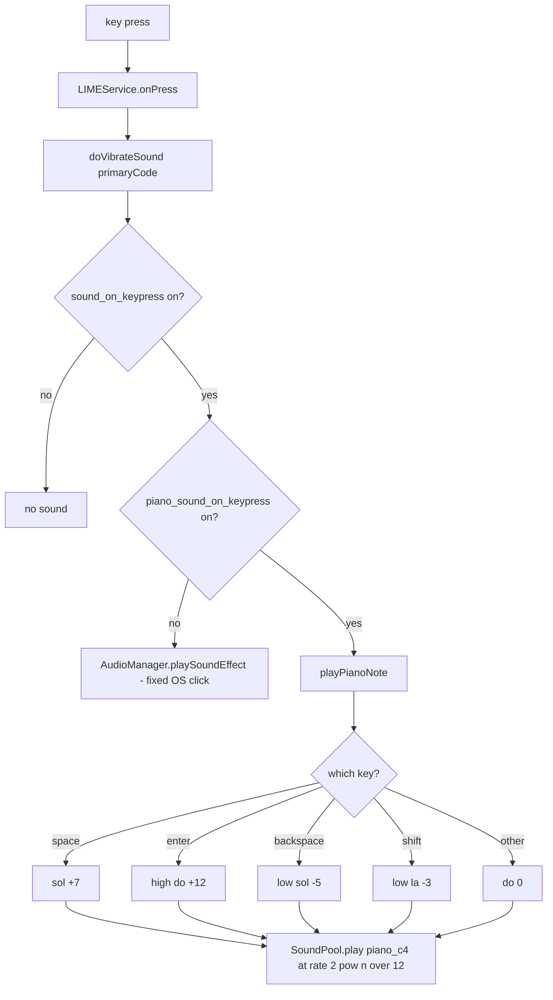

2026-08-06

# Sweet LIME: Piano Key Sounds (Do Re Mi)

Released in v7.5.0. Key presses can now play short piano notes instead of the
Android system click — an opt-in 琴鍵音效 checkbox that appears under the
existing 打字音效 setting. All ordinary keys play the same do (C4) so typing
does not turn into a random melody; only function keys get their own notes,
making them recognizable by ear:

| Key | Note | Semitones from C4 |
|---|---|---|
| any letter / symbol | do | 0 |
| space | sol | +7 |
| enter | high do | +12 |
| backspace | low sol | −5 |
| shift | low la | −3 |

## Why it is built this way

The first question was whether the OS could play custom key sounds for us —
it cannot. `AudioManager.playSoundEffect()` (what the existing 打字音效 uses)
only plays a fixed set of ogg files baked into `/system/media/audio/ui/`;
there is no API to register app-supplied audio, even for IMEs. Every keyboard
with custom sounds (Gboard, AOSP LatinIME) plays its own audio, so Sweet LIME
now does the same via `SoundPool`.

A single self-synthesized C4 note covers the whole octave: `SoundPool.play()`
accepts a playback rate of 0.5–2.0, which is exactly one octave down/up
(rate = 2^(n/12) for n semitones). One 26 KB WAV in `res/raw/` replaces what
would otherwise be eight samples. The sample is generated by
`Resources/gen_piano_sample.py` (additive synthesis: 8 harmonics, per-harmonic
decay, slight inharmonicity), so the asset is GPL-clean with its source in the
repo — no third-party sample licensing to track for F-Droid.

## Volume: three layers, tuned on device

The first build played at full gain and was far too loud on the Hisense A7.
Loudness turned out to be three stacked factors, each addressed separately:

1. **Stream routing** — the SoundPool uses `USAGE_ASSISTANCE_SONIFICATION`,
   so playback rides the system-sounds stream and the device volume scales it
   automatically, like a real system sound.
2. **Play gain** — the OS attenuates its own keypress clicks by an internal
   `config_soundEffectVolumeDb` (−6 dB in AOSP). We read that same value via
   `Resources.getSystem().getIdentifier(...)` (fallback −6) and apply it,
   then a further −6 dB because a tonal note carries further than a click.
3. **Sample mastering** — the stock Keypress oggs are mastered well below
   full scale; the synth sample was lowered from 0.85 to 0.5 peak, and
   shortened from 0.5 s to 0.3 s with a faster decay for a snappier feel.

Deliberate choice: the piano does **not** honor the OS "touch sounds" toggle
(`SOUND_EFFECTS_ENABLED`). The A7 has that toggle off — which also revealed
the old 打字音效 click had been silently suppressed there all along. Gboard's
key sound is likewise independent of the toggle; the in-app checkbox is the
explicit opt-in.

## Gotcha: the duplicate preference screen

The new checkbox initially did not appear on screen despite being in the APK.
This repo has **two** copies of the settings XML: `res/xml/preference.xml`
and `res/xml-v17/preference.xml`. With minSdk 21, every device resolves the
`-v17` variant, so edits to the base file alone are silently invisible. Both
files must be kept in sync — worth remembering for any future settings change.
