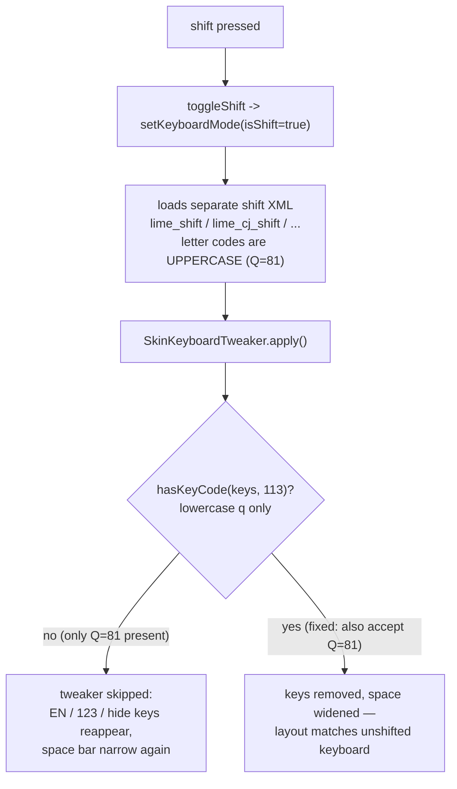

2026-08-02

# Shift reverted the keyboard to the un-skinned layout

With a custom skin active, pressing shift in any Chinese input method
(including custom .cin IMs) made the keyboard visibly "change style": the
EN/中, 123, and hide-keyboard keys reappeared and the space bar shrank back —
exactly the bottom-row keys the skin toolbar is supposed to replace.
Releasing shift snapped it back. English keyboards were unaffected, which
made it look like a custom-IM problem.

## Root cause

Shift does not restyle the current keyboard — `LIMEKeyboardSwitcher`
swaps in a **separate shift XML layout** (`kobj.getImshiftkb()`, e.g.
`lime_shift.xml` for custom IMs). `SkinKeyboardTweaker.apply()` — the pass
that removes toolbar-covered bottom-row keys and widens the space bar —
guards itself with a "is this a main text keyboard" check that looked for
**lowercase q (code 113)** only. Every IM shift layout defines its letter
keys with **uppercase codes** (`Q` = 81): lime_shift, lime_cj_shift,
lime_array_shift, lime_dayi_shift, lime_phonetic_shift, lime_et_41_shift.
The check failed, the tweaker returned early, and the shifted keyboard kept
its original bottom row. `lime_english_shift.xml` happens to keep lowercase
codes and only changes labels, which is why English shift looked fine.



## Fix

One condition in `SkinKeyboardTweaker.apply()`: accept either case when
detecting a main text keyboard —

```java
if (!hasKeyCode(keys, KEYCODE_LETTER_Q)
        && !hasKeyCode(keys, KEYCODE_LETTER_Q_UPPER)) return;
```

Verified on the emulator with a skin whose toolbar covers the EN/123 keys:
before the fix the shifted layout showed seven bottom-row keys with a
narrow space; after, the shifted layout keeps the same four-key wide-space
bottom row as the unshifted one.

Shipped in v7.3.0 together with the emoji picker panel
(see the sweetlime-emoji-picker-panel ADR).
